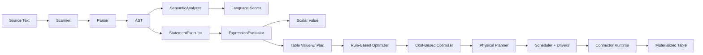
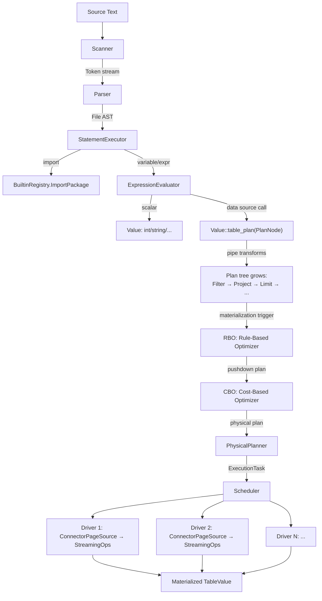

# Flux Interpreter Architecture

## Overview

Flux 是 InfluxData 设计的数据查询与处理语言。本项目实现了 Flux 语言的一个子集，包含完整的编译/执行管线：词法分析、语法分析、语义分析、逻辑计划构建、基于规则和代价的查询优化、物理执行引擎、数据源连接器框架，以及 LSP 语言服务器。

**范围**：支持 Flux 的核心语法（变量、函数、管道、条件、正则）、标准库子集（20+ 包）、表流处理管线，以及对 SQLite/MySQL 的数据源查询。

**技术栈**：C++20、Bazel 8 (bzlmod)、Ragel (lexer 生成)、Abseil、simdjson、Boost.MySQL、SQLite3、GoogleTest。

**与 InfluxData 官方实现的差异**：

| 维度 | 官方 Flux (Go) | 本实现 (C++) |
|------|---------------|-------------|
| 类型系统 | HM 类型推断 | 动态类型 + 静态分析辅助 |
| 执行模型 | 全部 eager | 双路径：scalar eager + table lazy (plan-based) |
| 数据源 | InfluxDB | SQLite、MySQL、内存 |
| 优化器 | 无独立优化器 | RBO + CBO，支持 predicate/projection/limit pushdown |
| 分布式 | 无 | 无（单机多线程） |
| 语言覆盖 | 完整 | 子集（无 testcase、部分类型语法） |

## Architecture



系统分为两条执行路径：

1. **Scalar 路径**：变量赋值、算术运算、函数定义等表达式直接由 `ExpressionEvaluator` 求值
2. **Table 路径**：`sqlite.from()` / `mysql.from()` 等数据源操作构建逻辑计划，经优化器优化后由物理执行引擎分页执行

## Core Components

### 编译前端 (`syntax/`)

| 模块 | 文件 | 职责 |
|------|------|------|
| Scanner | `scanner.h`, `scanner.rl` | Ragel 生成的状态机 lexer，支持三种扫描模式（normal/regex/string-expr） |
| Parser | `parser.h` | 递归下降解析器，运算符优先级，深度限制 80 层，带错误恢复 |
| AST | `ast.h` | 完整 AST 节点定义：25 种 Expression variant + 7 种 Statement variant |
| StrConv | `strconv.h` | 字面量解析：字符串转义、时间、Duration |

### 语义分析 (`analysis/`)

| 模块 | 文件 | 职责 |
|------|------|------|
| SemanticAnalyzer | `semantic_analyzer.h` | 绑定 definitions/references/scopes，生成诊断信息 |
| SemanticModel | `semantic_model.h` | 类型系统：TypeKind、类型构造器、赋值兼容性判定 |
| BuiltinMetadata | `builtin_metadata.h` | 内建函数签名注册表，LSP/分析器/运行时共享 |

### 运行时 (`runtime/`)

| 模块 | 文件 | 职责 |
|------|------|------|
| Value | `runtime_value.h` | 值模型：13 种类型（Null...Function），TableValue 支持 lazy plan |
| Page | `runtime_page.h` | 列式数据表示：ColumnVector、PageChunk、Page |
| Environment | `runtime_env.h` | 作用域链：parent-pointer 结构，变量绑定 |
| ExpressionEvaluator | `runtime_eval.h` | 表达式求值：递归遍历 AST，函数调用分发 |
| StatementExecutor | `runtime_exec.h` | 语句执行：import、变量定义、option、return |
| BuiltinRegistry | `runtime_builtin.h` | 内建函数注册与加载（universe + 20 个命名包） |

### 计划层 (`plan/`)

| 模块 | 文件 | 职责 |
|------|------|------|
| PlanNode | `plan_node.h` | 逻辑计划 IR：17 种节点（SourceScan→Yield），树形结构 |
| PhysicalPlanNode | `physical_plan.h` | 物理计划：CostEstimate、OptimizerTrace |

### 优化器 (`optimizer/`)

| 模块 | 文件 | 职责 |
|------|------|------|
| RBO | `rbo.h` | 基于规则的优化：predicate pushdown、projection pruning、limit pushdown、sort elimination |
| CBO | `cbo.h` | 基于代价的优化：统计信息收集、候选计划生成、代价估算、选择最优路径 |
| Explain | `explain.h` | 计划格式化输出（文本、Mermaid DAG） |

### 连接器 (`connector/`)

| 模块 | 文件 | 职责 |
|------|------|------|
| ConnectorRuntime | `connector_runtime.h` | 三层接口：Metadata + SplitManager + PageSourceProvider |
| ConnectorRegistry | `connector_registry.h` | 连接器注册表（全局单例） |
| SQLiteSource | `sqlite_source.h` | SQLite 连接器：rowid 分片、全量 pushdown |
| MySQLSource | `mysql_source.h` | MySQL 连接器：主键范围分片、连接池、prepared statement |
| MemorySource | `memory_source.h` | 内存连接器：array.from / csv.from 数据 |
| SqlBuilder | `sql_builder.h` | SQL 方言抽象 + 参数化 SQL 生成 |

### 执行引擎 (`execution/`)

| 模块 | 文件 | 职责 |
|------|------|------|
| PhysicalExecutor | `physical_executor.h` | Pipeline/Operator/Driver/Scheduler 完整执行框架 |
| TaskExecutor | `task_executor.h` | 线程池：并行 driver 执行 |
| Accumulator | `accumulator.h` | 流式算子：Group、Distinct、Aggregate（Partial/Final） |
| Materializer | `materializer.h` | lazy table → materialized table 转换 |

### 语言服务器 (`contrib/lsp/`)

| 模块 | 文件 | 职责 |
|------|------|------|
| FluxLanguageServer | `server.h` | 完整 LSP 实现：补全、hover、定义跳转、引用、重命名、诊断、语义高亮 |
| Formatter | `formatter.h` | Width-aware 代码格式化 |
| Transport | `transport.h` | stdio JSON-RPC 2.0 传输层 |

## Data Flow

### 完整执行管线



### 详细流转说明

**Phase 1: Parse**

```
source string → Scanner.scan() → Token stream → Parser.parse_file() → File AST
```

Scanner 基于 Ragel 状态机，单遍扫描。Parser 是手写递归下降，支持运算符优先级（pipe > conditional > logical > comparison > additive > multiplicative > exponent > unary > postfix）和 panic-mode 错误恢复。

**Phase 2: Execute statements**

StatementExecutor 遍历 AST body：
- `import "pkg"` → `BuiltinRegistry::ImportPackage("pkg")`，将包的函数注入当前环境
- `x = expr` → `ExpressionEvaluator::Evaluate(expr)` → `env.define("x", value)`
- 表达式语句 → 求值并收集为结果

**Phase 3: Lazy plan construction**

当 `sqlite.from(dsn: "...", table: "t")` 被调用时，不立即执行查询，而是返回一个 `Value::table_plan(MakeSourceScan(spec))`。后续的管道操作（`|> filter()`, `|> limit()` 等）向计划树追加节点。

触发物化的时机：
- 遇到无法下推的操作（如某些用户自定义函数）→ 插入 `MakeMaterializeBarrier()`
- 最终输出时

**Phase 4: Optimization**

RBO 规则（按顺序应用）：
1. Filter pushdown — 将 predicate 下推到 SourceScan
2. Projection pruning — 只请求被引用的列
3. Limit pushdown — 将 limit 下推
4. Sort elimination — 移除冗余排序

CBO 在 RBO 之后：
1. 从 ConnectorMetadata 收集统计信息（行数、大小）
2. 生成候选物理计划（如 ConnectorScan vs LocalHashJoin）
3. 估算代价（rows/cpu/io）
4. 选择最低代价的方案

**Phase 5: Physical execution**

PhysicalPlanner 将优化后的逻辑计划转为 `ExecutionTask`（一组 Pipeline）：
1. 为 SourceScan 创建 ConnectorRuntime
2. 通过 SplitManager 将数据源拆分为多个 Split
3. 构建 Operator 链：`ConnectorPageSource → StreamingGroupOp → StreamingAggregateOp`
4. 为每个 Split 创建一个 Driver

Scheduler 将 Driver 提交到 TaskExecutor 线程池并行执行。每个 Driver 循环调用 `Operator::NextPage()` 拉取 Page（列式数据块），直到数据耗尽。

**Phase 6: Materialization**

将 Page 结果转回 `TableValue`（设置 `materialized=true`，清除 plan 指针），供后续消费或输出。

## Key Data Structures

### Value（`runtime/runtime_value.h`）

```
Value
├── type: Type enum (Null, Bool, Int, UInt, Float, String, Duration, Time, Regex, Array, Object, Table, Function)
├── storage: std::variant<monostate, bool, int64_t, uint64_t, double, string, DurationValue, TimeValue, RegexValue, shared_ptr<...>>
│
├── TableValue
│   ├── bucket: string (result name)
│   ├── rows / tables: vector<TableChunk> (eager data)
│   ├── plan: shared_ptr<PlanNode> (lazy, nullptr if materialized)
│   └── materialized: bool
│
└── FunctionValue
    ├── User: params + body AST + closure Environment
    └── Builtin: std::function<StatusOr<Value>(vector<Value>&)>
```

### Page（`runtime/runtime_page.h`）— 列式执行格式

```
Page
├── bucket: string
├── chunks: vector<PageChunk>
│   └── PageChunk
│       ├── columns: vector<ColumnVector>
│       │   └── ColumnVector { name, type, values: vector<Value> }
│       ├── group_key: vector<pair<string, Value>>
│       └── row_count: size_t
├── range: optional<TimeRange>
└── plan: optional<PlanNode>
```

Page 是执行引擎的中间表示。Operators 之间通过 Page 传递数据，避免整表物化。

### PlanNode（`plan/plan_node.h`）— 逻辑计划 IR

```
PlanNode
├── kind: PlanNodeKind (SourceScan | Filter | Project | Limit | Sort | Group | Aggregate | Join | ...)
├── inputs: vector<shared_ptr<PlanNode>> (子节点)
└── spec: variant<SourceScanSpec, FilterSpec, ProjectSpec, LimitSpec, JoinSpec, ...>
    │
    ├── SourceScanSpec { source, driver, dsn, table, database }
    ├── FilterSpec { predicates: vector<Expression> }
    ├── JoinSpec { on, method(Inner/Left/Right/Cross), build_side }
    └── ExchangeSpec { distribution: Gather | Repartition(keys) }
```

### Connector 三层接口

```
ConnectorRuntime
├── ConnectorMetadata
│   ├── GetTableHandle(table_name)
│   ├── Schema(handle) → TableSchema
│   ├── Capabilities(handle) → SourceCapabilities (pushdown flags)
│   └── Statistics(handle) → TableStatistics (row_count, size_bytes)
│
├── ConnectorSplitManager
│   └── GetSplits(handle, request) → vector<ConnectorSplit>
│       └── ConnectorSplit { table_handle, scan_request, split_id, row_bounds }
│
└── ConnectorPageSourceProvider
    └── CreatePageSource(split) → ConnectorPageSource
        └── NextPage() → optional<Page>  (streaming)
```

## Design Decisions

### 为什么采用 lazy plan + eager scalar 双路径

纯 eager 执行（每个操作立即求值）无法实现 predicate pushdown —— 当 `sqlite.from() |> filter(fn: ...)` 时，eager 模式会先读取全表再过滤。

纯 lazy 模式（全部操作都延迟到最后）则对简单表达式（`1 + 2`）增加不必要的复杂度。

本实现选择混合模式：
- Scalar 表达式直接求值（简单、符合直觉）
- 数据源操作返回 lazy table（携带 plan pointer），管道操作追加 plan 节点
- 物化点（遇到不可下推操作或最终输出）触发 optimize → execute

这接近 Trino/Presto 的"build plan tree → optimize → execute"模式。

### 为什么 Connector 采用 Split-based 并行

参考 Trino 的 SPI（Service Provider Interface）设计：
- Split 是并行单元：一个表可以被拆分为多个 Split，每个 Split 由独立 Driver 执行
- PageSource 是流式接口：每次返回一个 Page，避免整表加载到内存
- 统一接口：SQLite（rowid 范围分片）和 MySQL（主键范围分片）共享同一套框架

代价是对于小表（几百行），Split 开销大于收益。但架构统一性值得这个取舍。

### 为什么 AST 用 variant 而不是虚函数

AST 节点使用 `std::variant`（Expression 有 25 种、Statement 有 7 种）而非传统的继承体系：
- 所有节点紧凑存储在 variant 中，减少堆分配
- 模式匹配通过 `std::visit` 实现，编译器可以检查是否覆盖所有分支
- 解析阶段是 hot path，避免虚函数调用开销

代价是新增节点类型需要修改 variant 定义（不影响 OCP），但对于一个子集实现，节点类型是固定的。

### 为什么 SQL 生成抽象为 SqlDialect

SQLite 和 MySQL 的 SQL 语法存在差异（标识符引用、LIMIT 语法、类型名）。`SqlBuilder` 通过 `SqlDialect` 虚类隔离差异，共享下推逻辑：
- `BuildWhereClause(predicates, dialect)` — 一套代码生成两种 SQL
- `BuildParameterizedScanSql(request, dialect)` — 参数化避免 SQL 注入

新增数据源（如 PostgreSQL）只需实现 `SqlDialect` 接口。

### BuiltinMetadata 单一来源

内建函数签名（参数名、类型、是否可选）注册在 `BuiltinMetadata` 中，被三个消费者共享：
- **运行时**：函数调用时验证参数
- **语义分析器**：类型推断和诊断
- **LSP**：补全建议和 hover 文档

避免了信息重复和不一致。

## Future Work

- 更多 Connector：PostgreSQL、ClickHouse、CSV 文件
- 窗口函数并行化：当前 window 操作是串行的
- 查询缓存：对相同 plan 的重复查询复用结果
- WASM 编译目标：将 Flux 脚本编译为 WASM 执行
- 增量解析：LSP 场景下只重新解析变更部分
