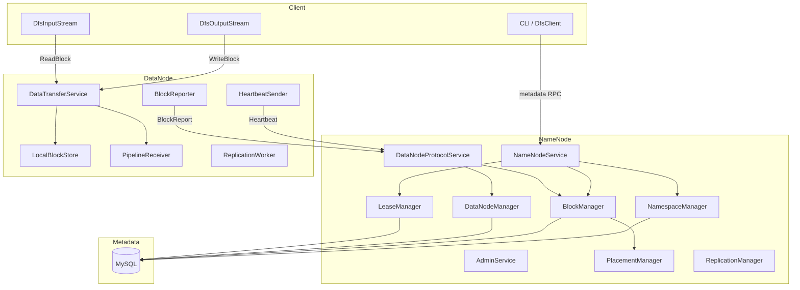
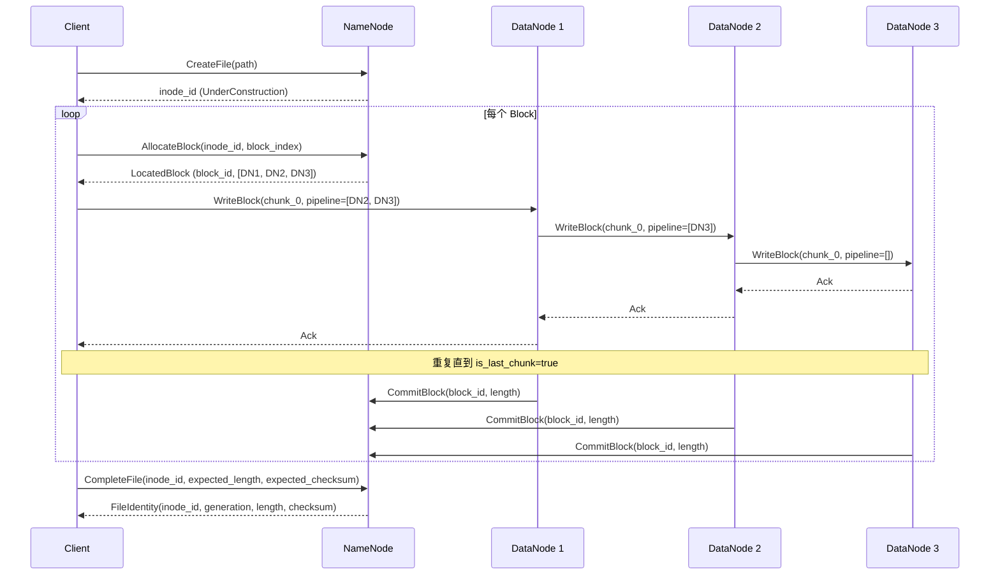
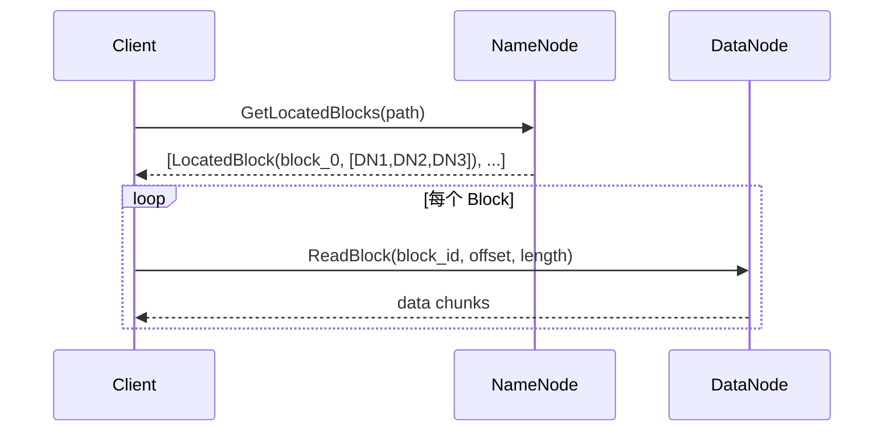
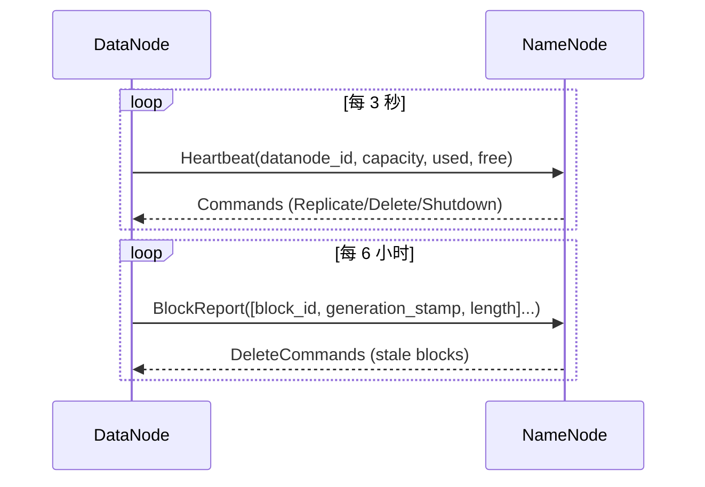

# MiniDFS Architecture

## Overview

MiniDFS 是一个用 C++20 实现的 HDFS-like 分布式文件系统。目标是在保持核心语义（块存储、副本、管道写入、心跳）的前提下，以最小代码量实现一个可运行的分布式文件系统原型。

**范围**：支持 `mkdir`、`put`、`get`、`ls`、`stat`、`rm`、`mv` 等基本文件系统操作，包含完整的 NameNode/DataNode/Client 三层架构。

**技术栈**：C++20、Bazel 8 (bzlmod)、brpc + protobuf (RPC)、MySQL via Boost.MySQL (元数据)、ISA-L/crc32c (校验)、zstd/snappy (压缩)、folly (错误处理与日志)。

**与 HDFS 的主要差异**：

| 维度 | HDFS | MiniDFS |
|------|------|---------|
| 元数据存储 | 内存 + EditLog + FsImage | MySQL（持久化，无需 checkpoint） |
| RPC 框架 | Hadoop IPC (protobuf) | brpc |
| 块大小 | 128MB | 128MB（可配置） |
| 副本放置 | 三级 rack-aware | 简化版 rack-aware |
| HA | Active/Standby NameNode | 单 NameNode（无 HA） |
| Federation | 支持 | 不支持 |
| 安全 | Kerberos | 无认证 |
| 语言 | Java | C++ |

## Architecture



系统由三个独立进程组成：

- **NameNode** — 元数据管理节点，处理客户端的文件系统请求和 DataNode 的注册/心跳
- **DataNode** — 数据存储节点，负责块的本地存储、Pipeline 写入接收、心跳上报
- **Client** — 用户接口，提供文件系统操作的 SDK 和 CLI

## Core Components

### NameNode 内部模块

| 模块 | 代码路径 | 职责 |
|------|---------|------|
| NamespaceManager | `namenode/namespace_manager.h` | 目录树管理：路径解析、mkdir、create/delete/rename file |
| BlockManager | `namenode/block_manager.h` | Block 生命周期：分配、提交、定位、失效 |
| DataNodeManager | `namenode/datanode_manager.h` | DataNode 注册、心跳处理、状态机转换 (Live→Stale→Dead) |
| LeaseManager | `namenode/lease_manager.h` | 文件写入互斥租约：获取、续租、过期 |
| PlacementManager | `namenode/placement_manager.h` | 副本放置策略：跨 rack 分散、按可用空间加权 |
| ReplicationManager | `namenode/replication_manager.h` | 扫描 under/over-replicated 块，生成修复任务 |
| NameNodeServiceImpl | `namenode/namenode_service_impl.h` | Client-facing RPC 实现 |
| DataNodeProtocolServiceImpl | `namenode/namenode_service_impl.h` | DataNode-facing RPC 实现 |
| AdminServiceImpl | `namenode/admin_service_impl.h` | 诊断/管理 RPC |

### DataNode 内部模块

| 模块 | 代码路径 | 职责 |
|------|---------|------|
| LocalBlockStore | `datanode/local_block_store.h` | 本地块文件管理：三级目录 (tmp→current→trash) |
| PipelineReceiver | `datanode/pipeline_receiver.h` | Pipeline 写入：逐 chunk 接收并转发到下游 |
| HeartbeatSender | `datanode/heartbeat_sender.h` | 周期性心跳，接收 NameNode 下发命令 |
| BlockReporter | `datanode/block_reporter.h` | 全量/增量块汇报 |
| ReplicationWorker | `datanode/replication_worker.h` | 执行块复制和删除任务 |
| DataTransferServiceImpl | `datanode/data_transfer_service_impl.h` | 数据传输 RPC：WriteBlock、ReadBlock、TransferBlock |

### Client 模块

| 模块 | 代码路径 | 职责 |
|------|---------|------|
| DfsClient | `client/dfs_client.h` | 高层 API；提供 immutable output stream，以及绑定 `FileIdentity` 的跨 Block `read_exact` |
| DfsOutputStream | `client/dfs_output_stream.h` | 流式 Pipeline 写入；complete 提交内容长度/CRC32C 并取得已发布 `FileIdentity` |
| DfsInputStream | `client/dfs_input_stream.h` | 流式读取：按块拉取，副本容错切换 |
| MiniDfsFileSystem | `../sstv2/io/minidfs_filesystem.h` | 实现 sstv2 `FileSystem`：`create/append/close` 对接 immutable `DfsOutputStream`，`open/read_at` 对接身份绑定的 `DfsClient::read_exact` 并填充调用方字节缓冲区；共享持有 `DfsClient` |

### 元数据层

| 模块 | 代码路径 | 职责 |
|------|---------|------|
| MetadataStore | `metadata/metadata_store.h` | 纯虚接口：定义所有元数据操作 |
| MySQLMetadataStore | `metadata/mysql_metadata_store.h` | MySQL 实现，thread-local 事务绑定 |
| MySQLConnectionPool | `metadata/mysql_connection_pool.h` | RAII 连接池：mutex + condvar + queue |

## Data Flow

### 写入流程 (put)



关键点：

1. 每个 Block 独立分配，NameNode 通过 PlacementManager 选择目标 DataNode
2. Pipeline 写入：数据从 Client 流向 DN1，DN1 转发到 DN2，DN2 转发到 DN3
3. 每个 chunk（默认 1MB）是一次独立的 RPC 请求-响应，并在 DataNode 落盘时记录 CRC32C
4. 所有副本都提交后，NameNode 将 Block 状态从 Allocating 转为 Committed
5. 只有 Block 满或文件写完时才触发 CommitBlock
6. Complete 必须声明客户端计算的内容长度和 CRC32C；成功时原子发布 `FileIdentity`
7. `kImmutableAfterComplete` 文件发布后拒绝 append、truncate 和原地覆盖；Complete replay 必须与已发布 identity 一致

### 读取流程 (get)



Client 从 NameNode 获取按已发布文件长度裁剪后的块位置，再直接从 DataNode positional read。如果某个 DataNode 超时、短读、校验失败或不可用，Client 自动切换到同一块的其他副本。`read_exact(path, offset, length, expected_identity)` 在 NameNode 和 Block Token 两层绑定 `FileIdentity`，防止路径重用或内容 generation 变化造成 ABA；DataNode 只读取与范围相交的 chunk，但会校验每个相交 chunk 的完整落盘 CRC32C。

### 心跳与块汇报



NameNode 通过心跳维护 DataNode 状态机（Live → Stale → Dead），并在心跳响应中下发复制/删除命令。

## Key Data Structures

### Block 二进制格式 (`datanode/block_format.h`)

```
+-------------------------------------------------------------------+
| BlockHeader (2148 bytes, packed)                                   |
+-------+----------+----------+-----------+---------+----+----------+
| magic | version  | block_id | inode_id  | block_  | gs | data_len |
| 4B    | 4B       | 8B       | 8B        | index 4B| 8B | 8B       |
+-------+----------+----------+-----------+---------+----+----------+
| compression_type | chunk_size | chunk_count | checksum_type        |
| 4B               | 4B         | 4B          | 4B                  |
+------------------+------------+-------------+----------------------+
| block_checksum | chunk_offsets[256] | chunk_checksums[256] | reserved |
| 4B             | 1024B              | 1024B                | 32B      |
+----------------+--------------------+----------------------+----------+

+-------------------------------------------------------------------+
| Data (chunk_0 | chunk_1 | ... | chunk_N)                          |
+-------------------------------------------------------------------+
```

- Magic: `0x4D444653` ("MDFS")
- 每个 chunk 默认 1MB，最多 256 chunks/block（即单 block 最大 256MB）
- CRC32C 校验同时覆盖 chunk 级和 block 级

### 本地存储目录布局

```
<storage_root>/
├── current/     # 已 finalize 的块文件
│   └── blk_<block_id>_<generation_stamp>.dat
├── tmp/         # 正在写入的块（crash 后清理）
│   └── blk_<block_id>_<generation_stamp>.dat
└── trash/       # 等待 purge 的块
    └── blk_<block_id>_<generation_stamp>.dat
```

三级目录保证 crash safety：写入失败时 tmp 中的不完整块不会被当作有效数据。

### MySQL Schema

| 表 | 主键 | 职责 |
|----|------|------|
| `inodes` | inode_id | 文件系统目录树 |
| `blocks` | block_id | Block 元数据（state、length、generation_stamp） |
| `block_replicas` | (block_id, datanode_id, storage_id) | 副本位置 |
| `datanodes` | datanode_id | DataNode 注册信息和容量 |
| `leases` | lease_id | 文件写入租约 |
| `op_log` | id (auto_increment) | 幂等去重日志 |

ID 通过 `id_allocators` 表单调递增分配（inode/block/datanode/lease 各自独立序列，起始值 1000）。

### DataNode 状态机

```
Live ──(heartbeat timeout > 30s)──→ Stale ──(timeout > 10min)──→ Dead
 ▲                                                                  │
 └────────────────────(re-register)─────────────────────────────────┘
```

- **Live**：正常心跳中，可参与副本放置
- **Stale**：超过 30s 未心跳，不参与新的副本分配，但已有数据仍可读
- **Dead**：超过 10min 未心跳，其上的副本标记为 stale，触发 ReplicationManager 修复

## Design Decisions

### 为什么用 MySQL 而不是内存 + EditLog

HDFS 将全部命名空间放在 NameNode 内存中，通过 EditLog 持久化变更，定期 checkpoint 为 FsImage。这带来两个问题：NameNode 内存成为瓶颈，以及启动时需要回放 EditLog。

MiniDFS 选择 MySQL 作为元数据后端：

- 持久化开箱即用，无需实现 EditLog/FsImage 机制
- 事务语义天然支持原子操作
- 连接池 + 索引可以满足原型级别的性能需求
- 代价是每次元数据操作有一次 MySQL 往返

这是一个"减少实现复杂度、接受性能损失"的取舍。对于学习和原型验证目的，这是合理的。

### 为什么用 brpc 而不是 gRPC

- brpc 的单连接多路复用在高并发场景下开销更低
- brpc 内置了连接管理、超时、负载均衡
- braft (Raft 库) 基于 brpc，为后续添加 NameNode HA 预留了可能性
- 代价是 brpc 生态不如 gRPC 广泛

### Pipeline 写入为什么以 chunk 为粒度做 RPC

每个 chunk (1MB) 是独立的 RPC 请求-响应周期：

- 任意位置失败可以精确重试到 chunk 粒度
- 内存占用可控（不需要缓存整个 128MB Block）
- 代价：一个 Block 约 128 次 RPC

HDFS 使用流式 packet (64KB) + ack pipeline，RPC 开销更低但实现复杂度更高。MiniDFS 选择了更简单的 RPC-per-chunk 模型。

### 幂等设计

所有写操作通过 `RequestHeader.request_id` 实现幂等。NameNode 在 `op_log` 表记录已处理的 request_id（unique key），重复请求直接返回。这避免了客户端重试导致的副作用（如重复创建文件）。

### 错误处理

基于 `folly::Expected` 的 `Result<T>` 类型。所有可能失败的操作返回 `Result<T>`，错误类型为 `ErrorCode` 枚举（分段编号：1xxx 命名空间、2xxx 租约、3xxx Block/DN、4xxx MySQL、5xxx RPC、6xxx IO）。编译期强制处理错误路径。

## Future Work

- NameNode HA：基于 braft 实现 Active/Standby 切换
- Append 写入：当前只支持 create-write-complete，不支持追加
- YAML 配置加载：当前使用 gflags 命令行参数
- 端到端集成测试框架
