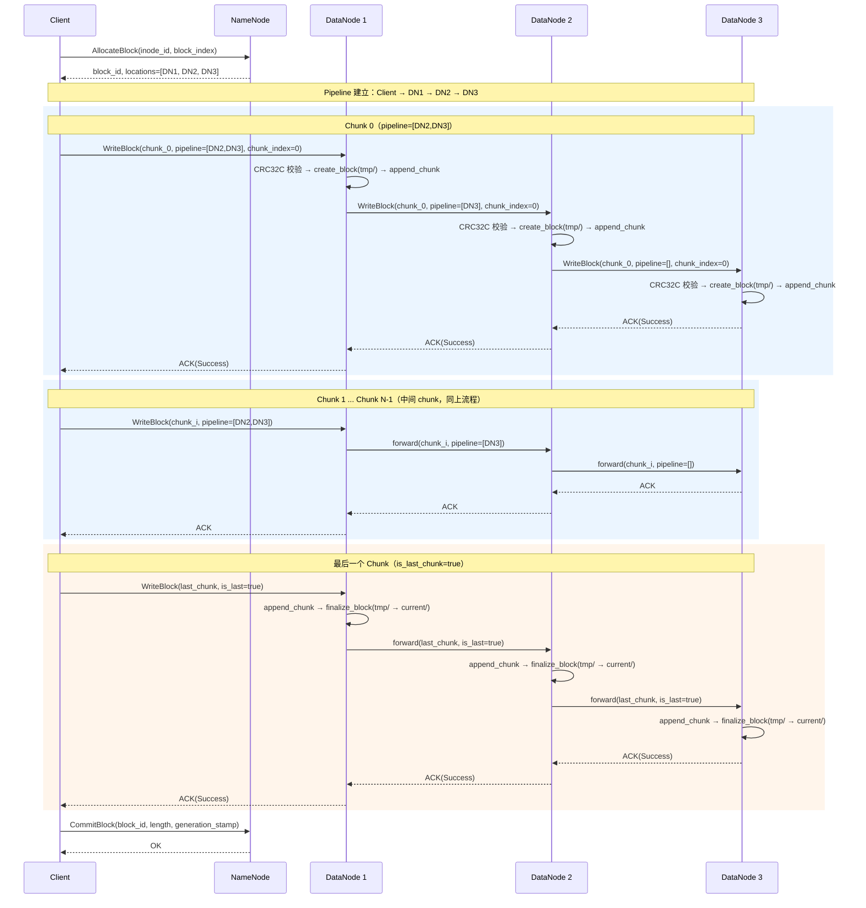

# MiniDFS — C++20 分布式文件系统设计规约

- 文档版本：v0.2
- 项目代号：`MiniDFS`
- 实现语言：C++20
- 构建系统：Bazel
- RPC 框架：brpc
- 元数据后端：MySQL (via Boost.MySQL)
- 命名空间：`pl::minidfs`

---

# 1. 项目定位

MiniDFS 是一个用 C++20 实现的 HDFS-like 分布式文件系统。追求：

- 极致性能：零拷贝 I/O、紧凑二进制格式、连接池复用、异步流式传输。
- 工程品质：强类型抽象、RAII 资源管理、编译期约束、无中间态设计。
- 可演进性：MetadataStore 可插拔、Block 格式自描述、协议向前兼容。

第一版闭环：

```text
format -> start cluster -> mkdir -> put file -> get file -> ls -> stat -> rm
```

---

# 2. 技术栈决策

| 领域     | 选型                         | 理由                                               |
| -------- | ---------------------------- | -------------------------------------------------- |
| 语言标准 | C++20                        | concepts、coroutines、ranges、constexpr 扩展       |
| 构建     | Bazel                        | 已有完整工程基础设施                               |
| RPC      | brpc                         | 高性能、支持 protobuf、已有 Bazel 集成             |
| MySQL    | Boost.MySQL + Boost.Asio     | 异步连接池、类型安全、header-only                  |
| 序列化   | protobuf                     | 与 brpc 天然配合                                   |
| 日志     | folly xlog                   | 结构化日志、已有依赖                               |
| 配置     | YAML (yaml-cpp)              | 已有依赖                                           |
| 错误处理 | pl::Result (folly::Expected) | 已有基础设施                                       |
| 校验     | CRC32C (ISA-L / crc32c)      | Linux: ISA-L (SIMD)，macOS: Google crc32c (ARM HW) |
| 压缩     | zstd / snappy                | 已有依赖                                           |

---

# 3. 架构总览

```text
                      +----------------------+
                      |        Client        |
                      | CLI / SDK / Library  |
                      +----------+-----------+
                                 |
                                 | brpc (Metadata RPC)
                                 |
                      +----------v-----------+
                      |       NameNode       |
                      |----------------------|
                      | NamespaceManager     |
                      | BlockManager         |
                      | DataNodeManager      |
                      | LeaseManager         |
                      | PlacementManager     |
                      | ReplicationManager   |
                      +----------+-----------+
                                 |
                                 | MetadataStore (abstract)
                                 |
                      +----------v-----------+
                      |        MySQL         |
                      | (Boost.MySQL async)  |
                      +----------------------+

      brpc (Data RPC / Block Transfer)
+------------------+  +------------------+  +------------------+
|    DataNode 1    |  |    DataNode 2    |  |    DataNode 3    |
|------------------|  |------------------|  |------------------|
| LocalBlockStore  |  | LocalBlockStore  |  | LocalBlockStore  |
| HeartbeatSender  |  | HeartbeatSender  |  | HeartbeatSender  |
| BlockReporter    |  | BlockReporter    |  | BlockReporter    |
| ReplicationWorker|  | ReplicationWorker|  | ReplicationWorker|
+------------------+  +------------------+  +------------------+
```

---

# 4. 目录结构

```text
cpp/pl/minidfs/
├── BUILD
├── spec.md
├── readme.md
├── Dockerfile
├── docker-compose.yml
│
├── common/
│   ├── BUILD
│   ├── common.h              // 统一头文件
│   ├── types.h              // Inode, Block, BlockReplica, DataNodeInfo, enums
│   ├── error_code.h         // ErrorCode enum
│   ├── config.h             // Configuration types (NameNodeConfig, DataNodeConfig, ClientConfig)
│   ├── config.cpp
│   ├── constants.h          // 系统常量
│   ├── compression.h        // CompressionType enum + compress/decompress
│   └── checksum.h           // CRC32C utilities (Linux: ISA-L, macOS: crc32c)
│
├── protocol/
│   ├── BUILD
│   └── minidfs.proto        // 统一 proto 文件（4 service: NameNodeService,
│                            //   DataNodeProtocolService, AdminService, DataTransferService）
│
├── metadata/
│   ├── BUILD
│   ├── metadata_store.h     // 纯虚接口
│   ├── mysql_metadata_store.h
│   ├── mysql_metadata_store.cpp
│   ├── mysql_connection_pool.h
│   ├── mysql_connection_pool.cpp
│   └── schema.sql           // DDL + 初始数据
│
├── namenode/
│   ├── BUILD
│   ├── namenode_service_impl.h
│   ├── namenode_service_impl.cpp
│   ├── admin_service_impl.h
│   ├── admin_service_impl.cpp
│   ├── namespace_manager.h
│   ├── namespace_manager.cpp
│   ├── block_manager.h
│   ├── block_manager.cpp
│   ├── datanode_manager.h
│   ├── datanode_manager.cpp
│   ├── lease_manager.h
│   ├── lease_manager.cpp
│   ├── placement_manager.h
│   └── placement_manager.cpp
│
├── datanode/
│   ├── BUILD
│   ├── data_transfer_service_impl.h
│   ├── data_transfer_service_impl.cpp
│   ├── local_block_store.h
│   ├── local_block_store.cpp
│   ├── block_format.h       // BlockHeader 定义
│   ├── block.h              // Block 抽象
│   ├── block.cpp
│   ├── pipeline_receiver.h
│   ├── pipeline_receiver.cpp
│   ├── heartbeat_sender.h
│   ├── heartbeat_sender.cpp
│   ├── block_reporter.h
│   ├── block_reporter.cpp
│   ├── replication_worker.h
│   └── replication_worker.cpp
│
├── client/
│   ├── BUILD
│   ├── dfs_client.h
│   ├── dfs_client.cpp
│   ├── dfs_input_stream.h
│   ├── dfs_output_stream.h
│   ├── cli_main.cpp         // minidfs CLI 入口
│   └── datanode_main.cpp    // DataNode 服务入口
│
└── master/
    ├── BUILD
    ├── namenode_main.cpp     // NameNode 服务入口
    └── format_main.cpp       // format 命令入口
```

---

# 5. 核心数据模型

所有模型定义于 `common/types.h`，全局使用强类型 enum 和 struct。

## 5.1 Inode

```cpp
namespace pl::minidfs {

enum class InodeType : uint8_t {
    kDirectory = 1,
    kFile      = 2,
};

enum class FileState : uint8_t {
    kNormal           = 0,
    kUnderConstruction = 1,
    kDeleted          = 2,
};

struct Inode {
    uint64_t    inode_id;
    InodeType   type;
    uint64_t    parent_id;
    std::string name;

    std::string owner;
    std::string group;
    uint32_t    permission;

    uint64_t    length;       // 文件总长度（目录为 0）
    uint32_t    replication;
    uint64_t    block_size;

    FileState   state;

    uint64_t    ctime_ms;
    uint64_t    mtime_ms;
    uint64_t    version;
};

} // namespace pl::minidfs
```

## 5.2 Block 元数据

```cpp
enum class BlockState : uint8_t {
    kAllocating = 0,
    kCommitted  = 1,
    kCorrupt    = 2,
    kDeleted    = 3,
};

struct BlockMeta {
    uint64_t   block_id;
    uint64_t   inode_id;
    uint32_t   block_index;
    uint64_t   generation_stamp;
    uint64_t   length;
    BlockState state;
    uint32_t   desired_replica;
    uint64_t   ctime_ms;
    uint64_t   mtime_ms;
};
```

## 5.3 Block Replica

```cpp
enum class ReplicaState : uint8_t {
    kWriting   = 0,
    kFinalized = 1,
    kCorrupt   = 2,
    kStale     = 3,
    kDeleting  = 4,
    kDeleted   = 5,
};

struct BlockReplica {
    uint64_t     block_id;
    uint64_t     datanode_id;
    uint64_t     storage_id;
    ReplicaState state;
    uint64_t     length;
    uint64_t     generation_stamp;
    uint64_t     report_time_ms;
};
```

## 5.4 DataNode 信息

```cpp
enum class DataNodeState : uint8_t {
    kLive            = 0,
    kStale           = 1,
    kDead            = 2,
    kDecommissioning = 3,
    kDecommissioned  = 4,
};

struct DataNodeInfo {
    uint64_t      datanode_id;
    std::string   uuid;
    std::string   hostname;
    std::string   ip;
    uint32_t      rpc_port;
    uint32_t      data_port;
    std::string   rack;
    DataNodeState state;
    uint64_t      capacity_bytes;
    uint64_t      used_bytes;
    uint64_t      free_bytes;
    uint64_t      last_heartbeat_ms;
};
```

---

# 6. Block 本地存储格式

采用**单文件自描述格式**：每个 block 是一个 `blk_<block_id>` 文件，包含 header + data。

## 6.1 BlockHeader（二进制、POD）

```cpp
namespace pl::minidfs {

static constexpr uint32_t kBlockMagic     = 0x4D444653; // "MDFS"
static constexpr uint32_t kBlockVersion   = 1;
static constexpr uint32_t kMaxChunkCount  = 256;

#pragma pack(push, 1)
struct BlockHeader {
    uint32_t magic;                           // 魔数 kBlockMagic
    uint32_t version;                         // 格式版本
    uint64_t block_id;                        // block ID
    uint64_t inode_id;                        // 所属文件 inode
    uint32_t block_index;                     // 文件内 block 序号
    uint64_t generation_stamp;                // 版本戳，用于 stale 检测
    uint64_t length;                          // 有效数据长度（压缩前）
    uint32_t checksum;                        // 整个 data 区域的 CRC32C
    CompressionType compress_type;            // 压缩类型
    uint32_t chunk_size;                      // 压缩分块大小（0=不分块）
    uint32_t chunk_count;                     // 实际 chunk 数量
    uint32_t chunk_offsets[kMaxChunkCount];   // 每个 chunk 在 data 区的偏移
    uint32_t chunk_checksums[kMaxChunkCount]; // 每个 chunk 的 CRC32C
    uint8_t  reserved[32];                    // 预留扩展
};
#pragma pack(pop)

static_assert(std::is_trivially_copyable_v<BlockHeader>);

} // namespace pl::minidfs
```

## 6.2 文件布局

```text
+--------------------+
| BlockHeader (fixed)|
+--------------------+
| Data (variable)    |
| chunk_0 bytes ...  |
| chunk_1 bytes ...  |
| ...                |
+--------------------+
```

## 6.3 DataNode 本地目录结构

```text
<data_dir>/
├── current/          // finalized blocks
│   ├── blk_1001
│   ├── blk_1002
│   └── ...
├── tmp/              // writing blocks (未 finalize)
│   ├── blk_1003
│   └── ...
└── trash/            // 待删除 blocks（延迟 GC）
    └── ...
```

写入流程：

1. 写入 `tmp/blk_<id>`（header + data，逐 chunk 写入）
2. fsync
3. rename 到 `current/blk_<id>`
4. 返回成功

---

# 7. MetadataStore 抽象

```cpp
namespace pl::minidfs {

class Transaction {
public:
    virtual ~Transaction() = default;
    virtual pl::Result<pl::Void> commit() = 0;
    virtual void rollback() = 0;
};

class MetadataStore {
public:
    virtual ~MetadataStore() = default;

    // Transaction
    virtual pl::Result<std::unique_ptr<Transaction>> begin_transaction() = 0;

    // Inode
    virtual pl::Result<Inode> get_inode(uint64_t inode_id) = 0;
    virtual pl::Result<std::optional<Inode>> get_child(uint64_t parent_id,
                                                        std::string_view name) = 0;
    virtual pl::Result<std::vector<Inode>> list_children(uint64_t parent_id) = 0;
    virtual pl::Result<pl::Void> create_inode(const Inode& inode) = 0;
    virtual pl::Result<pl::Void> update_inode(const Inode& inode) = 0;
    virtual pl::Result<pl::Void> delete_inode(uint64_t inode_id) = 0;

    // Block
    virtual pl::Result<BlockMeta> get_block(uint64_t block_id) = 0;
    virtual pl::Result<std::vector<BlockMeta>> get_blocks_by_inode(uint64_t inode_id) = 0;
    virtual pl::Result<pl::Void> create_block(const BlockMeta& block) = 0;
    virtual pl::Result<pl::Void> update_block(const BlockMeta& block) = 0;

    // Replica
    virtual pl::Result<std::vector<BlockReplica>> get_replicas(uint64_t block_id) = 0;
    virtual pl::Result<pl::Void> upsert_replica(const BlockReplica& replica) = 0;
    virtual pl::Result<pl::Void> delete_replicas_by_block(uint64_t block_id) = 0;

    // DataNode
    virtual pl::Result<DataNodeInfo> get_datanode(uint64_t datanode_id) = 0;
    virtual pl::Result<std::optional<DataNodeInfo>> get_datanode_by_uuid(
        std::string_view uuid) = 0;
    virtual pl::Result<std::vector<DataNodeInfo>> list_datanodes_by_state(
        DataNodeState state) = 0;
    virtual pl::Result<pl::Void> upsert_datanode(const DataNodeInfo& info) = 0;

    // Lease
    virtual pl::Result<pl::Void> create_lease(uint64_t lease_id, uint64_t inode_id,
                                               std::string_view client_id,
                                               uint64_t expire_time_ms) = 0;
    virtual pl::Result<bool> check_lease(uint64_t inode_id,
                                          std::string_view client_id) = 0;
    virtual pl::Result<pl::Void> renew_lease(uint64_t inode_id,
                                              uint64_t new_expire_ms) = 0;
    virtual pl::Result<pl::Void> close_lease(uint64_t inode_id) = 0;
    virtual pl::Result<pl::Void> expire_leases(uint64_t now_ms) = 0;

    // ID Allocation
    virtual pl::Result<uint64_t> alloc_id(std::string_view name, uint64_t count = 1) = 0;

    // OpLog
    virtual pl::Result<pl::Void> write_oplog(std::string_view op_type,
                                              uint64_t target_inode_id,
                                              std::string_view request_id,
                                              std::string_view payload_json) = 0;
    virtual pl::Result<bool> check_request_id(std::string_view request_id) = 0;
};

} // namespace pl::minidfs
```

第一版实现 `MySQLMetadataStore`，通过 Boost.MySQL 异步连接池访问 MySQL。

---

# 8. MySQL Schema

```sql
CREATE DATABASE IF NOT EXISTS minidfs DEFAULT CHARACTER SET utf8mb4;
USE minidfs;

-- Inode 表
CREATE TABLE IF NOT EXISTS inodes (
    inode_id        BIGINT UNSIGNED NOT NULL PRIMARY KEY,
    type            TINYINT UNSIGNED NOT NULL COMMENT '1=directory, 2=file',
    parent_id       BIGINT UNSIGNED NOT NULL DEFAULT 0,
    name            VARCHAR(255) NOT NULL,
    owner           VARCHAR(128) NOT NULL DEFAULT '',
    `group`         VARCHAR(128) NOT NULL DEFAULT '',
    permission      INT UNSIGNED NOT NULL DEFAULT 755,
    length          BIGINT UNSIGNED NOT NULL DEFAULT 0,
    replication     INT UNSIGNED NOT NULL DEFAULT 3,
    block_size      BIGINT UNSIGNED NOT NULL DEFAULT 134217728,
    state           TINYINT UNSIGNED NOT NULL DEFAULT 0 COMMENT '0=normal,1=under_construction,2=deleted',
    ctime_ms        BIGINT UNSIGNED NOT NULL DEFAULT 0,
    mtime_ms        BIGINT UNSIGNED NOT NULL DEFAULT 0,
    version         BIGINT UNSIGNED NOT NULL DEFAULT 0,
    UNIQUE KEY uk_parent_name (parent_id, name),
    KEY idx_parent (parent_id)
) ENGINE=InnoDB;

-- 根目录初始化
INSERT IGNORE INTO inodes (inode_id, type, parent_id, name, owner, `group`, permission, ctime_ms, mtime_ms)
VALUES (1, 1, 0, '/', 'root', 'supergroup', 755, UNIX_TIMESTAMP()*1000, UNIX_TIMESTAMP()*1000);

-- Block 表
CREATE TABLE IF NOT EXISTS blocks (
    block_id        BIGINT UNSIGNED NOT NULL PRIMARY KEY,
    inode_id        BIGINT UNSIGNED NOT NULL,
    block_index     INT UNSIGNED NOT NULL,
    generation_stamp BIGINT UNSIGNED NOT NULL DEFAULT 0,
    length          BIGINT UNSIGNED NOT NULL DEFAULT 0,
    state           TINYINT UNSIGNED NOT NULL DEFAULT 0 COMMENT '0=allocating,1=committed,2=corrupt,3=deleted',
    desired_replica INT UNSIGNED NOT NULL DEFAULT 3,
    ctime_ms        BIGINT UNSIGNED NOT NULL DEFAULT 0,
    mtime_ms        BIGINT UNSIGNED NOT NULL DEFAULT 0,
    KEY idx_inode (inode_id, block_index),
    KEY idx_state (state)
) ENGINE=InnoDB;

-- Block Replica 表
CREATE TABLE IF NOT EXISTS block_replicas (
    block_id        BIGINT UNSIGNED NOT NULL,
    datanode_id     BIGINT UNSIGNED NOT NULL,
    storage_id      BIGINT UNSIGNED NOT NULL DEFAULT 0,
    state           TINYINT UNSIGNED NOT NULL DEFAULT 0 COMMENT '0=writing,1=finalized,2=corrupt,3=stale,4=deleting,5=deleted',
    length          BIGINT UNSIGNED NOT NULL DEFAULT 0,
    generation_stamp BIGINT UNSIGNED NOT NULL DEFAULT 0,
    report_time_ms  BIGINT UNSIGNED NOT NULL DEFAULT 0,
    PRIMARY KEY (block_id, datanode_id, storage_id),
    KEY idx_datanode (datanode_id)
) ENGINE=InnoDB;

-- DataNode 表
CREATE TABLE IF NOT EXISTS datanodes (
    datanode_id     BIGINT UNSIGNED NOT NULL PRIMARY KEY,
    uuid            VARCHAR(64) NOT NULL,
    hostname        VARCHAR(255) NOT NULL DEFAULT '',
    ip              VARCHAR(45) NOT NULL DEFAULT '',
    rpc_port        INT UNSIGNED NOT NULL DEFAULT 0,
    data_port       INT UNSIGNED NOT NULL DEFAULT 0,
    rack            VARCHAR(255) NOT NULL DEFAULT '/default-rack',
    state           TINYINT UNSIGNED NOT NULL DEFAULT 0 COMMENT '0=live,1=stale,2=dead,3=decommissioning,4=decommissioned',
    capacity_bytes  BIGINT UNSIGNED NOT NULL DEFAULT 0,
    used_bytes      BIGINT UNSIGNED NOT NULL DEFAULT 0,
    free_bytes      BIGINT UNSIGNED NOT NULL DEFAULT 0,
    last_heartbeat_ms BIGINT UNSIGNED NOT NULL DEFAULT 0,
    UNIQUE KEY uk_uuid (uuid)
) ENGINE=InnoDB;

-- Lease 表
CREATE TABLE IF NOT EXISTS leases (
    lease_id        BIGINT UNSIGNED NOT NULL PRIMARY KEY,
    inode_id        BIGINT UNSIGNED NOT NULL,
    client_id       VARCHAR(128) NOT NULL,
    state           TINYINT UNSIGNED NOT NULL DEFAULT 0 COMMENT '0=active,1=closed',
    expire_time_ms  BIGINT UNSIGNED NOT NULL DEFAULT 0,
    ctime_ms        BIGINT UNSIGNED NOT NULL DEFAULT 0,
    mtime_ms        BIGINT UNSIGNED NOT NULL DEFAULT 0,
    KEY idx_inode_state (inode_id, state),
    KEY idx_expire (state, expire_time_ms)
) ENGINE=InnoDB;

-- ID 分配器
CREATE TABLE IF NOT EXISTS id_allocators (
    name            VARCHAR(64) NOT NULL PRIMARY KEY,
    next_id         BIGINT UNSIGNED NOT NULL DEFAULT 0
) ENGINE=InnoDB;

INSERT IGNORE INTO id_allocators (name, next_id) VALUES ('inode', 1000);
INSERT IGNORE INTO id_allocators (name, next_id) VALUES ('block', 1000);
INSERT IGNORE INTO id_allocators (name, next_id) VALUES ('datanode', 1000);
INSERT IGNORE INTO id_allocators (name, next_id) VALUES ('lease', 1000);

-- 操作日志（幂等去重）
CREATE TABLE IF NOT EXISTS op_log (
    id              BIGINT UNSIGNED NOT NULL AUTO_INCREMENT PRIMARY KEY,
    op_type         VARCHAR(64) NOT NULL,
    target_inode_id BIGINT UNSIGNED NOT NULL DEFAULT 0,
    request_id      VARCHAR(128) NOT NULL,
    payload_json    TEXT,
    created_at      TIMESTAMP NOT NULL DEFAULT CURRENT_TIMESTAMP,
    UNIQUE KEY uk_request_id (request_id),
    KEY idx_inode (target_inode_id)
) ENGINE=InnoDB;
```

---

# 9. RPC 协议 (protobuf + brpc)

所有 proto 定义在单一文件 `protocol/minidfs.proto` 中，package 为 `pl.minidfs.protocol`。

## 9.1 服务概览

| 服务                    | 调用方          | 职责                                      |
| ----------------------- | --------------- | ----------------------------------------- |
| NameNodeService         | Client          | 文件系统操作 + Block 分配 + Lease         |
| DataNodeProtocolService | DataNode        | 注册、心跳、BlockReport、CommitBlock      |
| AdminService            | CLI/运维        | 集群信息、DataNode 详情、Inode/Block 查询 |
| DataTransferService     | Client/DataNode | Block 读写（pipeline write）              |

## 9.2 消息命名约定

- 公共类型使用 `Proto` 后缀：`StatusProto`、`LocatedBlockProto`、`FileStatusProto`、`DataNodeEndpointProto` 等
- Request/Response 不加后缀
- 可变更操作的 `RequestHeader` 放在 field 15 位置（非 field 1），便于业务字段紧凑排列

## 9.3 NameNodeService（Client 调用）

```protobuf
service NameNodeService {
    // Namespace operations
    rpc Mkdir(MkdirRequest) returns (MkdirResponse);
    rpc CreateFile(CreateFileRequest) returns (CreateFileResponse);
    rpc CompleteFile(CompleteFileRequest) returns (CompleteFileResponse);
    rpc GetFileStatus(GetFileStatusRequest) returns (GetFileStatusResponse);
    rpc ListStatus(ListStatusRequest) returns (ListStatusResponse);
    rpc Delete(DeleteRequest) returns (DeleteResponse);
    rpc Rename(RenameRequest) returns (RenameResponse);

    // Block operations
    rpc AllocateBlock(AllocateBlockRequest) returns (AllocateBlockResponse);
    rpc GetLocatedBlocks(GetLocatedBlocksRequest) returns (GetLocatedBlocksResponse);

    // Lease operations
    rpc RenewLease(RenewLeaseRequest) returns (RenewLeaseResponse);
}
```

## 9.4 DataNodeProtocolService（DataNode 调用）

```protobuf
service DataNodeProtocolService {
    rpc RegisterDataNode(RegisterDataNodeRequest) returns (RegisterDataNodeResponse);
    rpc Heartbeat(HeartbeatRequest) returns (HeartbeatResponse);
    rpc BlockReport(BlockReportRequest) returns (BlockReportResponse);
    rpc CommitBlock(CommitBlockRequest) returns (CommitBlockResponse);
}
```

## 9.5 AdminService（运维诊断）

```protobuf
service AdminService {
    rpc GetClusterInfo(GetClusterInfoRequest) returns (GetClusterInfoResponse);
    rpc ListDataNodes(ListDataNodesRequest) returns (ListDataNodesResponse);
    rpc GetDataNodeInfo(GetDataNodeInfoRequest) returns (GetDataNodeInfoResponse);
    rpc GetInodeInfo(GetInodeInfoRequest) returns (GetInodeInfoResponse);
    rpc GetFileBlocks(GetFileBlocksRequest) returns (GetFileBlocksResponse);
    rpc GetBlockInfo(GetBlockInfoRequest) returns (GetBlockInfoResponse);
}
```

## 9.6 DataTransferService（数据传输 + Pipeline）

```protobuf
service DataTransferService {
    rpc WriteBlock(WriteBlockRequest) returns (WriteBlockResponse);
    rpc ReadBlock(ReadBlockRequest) returns (ReadBlockResponse);
    rpc TransferBlock(TransferBlockRequest) returns (TransferBlockResponse);
}
```

WriteBlock 支持 pipeline 模式：请求中携带 `repeated DataNodeEndpointProto pipeline` 字段，接收端写入本地后将数据继续转发给 pipeline 中的下一个节点。

注意：brpc 不支持 gRPC streaming，WriteBlock/ReadBlock 采用分 chunk 多次 RPC 方式。
每次 WriteBlock 传一个 chunk，通过 `chunk_index` + `is_last_chunk` 实现流式写入。
ReadBlock 通过 `offset` + `length` 实现分段读取。

---

# 12. 核心流程

## 12.1 format

`format` 初始化 MySQL 表和根目录。它是一个独立二进制（`master/format_main.cpp`），使用 gflags 接收参数。

流程：

```text
1. 连接 MySQL；
2. 创建 schema；
3. 创建 inodes、blocks、block_replicas 等表；
4. 插入 root inode；
5. 初始化 id_allocators；
6. 完成。
```

命令：

```bash
format --schema_file=cpp/pl/minidfs/metadata/schema.sql \
    --mysql_host=127.0.0.1 --mysql_port=3306 --mysql_user=root --mysql_password=<pwd> [--force]
```

---

## 12.2 DataNode 注册

流程：

```text
1. DataNode 启动；
2. 读取本地配置；
3. 生成或加载 datanode.uuid；
4. 扫描本地磁盘容量；
5. 调用 RegisterDataNode；
6. NameNode 分配 datanode_id；
7. DataNode 保存 datanode_id；
8. 开始 heartbeat；
9. 发送 full block report。
```

---

## 12.3 mkdir

流程：

```text
Client -> NameNode: Mkdir("/warehouse")

NameNode:
1. 解析父目录 "/";
2. 锁定父目录 inode；
3. 检查 warehouse 是否存在；
4. 分配 inode_id；
5. 插入 inodes；
6. 写 op_log；
7. 提交事务。
```

---

## 12.4 put 文件

假设上传：

```bash
minidfs put ./a.log /warehouse/a.log
```

流程：

```text
1. Client 调用 CreateFile；
2. NameNode 创建 under_construction 文件，分配 lease；
3. Client 本地按 block_size 切分文件；
4. 对每个 block：
   4.1 Client 调用 AllocateBlock；
   4.2 NameNode 通过 PlacementManager 选择 DataNode 列表；
   4.3 NameNode 创建 block（ALLOCATING）和 replica 元数据（WRITING）；
   4.4 Client 通过 pipeline 写入 DataNode（见 12.4.1）；
   4.5 最后一个 chunk 写入时，各 DataNode 执行 finalize（tmp/ → current/）；
   4.6 Client 调用 CommitBlock，NameNode 更新 block 状态为 COMMITTED；
5. 所有 block commit 完成后，Client 调用 CompleteFile；
6. NameNode 将文件状态改为 NORMAL；
7. lease 关闭。
```

### 12.4.1 Pipeline 写入详细流程

写副本采用 pipeline 模式：Client 只连接第一个 DataNode，由各级 DataNode 逐级转发至下游，ACK 从尾到头冒泡回 Client。

以 3 副本（DN1 → DN2 → DN3）写入一个 Block 为例：



**单个 DataNode 处理 WriteBlock 的逻辑：**

```text
1. chunk_index == 0 ?
   └─ YES → create_block(): 在 tmp/ 创建文件，写入空 BlockHeader
2. 校验 CRC32C(data) == request.checksum
   └─ 不匹配 → 返回 AckStatus::kChecksumError
3. append_chunk(): 数据追加到 tmp/blk_<id>_<gs>.blk
4. pipeline 不为空?
   └─ YES → 弹出 pipeline[0] 作为下一跳，剩余作为新 pipeline
          → 转发 WriteBlockRequest 到下一跳
          → 等待下游 ACK
          → 下游失败 → 返回 AckStatus::kDownstreamError
5. is_last_chunk == true?
   └─ YES → finalize_block(): 回填 BlockHeader + fsync + rename(tmp/ → current/)
          → 通知 BlockReporter
6. 返回 ACK(Success) 给上游
```

**设计要点：**

- pipeline 逐级缩短：Client 发给 DN1 时 `pipeline=[DN2,DN3]`，DN1 转发给 DN2 时 `pipeline=[DN3]`，DN2 转发给 DN3 时 `pipeline=[]`。
- ACK 从尾到头冒泡：Client 收到成功 ACK 时，所有副本都已写入。
- 每个 chunk 独立一次 RPC：brpc 不支持 gRPC streaming，每个 chunk（默认 1MB）是一个完整的 WriteBlock 请求-响应周期。
- Client 出口带宽只需承担一份数据量，副本复制的带宽分摊到各 DataNode 之间。

---

## 12.5 get 文件

```bash
minidfs get /warehouse/a.log ./a.log
```

流程：

```text
1. Client 调用 OpenFile；
2. NameNode 返回 file length 和 located blocks；
3. Client 按 block 顺序读取；
4. 每个 block 选择一个 DataNode；
5. 读取失败则切换下一个 replica；
6. 写入本地文件；
7. 校验 checksum。
```

---

## 12.6 delete 文件

```bash
minidfs rm /warehouse/a.log
```

流程：

```text
1. Client 调用 Delete；
2. NameNode resolve path；
3. NameNode 标记 inode 为 DELETED；
4. NameNode 标记 blocks 为 DELETED；
5. NameNode 标记 block_replicas 为 DELETING；
6. 后台任务下发 DeleteBlock；
7. DataNode 移动 block 到 trash/；
8. DataNode 上报删除结果；
9. NameNode 更新 replica 状态为 DELETED。
```

---

# 13. 本地 Block 文件格式

采用紧凑二进制自描述格式：每个 block 是一个单独的文件，文件头部为 `BlockHeader`，后跟原始数据。

```cpp
namespace pl::minidfs {

static constexpr uint32_t kBlockMagic = 0x4D444653; // "MDFS"
static constexpr uint32_t kBlockVersion = 1;
static constexpr uint32_t kMaxChunkNum = 256;
static constexpr uint32_t kDefaultChunkSize = 1 * 1024 * 1024; // 1MB

#pragma pack(push, 1)
struct BlockHeader {
    uint32_t magic;              // 魔数 kBlockMagic
    uint32_t version;            // 格式版本
    uint64_t block_id;           // block ID
    uint64_t inode_id;           // 所属文件 inode
    uint32_t block_index;        // 文件内 block 序号
    uint64_t generation_stamp;   // 版本戳，用于 stale replica 检测
    uint64_t data_length;        // 有效数据长度
    uint32_t compression_type;   // CompressionType
    uint32_t chunk_size;         // 每个 chunk 的原始大小
    uint32_t chunk_count;        // 实际 chunk 数
    uint32_t checksum_type;      // ChecksumType (CRC32C)
    uint32_t block_checksum;     // 整个 data 区域的 CRC32C
    uint32_t chunk_offsets[kMaxChunkNum];   // 各 chunk 在 data 区域的偏移
    uint32_t chunk_checksums[kMaxChunkNum]; // 各 chunk 的 CRC32C
};
#pragma pack(pop)

} // namespace pl::minidfs
```

文件布局：

```text
+------------------+
|   BlockHeader    |  固定大小
+------------------+
|   Data Region    |  chunk_0 | chunk_1 | ... | chunk_N
+------------------+
```

DataNode 本地目录结构：

```text
<data_dir>/
├── current/          # 已 finalize 的 block
│   ├── blk_1001
│   └── blk_1002
├── tmp/              # 正在写入的 block
│   └── blk_1003.writing
└── trash/            # 待删除的 block（延迟清理）
    └── blk_999
```

写入流程：

```text
1. 创建 tmp/blk_<id>.writing；
2. 写入 BlockHeader（先占位，data_length 设为 0）；
3. 逐 chunk 写入数据，计算每个 chunk checksum；
4. 写完后回填 BlockHeader（data_length、chunk_count、checksums 等）；
5. fsync；
6. rename 到 current/blk_<id>；
7. 返回成功。
```

---

# 14. 配置与二进制模型

当前实现使用 **gflags 命令行参数** 作为所有二进制的配置方式。YAML 配置加载基础设施（`common/config.h`）已实现，供未来迁移使用。

## 14.1 二进制程序

系统由 4 个独立二进制组成（非子命令模式）：

| 二进制     | 源文件                     | 职责                                    |
| ---------- | -------------------------- | --------------------------------------- |
| `namenode` | `master/namenode_main.cpp` | NameNode 服务（注册 3 个 brpc service） |
| `format`   | `master/format_main.cpp`   | 初始化 MySQL schema                     |
| `datanode` | `client/datanode_main.cpp` | DataNode 服务                           |
| `minidfs`  | `client/cli_main.cpp`      | CLI 客户端（文件系统 + admin 命令）     |

NameNode 进程注册的 3 个 brpc service：

- NameNodeServiceImpl（Client 调用）
- DataNodeProtocolServiceImpl（DataNode 调用）
- AdminServiceImpl（运维诊断）

注意：ReplicationManager 源码存在但当前未在 namenode_main.cpp 中实例化。

## 14.2 YAML 配置结构（config.h 定义，未来使用）

### NameNode 配置

```yaml
server:
  host: "0.0.0.0"
  port: 9000

mysql:
  host: "127.0.0.1"
  port: 3306
  user: "minidfs"
  password: "minidfs"
  database: "minidfs"
  pool_size: 16

filesystem:
  default_replication: 3
  default_block_size: 134217728
  default_chunk_size: 1048576
  min_write_replica: 2

heartbeat:
  stale_timeout_ms: 30000
  dead_timeout_ms: 600000

replication:
  scan_interval_ms: 30000
  max_replication_tasks_per_round: 100
```

### DataNode 配置

```yaml
server:
  host: "0.0.0.0"
  data_port: 9100
  rpc_port: 9101

namenode:
  host: "127.0.0.1"
  port: 9000

storage:
  data_dirs:
    - "/tmp/minidfs/dn1"
  reserved_bytes: 1073741824

heartbeat:
  interval_ms: 3000

block_report:
  interval_ms: 600000
```

### Client 配置

```yaml
namenode:
  host: "127.0.0.1"
  port: 9000

client:
  user: "liubang"
  default_block_size: 134217728
  io_buffer_size: 1048576
```

---

# 15. 实现顺序

本项目不做中间态，每个模块设计到位后一次性实现。整体推进顺序：

## Phase 1：基础设施 + 类型定义

- 统一 namespace `pl::minidfs`；
- 定义所有核心类型（Inode, Block, BlockReplica, DataNodeInfo, Lease）；
- 定义 ErrorCode；
- 复用项目 `pl::Status` / `pl::Result`；
- 配置加载（YAML）；
- 日志接入。

## Phase 2：元数据层

- MetadataStore 抽象接口；
- MySQLMetadataStore 实现（boost.mysql + 连接池 + 事务）；
- ID allocator；
- schema.sql + format 命令。

## Phase 3：NameNode 核心

- NamespaceManager；
- BlockManager；
- DataNodeManager；
- LeaseManager；
- PlacementManager；
- ReplicationManager。

## Phase 4：DataNode 核心

- LocalBlockStore（紧凑二进制格式）；
- HeartbeatSender；
- BlockReporter；
- ReplicationWorker。

## Phase 5：RPC 服务层

- proto 定义；
- NameNodeServiceImpl（brpc）；
- DataNodeServiceImpl（brpc）；
- RPC server 启动框架。

## Phase 6：Client SDK + CLI

- DfsClient；
- DfsInputStream / DfsOutputStream；
- CLI 工具（format, mkdir, put, get, ls, stat, rm）。

## Phase 7：集成 + 部署

- 集成测试；
- docker-compose；
- 验收全链路闭环。

---

# 16. 关键事务设计

## 16.1 create file 事务

```text
BEGIN

1. SELECT parent inode FOR UPDATE
2. SELECT child WHERE parent_id=? AND name=?
3. child 不存在则继续
4. INSERT inode file_state=UNDER_CONSTRUCTION
5. INSERT lease
6. INSERT metadata_oplog

COMMIT
```

## 16.2 allocate block 事务

```text
BEGIN

1. SELECT inode FOR UPDATE
2. 校验 inode 是 file
3. 校验 file_state = UNDER_CONSTRUCTION
4. 校验 lease active
5. 计算 block_index
6. 分配 block_id
7. 分配 generation_stamp
8. INSERT blocks state=ALLOCATING
9. INSERT block_replicas state=WRITING
10. INSERT metadata_oplog

COMMIT
```

## 16.3 commit block 事务

```text
BEGIN

1. SELECT block FOR UPDATE
2. 校验 block state = ALLOCATING
3. 校验成功副本数 >= min_write_replica
4. UPDATE blocks SET state=COMMITTED, length=?
5. UPDATE block_replicas SET state=FINALIZED
6. UPDATE inode length
7. INSERT metadata_oplog

COMMIT
```

## 16.4 complete file 事务

```text
BEGIN

1. SELECT inode FOR UPDATE
2. 校验 file_state = UNDER_CONSTRUCTION
3. 校验 lease active
4. 校验所有 block 都是 COMMITTED
5. UPDATE inode SET file_state=NORMAL
6. UPDATE leases SET state=CLOSED, active_flag=0
7. INSERT metadata_oplog

COMMIT
```

---

# 17. 错误码设计

```cpp
namespace pl::minidfs {

enum class ErrorCode : uint16_t {
    kOK = 0,

    // 通用错误 1xxx
    kInvalidArgument    = 1000,
    kNotFound           = 1001,
    kAlreadyExists      = 1002,
    kNotDirectory       = 1003,
    kIsDirectory        = 1004,
    kPermissionDenied   = 1005,
    kDirectoryNotEmpty  = 1006,

    // Lease 错误 2xxx
    kLeaseExpired           = 2000,
    kLeaseConflict          = 2001,
    kFileUnderConstruction  = 2002,

    // DataNode/Block 错误 3xxx
    kNoAvailableDataNode = 3000,
    kBlockNotFound       = 3001,
    kBlockCorrupt        = 3002,
    kReplicaNotFound     = 3003,
    kChecksumMismatch    = 3004,

    // 基础设施错误 4xxx+
    kMySQLError   = 4000,
    kRPCError     = 5000,
    kIOError      = 6000,

    kInternalError = 9000,
};

} // namespace pl::minidfs
```

---

# 18. 幂等设计

所有可能重试的接口都支持 `request_id`（通过 `RequestHeader`）。

NameNode 通过 `op_log.request_id` 唯一索引实现去重。重复 request_id 直接返回之前的结果。

---

# 19. 一致性模型

```text
1. 元数据强一致（MySQL 事务）；
2. 数据副本最终一致；
3. 文件 close 后可读；
4. under_construction 文件不可读；
5. 删除是异步物理删除；
6. 副本修复是异步完成。
```

写成功条件：

```text
min_write_replica = 2 （至少写成功 2 个副本才 commit）
desired_replica = 3   （期望 3 副本，不足时后台补齐）
```

---

# 20. 部署设计

```yaml
services:
  mysql:
    image: mysql:8.4
    environment:
      MYSQL_ROOT_PASSWORD: root
      MYSQL_DATABASE: minidfs
      MYSQL_USER: minidfs
      MYSQL_PASSWORD: minidfs
    ports:
      - "3306:3306"

  namenode:
    image: minidfs:latest
    command: ["minidfs", "namenode", "--config", "/conf/namenode.yaml"]
    depends_on:
      - mysql
    ports:
      - "9000:9000"

  datanode1:
    image: minidfs:latest
    command: ["minidfs", "datanode", "--config", "/conf/datanode1.yaml"]
    depends_on:
      - namenode
    ports:
      - "9100:9100"
      - "9101:9101"

  datanode2:
    image: minidfs:latest
    command: ["minidfs", "datanode", "--config", "/conf/datanode2.yaml"]
    depends_on:
      - namenode
    ports:
      - "9200:9100"
      - "9201:9101"

  datanode3:
    image: minidfs:latest
    command: ["minidfs", "datanode", "--config", "/conf/datanode3.yaml"]
    depends_on:
      - namenode
    ports:
      - "9300:9100"
      - "9301:9101"
```

---

# 21. 测试计划

## 21.1 单元测试

```text
MetadataStoreTest
  - create/get/update/delete inode
  - create/get block
  - upsert/get replicas
  - id allocation
  - transaction rollback

NamespaceManagerTest
  - mkdir / nested mkdir
  - create file
  - path resolve
  - list status
  - delete file / directory
  - duplicate create

BlockManagerTest
  - allocate block
  - commit block
  - get locations

LocalBlockStoreTest
  - write block
  - read block (full / partial)
  - finalize block
  - delete block
  - restart scan
  - checksum verification
```

## 21.2 集成测试

```text
1. 单副本 put/get；
2. 三副本 put/get；
3. kill 一个 DataNode 后读取；
4. 上传大文件，多 block；
5. 删除文件后 list 不可见；
6. DataNode 重启后 block report；
7. NameNode 重启后仍能读取文件；
8. 写入过程中 DataNode 失败；
9. 重复请求幂等。
```

---

# 22. 后续演进路线

```text
v0.1 - 完整多副本系统（本项目第一版目标）
v0.2 - lease recovery + checksum 全链路
v0.3 - NameNode active-standby（基于 braft）
v0.4 - DataNode decommission + rack awareness
v1.0 - 可试用版本（简单权限、大目录分页、metrics、admin）
v2.0 - MetadataStore 可替换（FDB/TiKV/自研）
```

---

# 23. 主要风险与应对

| 风险                           | 应对                                         |
| ------------------------------ | -------------------------------------------- |
| MySQL 元数据瓶颈               | MetadataStore 抽象 + ID 批量分配 + 连接池    |
| 本地 block 状态与 MySQL 不一致 | tmp->current rename + block report reconcile |
| brpc 大 payload 性能           | chunk 分段传输 + 零拷贝 IOBuf                |
| DataNode 写一半崩溃            | tmp 目录隔离 + 启动时清理未完成 block        |
| NameNode 单点                  | 第一版接受，后续 braft 解决                  |
