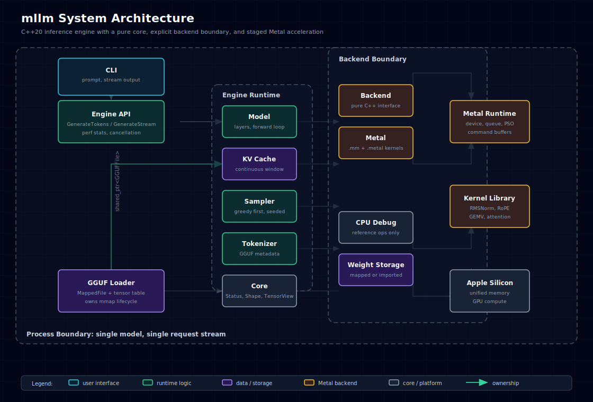
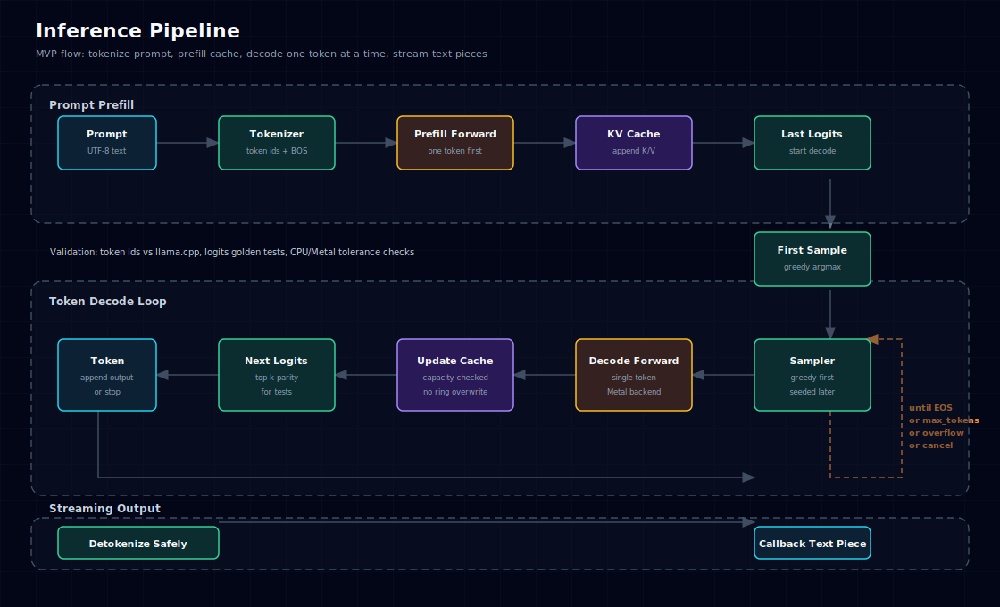
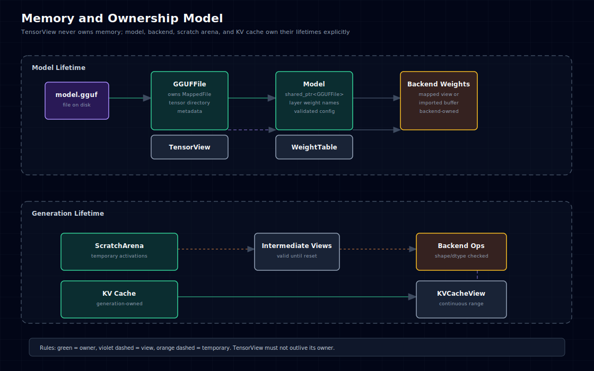

# mllm — LLM Inference Engine for Apple Silicon

`mllm` 是一个面向 Apple Silicon 的本地 LLM 推理引擎。本文档定义首版系统的范围、架构、接口边界、验证策略和分阶段交付计划。

核心策略：先交付一条小而完整的端到端推理路径，以 llama.cpp/MLX 作为正确性和性能参照；再根据 profiling 结果替换热点 kernel。每个阶段都有明确的验收标准。

---

## 0. 范围与验收

### 0.1 MVP 范围

MVP 只做一条完整路径：

- 平台：macOS 14+，Apple Silicon，arm64。
- 语言：C++20 + Objective-C++ 边界文件。
- 构建：Bazel。
- 模型格式：GGUF v3。
- 模型族：LLaMA-compatible decoder-only 模型，先支持 LLaMA 3 / TinyLlama 一类结构相近模型。
- 量化：先支持 F16 和 Q8_0；Q4_0 作为第一轮优化；K-quants 后置。
- 请求模式：单进程、单模型、单请求流式生成。
- 前端：CLI。
- 后端：Metal GPU 优先，CPU fallback 只用于 correctness/debug，不追求性能。

暂不做：

- continuous batching。
- paged KV cache。
- speculative decoding。
- OpenAI HTTP server。
- 多模型热切换。
- Windows/Linux/Intel Mac 支持。
- 自研全部高性能 GEMM/FlashAttention 终态实现。

### 0.2 MVP 成功标准

MVP 完成必须同时满足：

1. `bazel test //cpp/pl/mllm/...` 通过。
2. 能加载一个 GGUF 测试模型，完成 prompt prefill 和至少 64 个 token decode。
3. 固定 seed、greedy sampling 下，前 16 个 token 与 llama.cpp 同模型同 prompt 一致，或 logits top-5 在可解释误差内一致。
4. 无 AddressSanitizer 可见悬垂指针、越界访问、double free。
5. `bench_decode` 输出 tok/s、峰值内存、time-to-first-token，并记录 llama.cpp 同机 baseline。

### 0.3 性能目标的写法

性能目标不直接承诺理论带宽百分比。每个优化阶段都以 baseline 为准：

- P0：端到端正确性。
- P1：decode 速度达到 llama.cpp Metal backend 的 30% 以上。
- P2：decode 速度达到 llama.cpp Metal backend 的 60% 以上。
- P3：对指定模型/芯片/量化组合，追赶或超过 llama.cpp。

只有 benchmark 和 profiler 证明瓶颈后，才引入复杂 kernel 或模板特化。

---

## 1. 总体架构

### 1.1 分层



```
cli
 └── engine
      ├── tokenizer
      ├── loader
      ├── model
      │    ├── kv_cache
      │    └── sampler
      └── backend
           ├── metal
           └── cpu_debug
core
```

职责边界：

- `core`：纯 C++20。只定义 Shape、DType、TensorView、OwnedBuffer、Result、Status 等基础类型。不包含 Metal/Objective-C 类型。
- `loader`：解析 GGUF，拥有 mmap 生命周期，提供权重表。
- `backend`：执行算子。Metal backend 隔离在 `.mm` 文件和 backend 私有头里。
- `model`：组织 transformer 计算图，不直接知道 Metal API。
- `engine`：管理模型、tokenizer、sampler、生成循环和 perf 统计。
- `cli`：薄封装，不放推理逻辑。

### 1.2 端到端数据流



```
model.gguf
  -> MappedFile
  -> GGUFLoader parses metadata/tensor directory
  -> Model owns WeightTable views into MappedFile
  -> Backend imports/copies weights into backend-specific buffers
  -> Engine tokenizes prompt
  -> Model prefill updates KV cache
  -> Decode loop: token -> logits -> sampler -> token
  -> CLI detokenizes streamed pieces
```

MVP 不将权重全程零拷贝作为公开接口承诺。Metal backend 允许在初始化时做一次权重导入或布局转换。是否使用 `newBufferWithBytesNoCopy` 是 backend 优化细节，不影响上层生命周期。

---

## 2. 工程约束

### 2.1 C++ 标准

项目使用 C++20。不能使用 C++23 标准库类型，例如 `std::expected`。

错误返回使用项目内的 `Result<T>`：

```cpp
enum class ErrorCode {
    kOk,
    kInvalidArgument,
    kNotFound,
    kInvalidFormat,
    kUnsupported,
    kOutOfMemory,
    kBackendFailure,
    kCancelled,
    kInternal,
};

struct Status {
    ErrorCode code = ErrorCode::kOk;
    std::string message;

    bool ok() const noexcept { return code == ErrorCode::kOk; }
};

template <typename T>
class Result {
public:
    Result(T value);
    Result(Status status);

    bool ok() const noexcept;
    const Status& status() const noexcept;
    T& value() &;
    const T& value() const&;
    T&& value() &&;
};
```

允许关闭 C++ exceptions，但要满足：

- 项目代码不 `throw`。
- coroutine 不依赖 `std::exception_ptr`。
- Objective-C/Metal API 错误转换为 `Status`。

### 2.2 Objective-C++ 边界

纯 C++ 头文件不得暴露 `id<MTLBuffer>`、`MTLDevice`、Foundation 类型。

Metal 相关类型只出现在：

- `metal/*.mm`
- `metal/*_internal.h`
- 少量 `.h` 中的 opaque handle，例如 `struct MetalBufferHandle;`

上层只依赖 `Backend` 接口和 `BufferHandle` 抽象。

### 2.3 编译选项

建议 `.bazelrc`：

```
build:mllm --cpu=darwin_arm64
build:mllm --macos_minimum_os=14.0
build:mllm --cxxopt=-std=c++20
build:mllm --host_cxxopt=-std=c++20
build:mllm --cxxopt=-fno-rtti
build:mllm --cxxopt=-fno-exceptions
```

不使用 `-fcoroutines` 作为必需项；Clang C++20 coroutine 支持由 `-std=c++20` 提供。若某工具链确实需要额外 flag，由 Bazel toolchain 统一处理。

---

## 3. 核心数据结构

### 3.1 Shape

MVP 支持最多 4 维张量，shape 是值类型。

```cpp
class Shape {
public:
    static constexpr int kMaxRank = 4;

    Shape() = default;
    explicit Shape(std::span<const int64_t> dims);

    int rank() const noexcept;
    int64_t dim(int i) const noexcept;
    int64_t numel() const noexcept;
    std::span<const int64_t> dims() const noexcept;

private:
    std::array<int64_t, kMaxRank> dims_{};
    int rank_ = 0;
};
```

验收：

- rank 越界测试。
- `numel()` 溢出测试。
- reshape 前后 `numel` 一致测试。

### 3.2 TensorView

`TensorView` 是非拥有视图，不负责释放内存。

```cpp
class TensorView {
public:
    TensorView() = default;
    TensorView(void* data, size_t byte_size, DType dtype, Shape shape,
               std::span<const int64_t> strides = {});

    void* data() noexcept;
    const void* data() const noexcept;
    size_t byte_size() const noexcept;
    DType dtype() const noexcept;
    const Shape& shape() const noexcept;
    bool is_contiguous() const noexcept;

    Result<TensorView> reshape(Shape shape) const noexcept;
    Result<TensorView> slice(int dim, int64_t begin, int64_t end) const noexcept;

private:
    void* data_ = nullptr;
    size_t byte_size_ = 0;
    DType dtype_ = DType::kF16;
    Shape shape_;
    std::array<int64_t, Shape::kMaxRank> strides_{};
};
```

规则：

- `TensorView` 不保存 owner。
- 所有返回 `TensorView` 的对象必须在接口文档中声明 owner。
- `TensorView` 不提供 unchecked typed cast 给业务层；backend 内部可以有受控 helper。
- 非连续 view 在 MVP 中只允许 CPU debug 使用；Metal MVP kernel 只接受连续 tensor。

### 3.3 OwnedBuffer

中间激活和 KV cache 使用 owned buffer。

```cpp
class OwnedBuffer {
public:
    static Result<OwnedBuffer> AllocateCpu(size_t bytes, size_t alignment);

    OwnedBuffer(OwnedBuffer&&) noexcept;
    OwnedBuffer& operator=(OwnedBuffer&&) noexcept;
    OwnedBuffer(const OwnedBuffer&) = delete;
    OwnedBuffer& operator=(const OwnedBuffer&) = delete;

    void* data() noexcept;
    const void* data() const noexcept;
    size_t size() const noexcept;

private:
    void* data_ = nullptr;
    size_t size_ = 0;
    void (*deleter_)(void*) = nullptr;
};
```

Metal buffer 由 Metal backend 管理，不塞进 `core::OwnedBuffer`。

---

## 4. GGUF Loader

### 4.1 所有权模型

`GGUFLoader` 拥有 `MappedFile`。`WeightTable` 中的 `TensorView` 都指向该 mmap 区域。因此：

- `Model` 必须持有 `std::shared_ptr<const GGUFFile>` 或移动持有 loader 解析结果。
- 只要模型存在，mmap 不得释放。
- 不允许把权重 `TensorView` 单独长期保存到不持有 owner 的对象中。

### 4.2 接口

```cpp
struct TensorInfo {
    std::string name;
    DType dtype;
    QuantType quant_type;
    Shape shape;
    size_t file_offset = 0;
    size_t byte_size = 0;
};

class GGUFFile {
public:
    static Result<std::shared_ptr<GGUFFile>> Open(std::string path);

    std::string_view architecture() const noexcept;
    Result<ModelConfig> model_config() const;
    std::span<const TensorInfo> tensors() const noexcept;
    Result<TensorView> tensor(std::string_view name) const;

private:
    MappedFile mapped_;
    std::vector<TensorInfo> tensors_;
    std::unordered_map<std::string_view, size_t> name_to_index_;
};
```

### 4.3 MVP 支持的 GGUF 内容

必须支持：

- little-endian GGUF v3 header。
- metadata：architecture、context length、embedding length、head count、kv head count、layer count、rope freq base、norm eps、vocab。
- tensor directory。
- tensor data alignment。
- F16、Q8_0。

暂不支持：

- LoRA adapter。
- split GGUF。
- K-quants。
- MoE metadata。

验收：

- 用小型 fixture GGUF 测 header、metadata、tensor table。
- 与 llama.cpp 打印的 tensor name/shape/dtype 对比。
- 对截断文件、错误 magic、错误 offset 做负例测试。

---

## 5. Backend 设计

### 5.1 原则

MVP backend 以正确性和可替换性优先，首版不追求所有算子模板化。

```cpp
class Backend {
public:
    virtual ~Backend() = default;

    virtual Status ImportWeights(const WeightTable& weights) = 0;

    virtual Status RmsNorm(TensorView out, TensorView x, TensorView weight,
                           float eps) = 0;
    virtual Status MatMul(TensorView out, TensorView x,
                          std::string_view weight_name) = 0;
    virtual Status RoPE(TensorView q, TensorView k, int64_t position,
                        const RopeConfig& config) = 0;
    virtual Status Attention(TensorView out, TensorView q, const KVCacheView& kv,
                             const AttentionConfig& config) = 0;
    virtual Status SwiGLU(TensorView out, TensorView gate, TensorView up) = 0;
    virtual Status AddInPlace(TensorView x, TensorView residual) = 0;
    virtual Status Synchronize() = 0;
};
```

这里允许 virtual。理由：

- Backend dispatch 次数远少于 GPU 内部计算量。
- MVP 更需要清晰边界和可测试性。
- 若 profiling 证明 virtual dispatch 可见，再把内层算子调度模板化。

### 5.2 Metal backend MVP

第一版 Metal backend 可以混合使用：

- 自研简单 elementwise kernels：add、RMSNorm、RoPE、SwiGLU。
- MPS 或简单自研 matmul 路径处理 F16。
- Q8_0 先实现 fused dequant GEMV，作为 decode 路径优化目标。

实现规则：

- `.metal` kernel 必须有 CPU reference 测试。
- 每个 kernel 都要支持非整除维度。
- 每个 kernel launch 前校验 dtype、shape、contiguous。
- command buffer 错误转为 `Status`。
- 不在上层暴露 `id<MTLBuffer>`.

### 5.3 CPU debug backend

CPU backend 只用于：

- 小 shape 单元测试。
- logits reference。
- Metal kernel correctness 对比。

CPU backend 可以慢，但必须简单、确定、易读。

---

## 6. 模型运行时

### 6.1 ModelConfig

```cpp
struct ModelConfig {
    std::string architecture;
    int32_t vocab_size = 0;
    int32_t hidden_size = 0;
    int32_t intermediate_size = 0;
    int32_t num_layers = 0;
    int32_t num_attention_heads = 0;
    int32_t num_kv_heads = 0;
    int32_t head_dim = 0;
    int32_t context_length = 0;
    float rms_norm_eps = 1e-5f;
    float rope_freq_base = 10000.0f;
};
```

`Validate()` 必须检查：

- 所有核心维度大于 0。
- `hidden_size == num_attention_heads * head_dim`。
- `num_attention_heads % num_kv_heads == 0`。
- GGUF tensor shape 与 config 匹配。

### 6.2 TransformerLayer

MVP 不使用 CRTP。每层持有权重名，真正的权重存放在 backend 中。

```cpp
class TransformerLayer {
public:
    Status Forward(TensorView hidden, int32_t position, KVCache& cache,
                   Backend& backend, ScratchArena& scratch) const;

private:
    int32_t layer_index_ = 0;
    LayerWeightNames weights_;
};
```

好处：

- 权重生命周期由 `Model`/`Backend` 管。
- layer 逻辑易于和 llama.cpp 对齐。
- 后续可只对热点子路径做模板化。

### 6.3 Forward 语义

单 token decode：

1. RMSNorm。
2. Q/K/V projection。
3. RoPE applied to Q/K。
4. append K/V to KV cache。
5. attention over valid cache range。
6. output projection。
7. residual add。
8. RMSNorm。
9. gate/up projection。
10. SwiGLU。
11. down projection。
12. residual add。

Prefill MVP 可以先用逐 token 循环实现，保证正确；之后再做 batched prefill 优化。

---

## 7. KV Cache

### 7.1 MVP：连续固定窗口 cache

MVP 使用预分配连续 cache，不使用 ring overwrite。

```cpp
class KVCache {
public:
    static Result<KVCache> Create(const ModelConfig& config, int32_t max_tokens,
                                  DType dtype);

    Status Append(int32_t layer, TensorView key, TensorView value);
    KVCacheView View(int32_t layer) const noexcept;
    int32_t length() const noexcept;
    int32_t capacity() const noexcept;
    void Clear() noexcept;
};
```

行为：

- append 到 `length == capacity` 时返回 `kUnsupported` 或 `kInvalidArgument`，不隐式覆盖。
- context overflow 由 Engine 处理。
- 长上下文截断策略后续单独设计。

理由：

- ring cache 会改变位置编码和 attention 语义。
- ring view 可能不是连续内存，Metal kernel 复杂度会上升。
- MVP 应先确保 logits 正确。

### 7.2 后续：Ring/Paged cache

只有在 MVP 正确且 benchmark 需要时再做：

- ring cache：需要明确滑动窗口、position remap、RoPE 行为。
- paged cache：需要 page table、block allocator、attention kernel 支持。

---

## 8. Tokenizer 与 Sampler

### 8.1 Tokenizer

MVP 支持 GGUF 中的 tokenizer metadata。优先实现 LLaMA BPE/SentencePiece-compatible 路径。

接口：

```cpp
class Tokenizer {
public:
    static Result<Tokenizer> FromGGUF(const GGUFFile& file);
    Result<std::vector<int32_t>> Encode(std::string_view text,
                                        bool add_bos) const;
    Result<std::string> Decode(std::span<const int32_t> tokens) const;
    Result<std::string> DecodeOne(int32_t token) const;
};
```

验收：

- 与 llama.cpp 对同一 prompt 的 token ids 对齐。
- BOS/EOS 行为有测试。
- UTF-8 边界和 byte fallback 有测试。

### 8.2 Sampler

第一版只做 greedy 和 temperature=0。

第二版支持：

- temperature。
- top-k。
- top-p。
- repeat penalty。

采样器必须可设置 seed，保证测试可复现。

---

## 9. Engine 与生成接口

### 9.1 Engine 生命周期

```cpp
class Engine {
public:
    struct Options {
        std::string model_path;
        int32_t context_length = 4096;
        BackendKind backend = BackendKind::kMetal;
    };

    static Result<std::unique_ptr<Engine>> Create(Options options);

    Result<std::vector<int32_t>> GenerateTokens(std::string_view prompt,
                                                GenerateParams params);

    Status GenerateStream(std::string_view prompt, GenerateParams params,
                          std::function<bool(std::string_view)> on_piece);

    const PerfStats& last_perf_stats() const noexcept;
};
```

MVP 先不用 coroutine。流式输出用 callback，减少 coroutine 与 `-fno-exceptions`、生命周期、取消语义之间的复杂度。

coroutine 可以作为后续 API 层包装，但不进入第一版核心。

### 9.2 取消与错误

`on_piece` 返回 `false` 表示用户取消。Engine 返回 `Status{ErrorCode::kCancelled, "cancelled by callback"}`，并在 engine/CLI 测试中覆盖。

GPU 错误、context overflow、tokenizer 错误必须能返回到 CLI，不允许 `abort()`。

---

## 10. 内存管理



### 10.1 ScratchArena

每次生成创建一个 ScratchArena，按最大需要预分配中间激活。

```cpp
class ScratchArena {
public:
    static Result<ScratchArena> Create(size_t bytes, size_t alignment);
    Result<TensorView> AllocateTensor(Shape shape, DType dtype);
    void Reset() noexcept;
};
```

规则：

- layer 内部不得 `new` 中间 tensor。
- decode loop 每 token 后 reset scratch。
- KV cache 和权重不来自 scratch。

### 10.2 权重内存

允许两种实现：

1. `MappedWeightStorage`：权重 view 指向 mmap，Metal 按需导入。
2. `MetalWeightStorage`：初始化时转换/上传到 Metal buffer。

MVP 选择更容易保证正确性的一种。零拷贝只作为 backend 内部优化，不作为接口承诺。

---

## 11. Metal Kernel 交付顺序

### 11.1 第一批 kernel

每个 kernel 都要有 CPU reference 和随机小 shape 测试。

1. `add_in_place_f16`
2. `rms_norm_f16`
3. `rope_f16`
4. `silu_mul_f16`
5. `softmax_f16_debug`

### 11.2 第二批 kernel

1. `gemv_q8_0_f16`
2. `matmul_f16_simple`
3. decode attention simple kernel

### 11.3 暂缓 kernel

以下不进入 MVP：

- FlashAttention v2。
- simdgroup_matrix GEMM。
- Q4_K_M/Q5_K_M/Q6_K。
- pipeline overlap。

这些都需要单独设计和 benchmark，不放在第一版主线里。

---

## 12. 测试策略

### 12.1 单元测试

```
core_test
  Shape, TensorView, Result, ScratchArena

gguf_loader_test
  header, metadata, tensor directory, bad files

tokenizer_test
  encode/decode parity with fixture

sampler_test
  greedy, seeded random paths

kv_cache_test
  append, capacity overflow, view shape

backend_cpu_test
  reference ops

backend_metal_test
  Metal ops vs CPU reference

model_test
  one layer tiny config vs CPU reference

engine_test
  tiny model fixture end-to-end
```

### 12.2 Golden 测试

准备一个小模型 fixture 或 tiny random model：

- 固定 config。
- 固定权重。
- 固定 prompt tokens。
- 保存每层关键 tensor 的 checksum 或 logits。

每次修改 backend/kernel，都跑 golden 测试。

### 12.3 与 llama.cpp 对齐

至少保留一个脚本或文档化命令：

```
llama-cli -m model.gguf -p "..." -n 16 --temp 0 --seed 1
```

本项目同 prompt、同 greedy 输出 token ids，并比较。

---

## 13. Benchmark 策略

### 13.1 bench_decode

输出：

- model path。
- quant type。
- prompt tokens。
- generated tokens。
- prefill ms。
- decode ms。
- tok/s。
- peak RSS。
- backend。
- git commit。

### 13.2 bench_ops

每个 kernel 单独 benchmark：

- RMSNorm hidden sizes: 1024, 2048, 4096, 8192。
- GEMV rows/cols 与目标模型匹配。
- Attention seq lengths: 128, 512, 2048, 4096。

### 13.3 性能决策规则

只有当 profiler 证明某模块超过总耗时 10%，才允许引入更复杂实现。优化 PR 必须包含：

- benchmark before/after。
- correctness test。
- fallback 行为。

---

## 14. Bazel 结构

建议目录：

```
cpp/pl/mllm/
├── BUILD
├── SPEC.md
├── core/
├── loader/
├── tokenizer/
├── sampler/
├── kv_cache/
├── backend/
│   ├── backend.h
│   ├── cpu/
│   └── metal/
├── model/
├── engine/
├── cli/
├── bench/
└── ut/
```

关键点：

- `core` 不依赖 Metal。
- `backend/metal` 用 `objc_library` 或 `cc_library` + `.mm`，只暴露纯 C++ public header。
- `.metal` 文件进入 `data` 或通过 `metal_library` 预编译。
- 测试 fixture 放 `ut/testdata`。

---

## 15. 分阶段计划

### Phase 1：基础设施与 GGUF

交付：

- `core`：Status/Result、Shape、TensorView、OwnedBuffer、ScratchArena。
- `loader`：MappedFile、GGUF header/metadata/tensor table。
- Bazel build/test 跑通。

验收：

- core/loader 单测通过。
- 能列出 GGUF 所有 tensor name/shape/quant type。

### Phase 2：Tokenizer、Sampler、CPU Reference

交付：

- Tokenizer 从 GGUF metadata 构建。
- Greedy sampler。
- CPU debug backend 的基础 ops。

验收：

- tokenizer token ids 与 llama.cpp 对齐。
- CPU backend 小 shape ops 与 naive reference 对齐。

### Phase 3：单层和整模型正确性

交付：

- ModelConfig validate。
- TransformerLayer。
- 连续 KV cache。
- Tiny model end-to-end。

验收：

- tiny fixture logits golden test 通过。
- greedy decode 能稳定输出。

### Phase 4：Metal MVP

交付：

- Metal device/command queue/pipeline cache。
- 第一批 elementwise kernel。
- Metal backend 接入 Engine。

验收：

- Metal ops vs CPU reference。
- 同 prompt 下 Metal/CPU logits 误差在阈值内。

### Phase 5：Decode 性能优化

交付：

- Q8_0 fused GEMV。
- decode attention simple kernel。
- `bench_decode` 与 llama.cpp baseline 对比。

验收：

- P1 性能目标达成：>= llama.cpp Metal decode 30%。
- 所有 correctness tests 仍通过。

### Phase 6：扩展量化和高级 kernel

候选：

- Q4_0。
- Q4_K_M。
- simdgroup_matrix GEMM。
- FlashAttention/paged attention。
- coroutine streaming API。
- HTTP server。

每个候选都需要单独小设计文档和 benchmark 证明。

---

## 16. 主要风险与应对

| 风险 | 影响 | 应对 |
|---|---|---|
| GGUF/tokenizer 细节不兼容 | 输出完全不对 | 先与 llama.cpp token ids/tensor table 对齐 |
| TensorView 悬垂 | 难查 crash | 强制 owner 文档；Model 持有 GGUFFile |
| Metal kernel 正确性差 | 性能优化无意义 | 所有 kernel 必须 CPU reference 对比 |
| 一开始优化过度 | 工期失控 | MVP 禁止 FlashAttention/K-quants/continuous batching |
| C++/ObjC++ 边界污染 | 构建困难 | core public header 禁止 Metal 类型 |
| 性能目标虚高 | 项目判断失真 | benchmark 只跟同机 llama.cpp baseline 比 |

---

## 17. 参考实现

| 项目 | 用途 |
|---|---|
| llama.cpp | GGUF、tokenizer、量化、baseline |
| MLX | Apple unified memory 和 Metal 设计参考 |
| whisper.cpp | ggml/Metal 工程组织参考 |
| Apple Metal docs | Metal buffer、command queue、kernel 编译 |

---

## 18. 设计决策摘要

- 用 virtual backend 做 MVP，暂不使用 CRTP 作为主架构。
- 不把零拷贝作为上层 API 承诺。
- TensorView 非拥有，owner 必须由 Model/GGUFFile/Backend 明确持有。
- MVP 不使用 coroutine。
- MVP 不使用 ring KV cache。
- MVP 不使用 C++23 `std::expected`。
- 所有性能优化必须有 benchmark 和 correctness test。
