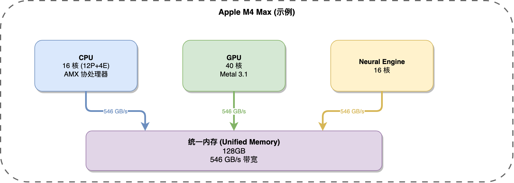
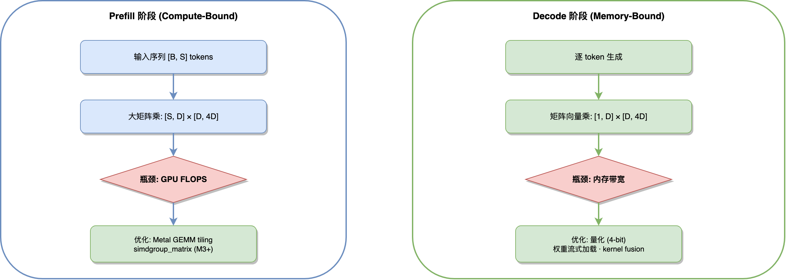
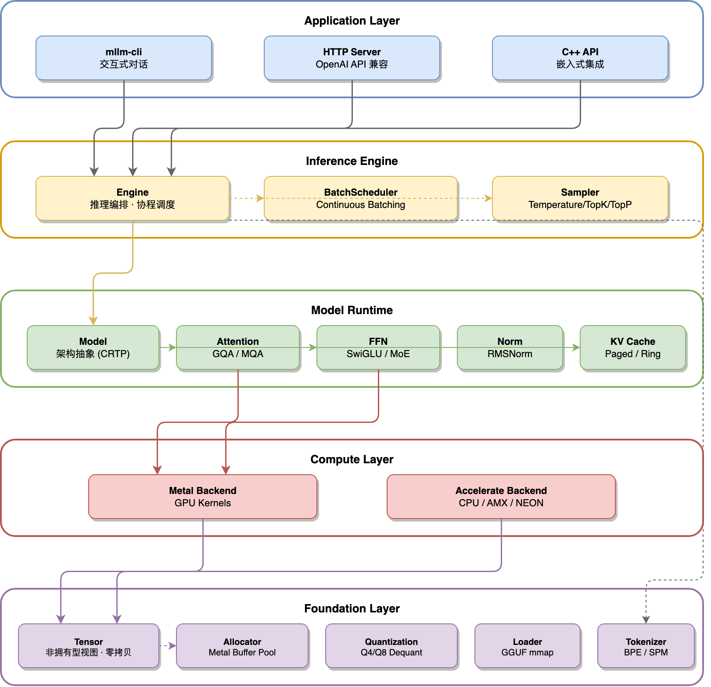
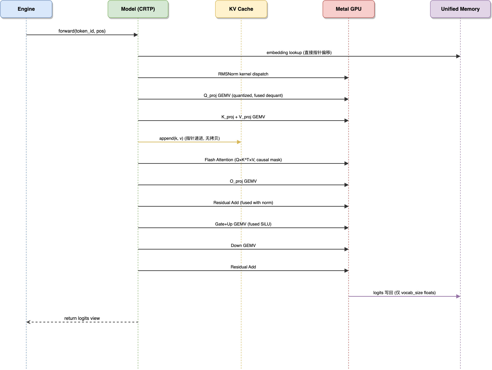
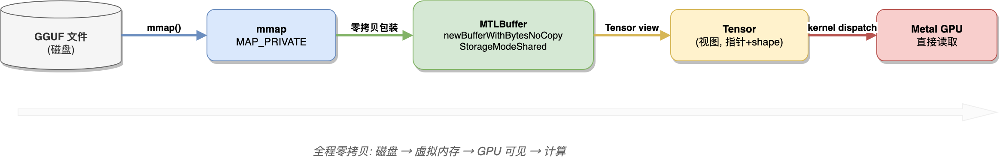

# mllm — LLM Inference Engine for Apple Silicon

## 项目概述

基于 C++20 的轻量级 LLM 推理引擎，专为 Apple M 系列芯片设计。以极致的内存带宽利用和 Metal GPU 算力调度为核心，通过统一内存零拷贝、定制 Metal Shader、编译期多态和协程流式生成等技术，实现本地高性能推理。

**项目代号**: `mllm` (Metal LLM)

**目标硬件**: Apple M1 / M2 / M3 / M4 / M5 全系列（含 Pro / Max / Ultra 变体）

**构建系统**: Bazel (bzlmod)

**语言标准**: C++20 (`-std=c++20`, Clang 15+)

**最低系统**: macOS 14.0 (Sonoma)，Metal 3.1

---

## 1. 设计原则

### 1.1 核心目标

- **极致带宽利用**: Decode 阶段为 memory-bound，目标达到芯片理论内存带宽 85%+ 利用率
- **GPU 算力最大化**: Prefill 阶段为 compute-bound，Metal GEMM kernel 目标达到 MPS 基准性能的 90%+
- **零拷贝贯穿全链路**: 模型加载（mmap）→ Metal Buffer → KV Cache → 输出，全程无冗余拷贝
- **编译期决策优先**: 通过 C++20 concepts + `if constexpr` + CRTP 将运行时分发开销降到零
- **无第三方 ML 依赖**: 仅依赖 macOS 系统框架（Metal、Accelerate、Foundation）

### 1.2 非目标

- 不支持训练（仅推理）
- 不支持非 Apple 平台（不做跨平台抽象层）
- 不支持多机分布式推理

### 1.3 C++20 核心理念

本项目将 C++20 作为**设计语言**而非仅仅语法糖：

| C++20 特性 | 在本项目中的角色 |
|---|---|
| Concepts | 替代虚函数表的编译期接口约束，消除 Backend/Sampler 等热路径上的间接调用开销 |
| Coroutines | Token 流式生成的零开销抽象，无回调嵌套、无线程切换 |
| `std::span` | Tensor slice / view 的非拥有型视图，避免 `shared_ptr` 引用计数 |
| `constexpr` + `if constexpr` | 量化类型分发在编译期完成，消除 switch/vtable 分支 |
| Designated Initializers | 配置结构体语义化构造，提高可读性 |
| `[[likely]]` / `[[unlikely]]` | Decode 热路径上的分支预测提示 |
| `std::bit_cast` | 量化反量化中 fp16↔uint16 的零开销类型转换 |
| Three-way comparison | Tensor Shape 比较的简洁实现 |

---

## 2. 硬件背景与性能模型

### 2.1 Apple Silicon 计算层次

> 📐 原始图表文件: [doc/apple_silicon_architecture.drawio](doc/apple_silicon_architecture.drawio)



### 2.2 推理阶段性能模型

> 📐 原始图表文件: [doc/inference_performance_model.drawio](doc/inference_performance_model.drawio)



### 2.3 Decode 阶段带宽分析

以 7B 模型 Q4_K_M 量化为例：

- 模型权重: ~4.0 GB
- 每 token 需读取全部权重一次: 4.0 GB / token
- M4 Pro 内存带宽: 273 GB/s
- **理论极限 decode 速度**: 273 / 4.0 ≈ 68 tok/s
- **目标（85% 带宽利用率）**: ~58 tok/s

核心优化策略：最小化每次 decode step 的内存访问量，除权重加载外的一切额外读写都是浪费。

---

## 3. 系统架构

### 3.1 分层架构

> 📐 原始图表文件: [doc/layered_architecture.drawio](doc/layered_architecture.drawio)



### 3.2 数据流（单次 Decode Step）

> 📐 原始图表文件: [doc/decode_data_flow.drawio](doc/decode_data_flow.drawio)



---

## 4. 目录结构

```
cpp/pl/mllm/
├── BUILD
├── SPEC.md
├── core/
│   ├── BUILD
│   ├── tensor.h              # Tensor: 非拥有型视图，16 bytes 栈对象
│   ├── tensor.cpp
│   ├── dtype.h               # DType enum + constexpr 属性查询
│   ├── shape.h               # Shape: std::array 固定维度，编译期推导
│   ├── buffer.h              # Buffer: Metal shared memory 抽象
│   ├── buffer.cpp
│   ├── allocator.h           # Arena 分配器 (Metal buffer pool)
│   ├── allocator.cpp
│   ├── platform.h            # 平台探测 (constexpr GPU family 识别)
│   └── log.h                 # std::format 日志
├── metal/
│   ├── BUILD
│   ├── device.h              # MTLDevice 单例 + feature 探测
│   ├── device.mm
│   ├── command_encoder.h     # 命令编码器 RAII 封装
│   ├── command_encoder.mm
│   ├── pipeline_cache.h      # PSO 缓存 (LRU, thread-safe)
│   ├── pipeline_cache.mm
│   ├── kernel_dispatch.h     # 模板化 kernel 调度器
│   ├── kernel_dispatch.mm
│   ├── ops/
│   │   ├── gemm.metal        # FP16 tiled GEMM (simdgroup_matrix)
│   │   ├── gemv_q4.metal     # Q4_0/Q4_K fused dequant GEMV
│   │   ├── gemv_q8.metal     # Q8_0 GEMV
│   │   ├── attention.metal   # Flash Attention v2 (causal)
│   │   ├── rms_norm.metal    # Fused RMSNorm + residual add
│   │   ├── rope.metal        # RoPE (支持 NTK-aware scaling)
│   │   ├── silu_mul.metal    # Fused SiLU × gate
│   │   ├── softmax.metal     # Online softmax (数值稳定)
│   │   ├── copy.metal        # 类型转换 + 布局变换
│   │   └── reduce.metal      # Parallel reduction
│   └── metal_backend.h
├── cpu/
│   ├── BUILD
│   ├── cpu_backend.h
│   ├── cpu_backend.cpp
│   ├── neon_kernels.h        # NEON intrinsics (Q4 dequant + dot)
│   └── amx_ops.h             # AMX 矩阵运算 (via Accelerate)
├── model/
│   ├── BUILD
│   ├── model.h               # Model concept 定义
│   ├── config.h              # ModelConfig (constexpr 验证)
│   ├── layer.h               # TransformerLayer CRTP 基类
│   ├── attention.h           # GQA/MQA 实现 (模板化 head 配置)
│   ├── ffn.h                 # SwiGLU FFN (fused gate)
│   ├── norm.h                # RMSNorm (epsilon 编译期常量)
│   ├── rope.h                # RoPE 频率表预计算
│   └── archs/
│       ├── BUILD
│       ├── llama.h           # LLaMA / LLaMA-3 系列
│       ├── llama.cpp
│       ├── qwen2.h           # Qwen2 / Qwen2.5 系列
│       ├── qwen2.cpp
│       ├── phi3.h            # Phi-3 系列
│       └── phi3.cpp
├── quant/
│   ├── BUILD
│   ├── quant_type.h          # 量化块 POD 结构 (static_assert 大小)
│   ├── dequantize.h          # constexpr 分发 + CRTP kernel 选择
│   └── dequantize.cpp
├── kv_cache/
│   ├── BUILD
│   ├── kv_cache.h            # KVCache concept
│   ├── ring_cache.h          # Ring buffer 实现 (固定窗口)
│   ├── ring_cache.cpp
│   ├── paged_cache.h         # Paged KV cache (动态扩展)
│   └── paged_cache.cpp
├── sampler/
│   ├── BUILD
│   ├── sampler.h             # Sampler concept
│   ├── greedy.h              # Greedy (argmax, branchless)
│   ├── top_k.h               # Top-K (partial sort)
│   ├── top_p.h               # Top-P / Nucleus
│   ├── temperature.h         # Temperature scaling
│   ├── repetition.h          # Repetition penalty
│   ├── min_p.h               # Min-P 采样
│   └── chain.h               # 采样器组合链 (variadic template)
├── tokenizer/
│   ├── BUILD
│   ├── tokenizer.h           # Tokenizer concept
│   ├── bpe.h                 # Byte-Pair Encoding
│   ├── bpe.cpp
│   ├── vocab.h               # 词表 (flat_hash_map, SSO 优化)
│   └── vocab.cpp
├── loader/
│   ├── BUILD
│   ├── model_loader.h        # Loader concept
│   ├── gguf_loader.h         # GGUF 解析 + mmap
│   ├── gguf_loader.cpp
│   ├── gguf_format.h         # GGUF 二进制格式常量
│   └── mmap_reader.h         # mmap + Metal newBufferWithBytesNoCopy
├── engine/
│   ├── BUILD
│   ├── engine.h              # 推理引擎主接口
│   ├── engine.cpp
│   ├── generator.h           # C++20 协程 TokenGenerator
│   ├── request.h             # 推理请求 (值语义, trivially movable)
│   └── batch_scheduler.h     # Continuous batching 调度
├── server/
│   ├── BUILD
│   ├── http_server.h         # 轻量 HTTP/1.1 (io_uring/kqueue)
│   ├── http_server.cpp
│   └── openai_api.h          # /v1/chat/completions 兼容
├── cli/
│   ├── BUILD
│   ├── main.cpp
│   └── chat.cpp              # 交互式 REPL
├── bench/
│   ├── BUILD
│   ├── gemm_bench.cpp        # Metal GEMM vs MPS 基准
│   ├── decode_bench.cpp      # 端到端 decode 吞吐
│   └── prefill_bench.cpp     # Prefill 吞吐
└── ut/
    ├── BUILD
    ├── tensor_test.cpp
    ├── gguf_loader_test.cpp
    ├── tokenizer_test.cpp
    ├── kv_cache_test.cpp
    ├── sampler_test.cpp
    └── engine_test.cpp
```

---

## 5. 核心接口设计

### 5.1 Tensor — 极致轻量的非拥有型视图

设计决策：Tensor 本身是一个 **trivially copyable** 的小对象（≤64 bytes），不拥有内存，类似 `std::string_view` 对 `std::string` 的关系。实际内存由 `Buffer` 管理。

```cpp
// core/tensor.h
#pragma once

#include <cstddef>
#include <cstdint>
#include <span>
#include <cassert>

#include "dtype.h"
#include "shape.h"
#include "buffer.h"

namespace mllm {

/// 非拥有型张量视图，栈分配，trivially copyable
/// 所有 view 操作（slice, transpose, reshape）均为 O(1) 指针运算
class Tensor {
public:
    static constexpr int kMaxDims = 4;

    constexpr Tensor() noexcept = default;

    Tensor(void* data, Shape shape, DType dtype,
           std::span<const int64_t> strides = {}) noexcept;

    // 从 Buffer 构造 (带偏移)
    Tensor(Buffer& buffer, size_t byte_offset,
           Shape shape, DType dtype) noexcept;

    // ─── 属性访问 (全部 constexpr/noexcept) ───
    [[nodiscard]] constexpr auto shape() const noexcept -> const Shape&;
    [[nodiscard]] constexpr auto dtype() const noexcept -> DType;
    [[nodiscard]] constexpr auto ndim() const noexcept -> int;
    [[nodiscard]] constexpr auto numel() const noexcept -> int64_t;
    [[nodiscard]] constexpr auto nbytes() const noexcept -> size_t;
    [[nodiscard]] constexpr auto stride(int dim) const noexcept -> int64_t;
    [[nodiscard]] constexpr auto is_contiguous() const noexcept -> bool;

    // ─── 零拷贝数据访问 (统一内存, CPU/GPU 均可直接访问) ───
    [[nodiscard]] auto data_ptr() noexcept -> void*;
    [[nodiscard]] auto data_ptr() const noexcept -> const void*;

    template <typename T>
    [[nodiscard]] auto as() noexcept -> T* {
        assert(sizeof(T) == dtype_size(dtype_));
        return static_cast<T*>(data_ptr());
    }

    template <typename T>
    [[nodiscard]] auto as() const noexcept -> const T* {
        assert(sizeof(T) == dtype_size(dtype_));
        return static_cast<const T*>(data_ptr());
    }

    // ─── View 操作 (O(1), 无拷贝, 无分配) ───
    [[nodiscard]] auto view(Shape new_shape) const noexcept -> Tensor;
    [[nodiscard]] auto slice(int dim, int64_t start, int64_t end) const noexcept -> Tensor;
    [[nodiscard]] auto transpose(int dim0, int dim1) const noexcept -> Tensor;
    [[nodiscard]] auto squeeze(int dim) const noexcept -> Tensor;
    [[nodiscard]] auto unsqueeze(int dim) const noexcept -> Tensor;

    // ─── Metal interop ───
    [[nodiscard]] auto metal_buffer() const noexcept -> id<MTLBuffer>;
    [[nodiscard]] auto metal_offset() const noexcept -> size_t;

private:
    void* data_ = nullptr;
    Shape shape_{};
    DType dtype_ = DType::F16;
    int64_t strides_[kMaxDims] = {};
    int ndim_ = 0;
    // Metal buffer 引用 (仅用于 GPU dispatch, 不影响生命周期)
    void* mtl_buffer_ = nullptr;  // id<MTLBuffer> 的 type-erased 指针
    size_t mtl_offset_ = 0;
};

static_assert(sizeof(Tensor) <= 96, "Tensor should be a small stack object");

} // namespace mllm
```

### 5.2 Buffer — 统一内存生命周期管理

```cpp
// core/buffer.h
#pragma once

#include <cstddef>
#include <memory>

namespace mllm {

/// Metal Shared Buffer 的 RAII 封装
/// 利用 MTLResourceStorageModeShared 实现 CPU/GPU 零拷贝
class Buffer {
public:
    // 分配新的 Metal shared buffer
    static auto allocate(size_t size) -> std::unique_ptr<Buffer>;

    // 从 mmap 地址创建零拷贝 buffer (newBufferWithBytesNoCopy)
    static auto from_mmap(void* addr, size_t size) -> std::unique_ptr<Buffer>;

    ~Buffer();
    Buffer(const Buffer&) = delete;
    Buffer& operator=(const Buffer&) = delete;
    Buffer(Buffer&&) noexcept;
    Buffer& operator=(Buffer&&) noexcept;

    [[nodiscard]] auto data() noexcept -> void*;
    [[nodiscard]] auto data() const noexcept -> const void*;
    [[nodiscard]] auto size() const noexcept -> size_t;
    [[nodiscard]] auto metal_buffer() const noexcept -> id<MTLBuffer>;

private:
    struct Impl;
    std::unique_ptr<Impl> impl_;
    explicit Buffer(std::unique_ptr<Impl> impl);
};

} // namespace mllm
```

### 5.3 Compute Backend — 编译期多态 (Concepts + CRTP)

**关键设计决策**: 不使用虚函数。Decode 热路径上每个 token 需要调用数百次后端函数，虚函数表的间接跳转会造成 icache miss。通过 concepts 约束 + 模板参数实现零开销抽象。

```cpp
// core/backend.h
#pragma once

#include <concepts>
#include "tensor.h"

namespace mllm {

/// Backend 接口约束 — 编译期检查，零运行时开销
template <typename B>
concept ComputeBackend = requires(B& backend, Tensor& out,
                                   const Tensor& a, const Tensor& b,
                                   const Tensor& weight, float scalar) {
    // 矩阵运算
    { backend.gemm(out, a, b) } noexcept;
    { backend.gemv(out, a, b) } noexcept;
    { backend.gemv_quantized(out, a, b) } noexcept;

    // 归一化
    { backend.rms_norm(out, a, weight, scalar) } noexcept;

    // 位置编码
    { backend.rope(out, a, int{}, float{}) } noexcept;

    // 激活函数 (fused)
    { backend.silu_mul(out, a, b) } noexcept;

    // 注意力
    { backend.flash_attention(out, a, b, weight, scalar, bool{}) } noexcept;

    // 逐元素
    { backend.add(out, a, b) } noexcept;
    { backend.mul_scalar(out, a, scalar) } noexcept;

    // 同步
    { backend.synchronize() } noexcept;
};

/// Sampler 接口约束
template <typename S>
concept Sampler = requires(S& sampler, const Tensor& logits) {
    { sampler.sample(logits) } -> std::same_as<int32_t>;
    { sampler.reset() } noexcept;
};

/// KVCache 接口约束
template <typename C>
concept KVCachePolicy = requires(C& cache, int layer,
                                  const Tensor& k, const Tensor& v) {
    { cache.append(layer, k, v) } noexcept;
    { cache.key_at(layer, int{}) } -> std::convertible_to<Tensor>;
    { cache.value_at(layer, int{}) } -> std::convertible_to<Tensor>;
    { cache.current_length() } -> std::convertible_to<int>;
    { cache.clear() } noexcept;
};

/// Model 接口约束
template <typename M>
concept LLModel = requires(M& model, const Tensor& input, int pos) {
    { model.forward(input, pos) } -> std::convertible_to<Tensor>;
    { model.config() } -> std::convertible_to<const auto&>;
    { model.reset_cache() } noexcept;
};

} // namespace mllm
```

### 5.4 Model Layer — CRTP 消除虚函数

```cpp
// model/layer.h
#pragma once

#include "core/backend.h"
#include "core/tensor.h"
#include "model/config.h"

namespace mllm {

/// CRTP 基类: TransformerLayer
/// 子类通过 CRTP 注入具体实现, 编译器可完全内联热路径
template <typename Derived, ComputeBackend Backend>
class TransformerLayer {
public:
    explicit TransformerLayer(const LayerConfig& config, Backend& backend)
        : config_(config), backend_(backend) {}

    auto forward(Tensor& hidden, int pos) noexcept -> Tensor {
        // Pre-norm
        backend_.rms_norm(norm_out_, hidden, attn_norm_weight_,
                          config_.norm_eps);

        // Self-attention (子类可特化 GQA/MQA)
        auto attn_out = static_cast<Derived*>(this)->attention(norm_out_, pos);

        // Residual connection (fused add)
        backend_.add(hidden, hidden, attn_out);

        // Post-attention norm
        backend_.rms_norm(norm_out_, hidden, ffn_norm_weight_,
                          config_.norm_eps);

        // FFN (子类可特化 SwiGLU/MoE)
        auto ffn_out = static_cast<Derived*>(this)->feed_forward(norm_out_);

        // Residual connection
        backend_.add(hidden, hidden, ffn_out);

        return hidden;
    }

protected:
    LayerConfig config_;
    Backend& backend_;
    Tensor attn_norm_weight_;
    Tensor ffn_norm_weight_;
    Tensor norm_out_;  // 预分配的中间 buffer
};

} // namespace mllm
```

### 5.5 Engine — 协程流式生成器

```cpp
// engine/generator.h
#pragma once

#include <coroutine>
#include <cstdint>
#include <utility>
#include <iterator>
#include <ranges>

namespace mllm {

/// 零开销协程 Token 生成器
/// 支持 range-based for, std::ranges 管道操作
class TokenGenerator {
public:
    struct promise_type {
        int32_t current_token_ = -1;
        std::exception_ptr exception_ = nullptr;

        auto get_return_object() -> TokenGenerator {
            return TokenGenerator{
                std::coroutine_handle<promise_type>::from_promise(*this)};
        }
        auto initial_suspend() noexcept -> std::suspend_always { return {}; }
        auto final_suspend() noexcept -> std::suspend_always { return {}; }
        auto yield_value(int32_t token) noexcept -> std::suspend_always {
            current_token_ = token;
            return {};
        }
        void return_void() noexcept {}
        void unhandled_exception() noexcept {
            exception_ = std::current_exception();
        }
    };

    using handle_type = std::coroutine_handle<promise_type>;

    // ─── Iterator 支持 (input_iterator, 兼容 std::ranges) ───
    class Iterator {
    public:
        using iterator_concept = std::input_iterator_tag;
        using value_type = int32_t;
        using difference_type = std::ptrdiff_t;

        Iterator() noexcept = default;
        explicit Iterator(handle_type h) noexcept : handle_(h) {}

        auto operator++() -> Iterator& {
            handle_.resume();
            if (handle_.done()) handle_ = nullptr;
            return *this;
        }
        void operator++(int) { ++(*this); }

        [[nodiscard]] auto operator*() const noexcept -> int32_t {
            return handle_.promise().current_token_;
        }

        [[nodiscard]] auto operator==(std::default_sentinel_t) const noexcept -> bool {
            return !handle_ || handle_.done();
        }

    private:
        handle_type handle_ = nullptr;
    };

    auto begin() -> Iterator {
        if (handle_) {
            handle_.resume();
            if (handle_.done()) return Iterator{nullptr};
        }
        return Iterator{handle_};
    }
    auto end() noexcept -> std::default_sentinel_t { return {}; }

    // ─── 生命周期 ───
    explicit TokenGenerator(handle_type h) noexcept : handle_(h) {}
    ~TokenGenerator() { if (handle_) handle_.destroy(); }
    TokenGenerator(TokenGenerator&& o) noexcept
        : handle_(std::exchange(o.handle_, nullptr)) {}
    TokenGenerator& operator=(TokenGenerator&& o) noexcept {
        if (this != &o) {
            if (handle_) handle_.destroy();
            handle_ = std::exchange(o.handle_, nullptr);
        }
        return *this;
    }
    TokenGenerator(const TokenGenerator&) = delete;
    TokenGenerator& operator=(const TokenGenerator&) = delete;

private:
    handle_type handle_ = nullptr;
};

static_assert(std::ranges::input_range<TokenGenerator>,
              "TokenGenerator must satisfy input_range");

} // namespace mllm
```

### 5.6 Engine 主接口

```cpp
// engine/engine.h
#pragma once

#include <string>
#include <string_view>
#include <functional>
#include <expected>
#include <memory>

#include "generator.h"
#include "request.h"

namespace mllm {

enum class EngineError {
    ModelLoadFailed,
    OutOfMemory,
    ContextOverflow,
    InvalidInput,
};

struct GenerateParams {
    float temperature = 0.7f;
    int32_t top_k = 40;
    float top_p = 0.9f;
    float min_p = 0.05f;
    float repetition_penalty = 1.1f;
    int32_t max_tokens = 2048;
    int32_t seed = -1;  // -1 = random
};

class Engine {
public:
    struct Options {
        std::string model_path;
        int32_t context_length = 4096;
        int32_t batch_size = 1;
        bool use_mmap = true;
        int32_t gpu_layers = -1;  // -1 = all layers on GPU
    };

    static auto create(const Options& opts) -> std::expected<Engine, EngineError>;
    ~Engine();
    Engine(Engine&&) noexcept;
    Engine& operator=(Engine&&) noexcept;

    // ─── 流式生成 (C++20 协程, 零拷贝) ───
    [[nodiscard]] auto generate(std::string_view prompt,
                                const GenerateParams& params = {}) -> TokenGenerator;

    // ─── 同步生成 ───
    [[nodiscard]] auto generate_text(std::string_view prompt,
                                     const GenerateParams& params = {}) -> std::string;

    // ─── 回调式流式生成 ───
    using TokenCallback = std::function<bool(std::string_view piece)>;
    void generate_stream(std::string_view prompt,
                         TokenCallback callback,
                         const GenerateParams& params = {});

    // ─── 诊断 ───
    [[nodiscard]] auto model_name() const noexcept -> std::string_view;
    [[nodiscard]] auto context_length() const noexcept -> int32_t;
    [[nodiscard]] auto memory_usage_mb() const noexcept -> float;

    struct PerfStats {
        float prefill_tokens_per_sec;
        float decode_tokens_per_sec;
        float time_to_first_token_ms;
        size_t peak_memory_bytes;
    };
    [[nodiscard]] auto last_perf_stats() const noexcept -> PerfStats;

private:
    struct Impl;
    std::unique_ptr<Impl> impl_;
    explicit Engine(std::unique_ptr<Impl> impl);
};

} // namespace mllm
```

---

## 6. Metal Shader 设计

### 6.1 设计原则

- **Fused Kernels 优先**: 减少 kernel launch 次数和中间结果写回。例如 `rms_norm + residual_add` 融合、`silu × gate` 融合
- **对齐 SIMD-group 宽度**: Apple GPU SIMD width = 32，所有 threadgroup 尺寸为 32 的倍数
- **最大化 Threadgroup Memory**: 作为 L1 cache 使用，减少全局内存往返
- **simdgroup_matrix (M3+)**: 利用硬件矩阵加速单元做 8×8 块乘

### 6.2 GEMM Kernel（Prefill 核心路径）

```metal
// metal/ops/gemm.metal
#include <metal_stdlib>
using namespace metal;

struct GemmParams {
    uint M, N, K;
    uint lda, ldb, ldc;
};

// Tiling: 每个 threadgroup 计算 C 的一个 TILE_M × TILE_N 子块
// 使用 simdgroup_matrix 做 8×8 子块乘累加
constant constexpr uint TILE_M = 64;
constant constexpr uint TILE_N = 64;
constant constexpr uint TILE_K = 32;

kernel void gemm_f16(
    device const half* A [[buffer(0)]],
    device const half* B [[buffer(1)]],
    device half* C [[buffer(2)]],
    constant GemmParams& params [[buffer(3)]],
    uint2 group_id [[threadgroup_position_in_grid]],
    uint simd_lane [[thread_index_in_simdgroup]],
    uint simd_id [[simdgroup_index_in_threadgroup]]
) {
    // 1. 每个 simdgroup 负责 C 的 8×8 子块
    // 2. 外层循环: 沿 K 维度分块迭代
    // 3. 每次迭代:
    //    a. 协同加载 A[TILE_M×TILE_K] 和 B[TILE_K×TILE_N] 到 threadgroup memory
    //    b. threadgroup_barrier(mem_flags::mem_threadgroup)
    //    c. simdgroup_matrix multiply-accumulate
    // 4. 循环结束后将累加结果写回 C

    threadgroup half As[TILE_M * TILE_K];
    threadgroup half Bs[TILE_K * TILE_N];

    simdgroup_matrix<half, 8, 8> acc[4][4] = {};  // 8×8 × 4×4 = 32×32 per simdgroup

    for (uint k_block = 0; k_block < params.K; k_block += TILE_K) {
        // 协同加载 ...
        threadgroup_barrier(mem_flags::mem_threadgroup);

        // simdgroup_matrix 乘累加
        for (uint kk = 0; kk < TILE_K; kk += 8) {
            simdgroup_matrix<half, 8, 8> a_frag, b_frag;
            // simdgroup_load + multiply_accumulate ...
        }
        threadgroup_barrier(mem_flags::mem_threadgroup);
    }
    // 写回 C ...
}
```

### 6.3 量化 GEMV Kernel（Decode 核心路径）

```metal
// metal/ops/gemv_q4.metal
#include <metal_stdlib>
using namespace metal;

struct GemvQ4Params {
    uint out_features;   // N (输出维度)
    uint in_features;    // K (输入维度)
    uint group_size;     // 量化组大小 (32)
};

// 设计要点:
// - 每个 threadgroup 负责输出向量的 ROWS_PER_GROUP 个元素
// - 每个线程处理多个量化组，最大化计算/访存比
// - 反量化在寄存器中完成，不写回 threadgroup memory
// - 使用 simd_sum 做组内归约，避免 atomic

constant constexpr uint ROWS_PER_GROUP = 4;
constant constexpr uint THREADS_PER_ROW = 256;

kernel void gemv_q4_0(
    device const uint8_t* weights [[buffer(0)]],   // packed int4 (2 per byte)
    device const half* scales [[buffer(1)]],        // fp16 scale per group
    device const half* input [[buffer(2)]],         // [K] 输入向量
    device half* output [[buffer(3)]],              // [N] 输出向量
    constant GemvQ4Params& params [[buffer(4)]],
    uint tid [[thread_position_in_threadgroup]],
    uint gid [[threadgroup_position_in_grid]]
) {
    const uint row = gid * ROWS_PER_GROUP + tid / THREADS_PER_ROW;
    if (row >= params.out_features) return;

    const uint lane = tid % THREADS_PER_ROW;
    const uint groups_per_row = params.in_features / params.group_size;
    float sum = 0.0f;

    // 每个线程处理 stride 个量化组
    for (uint g = lane; g < groups_per_row; g += THREADS_PER_ROW) {
        const half scale = scales[row * groups_per_row + g];
        const uint data_offset = (row * groups_per_row + g) * (params.group_size / 2);

        // 反量化 + dot product (在寄存器中完成)
        for (uint i = 0; i < params.group_size / 2; ++i) {
            uint8_t packed = weights[data_offset + i];
            int8_t w0 = int8_t(packed & 0x0F) - 8;
            int8_t w1 = int8_t(packed >> 4) - 8;
            uint idx = g * params.group_size + i * 2;
            sum += float(scale) * (float(w0) * float(input[idx]) +
                                   float(w1) * float(input[idx + 1]));
        }
    }

    // SIMD 归约
    sum = simd_sum(sum);
    if (lane == 0) {
        output[row] = half(sum);
    }
}
```

### 6.4 Fused RMSNorm + Residual

```metal
// metal/ops/rms_norm.metal
// 融合 residual add + RMSNorm, 减少一次全局内存读写

kernel void fused_rms_norm_residual(
    device const half* input [[buffer(0)]],
    device const half* residual [[buffer(1)]],
    device const half* weight [[buffer(2)]],
    device half* output [[buffer(3)]],
    device half* residual_out [[buffer(4)]],  // 更新后的 residual
    constant uint& dim [[buffer(5)]],
    constant float& eps [[buffer(6)]],
    uint tid [[thread_position_in_threadgroup]],
    uint gid [[threadgroup_position_in_grid]]
) {
    // 1. residual_out = residual + input (写一次)
    // 2. 计算 RMS: sqrt(mean(x^2) + eps)
    // 3. output = (residual_out / rms) * weight
    // 单次 kernel 完成两步操作, 节省一次 dim 大小的全局内存读写
}
```

### 6.5 Flash Attention

```metal
// metal/ops/attention.metal
// Flash Attention v2 for Apple Metal
// - Online softmax (数值稳定, 无需额外 pass 计算 max)
// - 分块 K/V 遍历, O(1) 额外内存
// - Causal mask 内联检查

kernel void flash_attention_f16(
    device const half* Q [[buffer(0)]],    // [num_heads, 1, head_dim] (decode)
    device const half* K [[buffer(1)]],    // [num_heads, seq_len, head_dim]
    device const half* V [[buffer(2)]],    // [num_heads, seq_len, head_dim]
    device half* output [[buffer(3)]],     // [num_heads, 1, head_dim]
    constant AttentionParams& params [[buffer(4)]],
    uint2 group_id [[threadgroup_position_in_grid]],
    uint tid [[thread_index_in_simdgroup]],
    uint simd_id [[simdgroup_index_in_threadgroup]]
) {
    // Flash Attention v2 实现:
    // - 外层循环: 遍历 K/V 块 (block_size = 64)
    // - 每块:
    //   1. 加载 K_block 到 threadgroup memory
    //   2. 计算 S = Q × K_block^T (simdgroup dot products)
    //   3. Online softmax: 更新 running max + exp sum
    //   4. 加载 V_block, 计算 O += softmax_weights × V_block
    //   5. Rescale 之前累积的 O
    // - 最终: O /= exp_sum
}
```

---

## 7. 量化系统

### 7.1 量化类型定义

```cpp
// quant/quant_type.h
#pragma once

#include <cstdint>
#include <cstddef>
#include <string_view>
#include <bit>

namespace mllm {

// ─── POD 结构, 与 GGUF 格式二进制兼容 ───

struct alignas(2) BlockQ4_0 {
    uint16_t scale;       // fp16 量化因子
    uint8_t data[16];     // 32 × 4-bit = 16 bytes
};
static_assert(sizeof(BlockQ4_0) == 18);
static_assert(std::is_trivially_copyable_v<BlockQ4_0>);

struct alignas(4) BlockQ4_1 {
    uint16_t scale;       // fp16 scale
    uint16_t min;         // fp16 minimum
    uint8_t data[16];     // 32 × 4-bit
};
static_assert(sizeof(BlockQ4_1) == 20);

struct alignas(2) BlockQ8_0 {
    uint16_t scale;       // fp16 量化因子
    int8_t data[32];      // 32 × 8-bit
};
static_assert(sizeof(BlockQ8_0) == 34);
static_assert(std::is_trivially_copyable_v<BlockQ8_0>);

// ─── 量化类型枚举与属性查询 (constexpr) ───

enum class QuantType : uint8_t {
    F32    = 0,
    F16    = 1,
    BF16   = 2,
    Q8_0   = 8,
    Q4_0   = 16,
    Q4_1   = 17,
    Q4_K_S = 20,
    Q4_K_M = 21,
    Q5_K_S = 22,
    Q5_K_M = 23,
    Q6_K   = 24,
};

struct QuantTraits {
    size_t block_size;      // 每个量化块包含的权重数
    size_t block_bytes;     // 每个量化块的字节数
    std::string_view name;
};

/// 编译期量化属性查询
consteval auto quant_traits(QuantType type) -> QuantTraits {
    switch (type) {
        case QuantType::F32:    return {1, 4, "f32"};
        case QuantType::F16:    return {1, 2, "f16"};
        case QuantType::BF16:   return {1, 2, "bf16"};
        case QuantType::Q8_0:   return {32, 34, "q8_0"};
        case QuantType::Q4_0:   return {32, 18, "q4_0"};
        case QuantType::Q4_1:   return {32, 20, "q4_1"};
        case QuantType::Q4_K_M: return {256, 144, "q4_k_m"};
        case QuantType::Q5_K_M: return {256, 176, "q5_k_m"};
        case QuantType::Q6_K:   return {256, 210, "q6_k"};
        default:                return {0, 0, "unknown"};
    }
}

/// 计算给定元素数量在某量化类型下的字节数
constexpr auto quantized_size(QuantType type, int64_t numel) -> size_t {
    auto traits = quant_traits(type);
    return (numel / traits.block_size) * traits.block_bytes;
}

} // namespace mllm
```

### 7.2 编译期量化分发

```cpp
// quant/dequantize.h
#pragma once

#include "quant_type.h"
#include "core/tensor.h"

namespace mllm {

/// 编译期量化类型分发, 避免运行时 switch
/// 使用 if constexpr 保证只编译需要的路径

template <QuantType QT>
struct DequantKernel;

template <>
struct DequantKernel<QuantType::Q4_0> {
    static void dequant_row(const void* src, float* dst, int64_t n) noexcept;
    static void vec_dot(const void* src, const float* vec,
                        float* out, int64_t n) noexcept;
};

template <>
struct DequantKernel<QuantType::Q8_0> {
    static void dequant_row(const void* src, float* dst, int64_t n) noexcept;
    static void vec_dot(const void* src, const float* vec,
                        float* out, int64_t n) noexcept;
};

/// 运行时分发入口 (thin wrapper, 通常在 Model 初始化时确定路径后不再调用)
inline void dequantize(QuantType type, const void* src,
                       float* dst, int64_t n) noexcept {
    switch (type) {
        case QuantType::Q4_0: DequantKernel<QuantType::Q4_0>::dequant_row(src, dst, n); break;
        case QuantType::Q8_0: DequantKernel<QuantType::Q8_0>::dequant_row(src, dst, n); break;
        default: break;
    }
}

} // namespace mllm
```

---

## 8. KV Cache 设计

### 8.1 Ring Buffer 实现（固定窗口，零分配）

对于固定上下文窗口的场景，使用 ring buffer 避免动态分配和数据搬移：

```cpp
// kv_cache/ring_cache.h
#pragma once

#include "core/tensor.h"
#include "core/buffer.h"
#include <vector>

namespace mllm {

/// Ring Buffer KV Cache
/// - 预分配固定大小 Metal buffer, 生命周期内无分配
/// - 写入时指针环形递进, 满时覆盖最旧 token
/// - 读取时返回 Tensor view (零拷贝)
class RingKVCache {
public:
    RingKVCache(int32_t num_layers, int32_t num_kv_heads, int32_t head_dim,
                int32_t max_seq_len, DType dtype = DType::F16);

    // 追加 KV (O(1), 仅指针递进)
    void append(int32_t layer, const Tensor& key, const Tensor& value) noexcept;

    // 获取有效 KV 视图 (处理环形回绕)
    [[nodiscard]] auto key_at(int32_t layer, int32_t seq_len) const noexcept -> Tensor;
    [[nodiscard]] auto value_at(int32_t layer, int32_t seq_len) const noexcept -> Tensor;

    [[nodiscard]] auto current_length() const noexcept -> int32_t { return length_; }
    [[nodiscard]] auto max_length() const noexcept -> int32_t { return max_seq_len_; }
    [[nodiscard]] auto memory_usage() const noexcept -> size_t;
    void clear() noexcept;

private:
    struct LayerCache {
        std::unique_ptr<Buffer> k_buffer;  // [max_seq_len, num_kv_heads, head_dim]
        std::unique_ptr<Buffer> v_buffer;
    };
    std::vector<LayerCache> layers_;
    int32_t write_pos_ = 0;
    int32_t length_ = 0;
    int32_t max_seq_len_;
    int32_t num_kv_heads_;
    int32_t head_dim_;
    DType dtype_;
};

} // namespace mllm
```

---

## 9. 模型加载

### 9.1 GGUF Loader (mmap 零拷贝)

```cpp
// loader/gguf_loader.h
#pragma once

#include <string>
#include <string_view>
#include <expected>
#include <span>
#include <vector>

#include "core/tensor.h"
#include "model/config.h"
#include "quant/quant_type.h"

namespace mllm {

enum class LoadError {
    FileNotFound,
    InvalidFormat,
    UnsupportedVersion,
    MmapFailed,
};

class GGUFLoader {
public:
    static auto open(std::string_view path)
        -> std::expected<GGUFLoader, LoadError>;

    // 元数据
    [[nodiscard]] auto architecture() const noexcept -> std::string_view;
    [[nodiscard]] auto to_model_config() const noexcept -> ModelConfig;
    [[nodiscard]] auto tensor_count() const noexcept -> size_t;

    // 加载张量: 返回指向 mmap 区域的 Tensor view (零拷贝)
    // 底层通过 MTLDevice::newBufferWithBytesNoCopy 实现
    [[nodiscard]] auto load_tensor(std::string_view name) const
        -> std::expected<Tensor, LoadError>;

    // 批量加载所有张量 (用于模型初始化)
    struct TensorEntry {
        std::string_view name;
        Tensor tensor;
        QuantType quant_type;
    };
    [[nodiscard]] auto load_all_tensors() const
        -> std::expected<std::vector<TensorEntry>, LoadError>;

private:
    struct Impl;
    std::shared_ptr<Impl> impl_;
    explicit GGUFLoader(std::shared_ptr<Impl> impl);
};

} // namespace mllm
```

### 9.2 零拷贝加载路径

> 📐 原始图表文件: [doc/zero_copy_loading.drawio](doc/zero_copy_loading.drawio)



---

## 10. 构建系统 (Bazel)

### 10.1 BUILD 文件

```python
# cpp/pl/mllm/BUILD
load("//cpp/copts:configure_copts.bzl", "COPTS", "LINKOPTS", "TEST_COPTS")

package(default_visibility = ["//visibility:public"])

# ═══════════════════════════════════════════════════
# Core (Tensor, Buffer, Allocator)
# ═══════════════════════════════════════════════════

cc_library(
    name = "core",
    srcs = glob(["core/*.cpp"]),
    hdrs = glob(["core/*.h"]),
    copts = COPTS,
)

# ═══════════════════════════════════════════════════
# Metal Backend
# ═══════════════════════════════════════════════════

objc_library(
    name = "metal_backend",
    srcs = glob(["metal/*.mm"]),
    hdrs = glob(["metal/*.h"]),
    data = glob(["metal/ops/*.metal"]),
    copts = COPTS + ["-fobjc-arc"],
    sdk_frameworks = [
        "Metal",
        "MetalPerformanceShaders",
        "Foundation",
    ],
    deps = [":core"],
)

# ═══════════════════════════════════════════════════
# CPU Backend (Accelerate / AMX / NEON)
# ═══════════════════════════════════════════════════

cc_library(
    name = "cpu_backend",
    srcs = glob(["cpu/*.cpp"]),
    hdrs = glob(["cpu/*.h"]),
    copts = COPTS,
    linkopts = LINKOPTS + ["-framework Accelerate"],
    deps = [":core"],
)

# ═══════════════════════════════════════════════════
# Quantization
# ═══════════════════════════════════════════════════

cc_library(
    name = "quant",
    srcs = glob(["quant/*.cpp"]),
    hdrs = glob(["quant/*.h"]),
    copts = COPTS,
    deps = [":core"],
)

# ═══════════════════════════════════════════════════
# Model Loader (GGUF / mmap)
# ═══════════════════════════════════════════════════

cc_library(
    name = "loader",
    srcs = glob(["loader/*.cpp"]),
    hdrs = glob(["loader/*.h"]),
    copts = COPTS,
    deps = [
        ":core",
        ":quant",
    ],
)

# ═══════════════════════════════════════════════════
# Tokenizer
# ═══════════════════════════════════════════════════

cc_library(
    name = "tokenizer",
    srcs = glob(["tokenizer/*.cpp"]),
    hdrs = glob(["tokenizer/*.h"]),
    copts = COPTS,
    deps = [":core"],
)

# ═══════════════════════════════════════════════════
# KV Cache
# ═══════════════════════════════════════════════════

cc_library(
    name = "kv_cache",
    srcs = glob(["kv_cache/*.cpp"]),
    hdrs = glob(["kv_cache/*.h"]),
    copts = COPTS,
    deps = [":core"],
)

# ═══════════════════════════════════════════════════
# Model Runtime
# ═══════════════════════════════════════════════════

cc_library(
    name = "model",
    srcs = glob(["model/*.cpp", "model/archs/*.cpp"]),
    hdrs = glob(["model/*.h", "model/archs/*.h"]),
    copts = COPTS,
    deps = [
        ":core",
        ":kv_cache",
        ":metal_backend",
        ":cpu_backend",
        ":quant",
    ],
)

# ═══════════════════════════════════════════════════
# Sampler
# ═══════════════════════════════════════════════════

cc_library(
    name = "sampler",
    srcs = glob(["sampler/*.cpp"]),
    hdrs = glob(["sampler/*.h"]),
    copts = COPTS,
    deps = [":core"],
)

# ═══════════════════════════════════════════════════
# Engine
# ═══════════════════════════════════════════════════

cc_library(
    name = "engine",
    srcs = glob(["engine/*.cpp"]),
    hdrs = glob(["engine/*.h"]),
    copts = COPTS,
    deps = [
        ":model",
        ":loader",
        ":tokenizer",
        ":sampler",
        ":kv_cache",
    ],
)

# ═══════════════════════════════════════════════════
# CLI
# ═══════════════════════════════════════════════════

cc_binary(
    name = "mllm-cli",
    srcs = glob(["cli/*.cpp"]),
    copts = COPTS,
    linkopts = LINKOPTS,
    deps = [":engine"],
)

# ═══════════════════════════════════════════════════
# Benchmarks
# ═══════════════════════════════════════════════════

cc_binary(
    name = "bench_decode",
    srcs = ["bench/decode_bench.cpp"],
    copts = COPTS,
    linkopts = LINKOPTS,
    deps = [":engine"],
)

# ═══════════════════════════════════════════════════
# Tests
# ═══════════════════════════════════════════════════

cc_test(
    name = "core_test",
    srcs = ["ut/tensor_test.cpp"],
    copts = TEST_COPTS,
    deps = [
        ":core",
        "@googletest//:gtest_main",
    ],
)

cc_test(
    name = "loader_test",
    srcs = ["ut/gguf_loader_test.cpp"],
    copts = TEST_COPTS,
    deps = [
        ":loader",
        "@googletest//:gtest_main",
    ],
)

cc_test(
    name = "tokenizer_test",
    srcs = ["ut/tokenizer_test.cpp"],
    copts = TEST_COPTS,
    deps = [
        ":tokenizer",
        "@googletest//:gtest_main",
    ],
)

cc_test(
    name = "kv_cache_test",
    srcs = ["ut/kv_cache_test.cpp"],
    copts = TEST_COPTS,
    deps = [
        ":kv_cache",
        "@googletest//:gtest_main",
    ],
)

cc_test(
    name = "sampler_test",
    srcs = ["ut/sampler_test.cpp"],
    copts = TEST_COPTS,
    deps = [
        ":sampler",
        "@googletest//:gtest_main",
    ],
)

cc_test(
    name = "engine_test",
    srcs = ["ut/engine_test.cpp"],
    copts = TEST_COPTS,
    deps = [
        ":engine",
        "@googletest//:gtest_main",
    ],
)
```

### 10.2 .bazelrc 平台配置

```
# .bazelrc 追加内容
build:mllm --cpu=darwin_arm64
build:mllm --macos_minimum_os=14.0
build:mllm --cxxopt=-std=c++20
build:mllm --cxxopt=-fcoroutines
build:mllm --cxxopt=-fno-rtti
build:mllm --cxxopt=-fno-exceptions
build:mllm --host_cxxopt=-std=c++20
```

> **Note**: 禁用 RTTI 和异常以减小二进制体积并避免异常处理的隐含开销。错误处理使用 `std::expected`。

### 10.3 Metal Shader 预编译 (可选)

```python
# bazel/metal.bzl
def metal_library(name, srcs, sdk = "macosx", min_os = "14.0", **kwargs):
    """预编译 .metal 为 .metallib, 避免运行时编译延迟"""
    native.genrule(
        name = name,
        srcs = srcs,
        outs = [name + ".metallib"],
        cmd = " && ".join([
            "xcrun -sdk {} metal -std=metal3.1 -O3 -c {} -o $(RULEDIR)/{}.air".format(
                sdk, " ".join(["$(location {})".format(s) for s in srcs]), name),
            "xcrun -sdk {} metallib $(RULEDIR)/{}.air -o $(OUTS)".format(sdk, name),
        ]),
        **kwargs,
    )
```

---

## 11. 性能优化清单

### 11.1 内存层面

| 策略 | 说明 | 预期收益 |
|------|------|---------|
| mmap + newBufferWithBytesNoCopy | 模型权重零拷贝直达 GPU | 加载时间 < 100ms (7B) |
| Arena 分配器 | 中间 Tensor buffer 预分配池化 | 推理时零 malloc |
| KV Cache 预分配 | 按 max_seq_len 一次性分配 | 无运行时扩容开销 |
| Tensor 值语义 | 小对象栈传递, 无引用计数 | 消除 atomic 操作 |

### 11.2 计算层面

| 策略 | 说明 | 预期收益 |
|------|------|---------|
| Kernel Fusion | RMSNorm+Residual, SiLU×Gate | 减少 30%+ kernel dispatch |
| simdgroup_matrix | M3+ 硬件矩阵加速 | GEMM 吞吐 2× |
| 量化 GEMV 融合反量化 | 反量化在寄存器中完成 | 节省 bandwidth |
| Flash Attention | O(1) 额外内存 | 支持长上下文 |
| Pipeline 并行 | 前一层 compute 与下一层数据加载重叠 | 隐藏延迟 |

### 11.3 编译层面

| 策略 | 说明 | 预期收益 |
|------|------|---------|
| CRTP + 模板 | 消除虚函数间接调用 | 热路径无 vtable 查找 |
| `if constexpr` 分发 | 量化类型编译期确定 | 零运行时分支 |
| `-fno-rtti -fno-exceptions` | 减小二进制、消除隐含开销 | 更紧凑 icache |
| `[[likely]]`/`[[unlikely]]` | Decode 主循环分支提示 | 更好分支预测 |
| LTO (Link-Time Optimization) | 跨模块内联 | 更多内联机会 |

---

## 12. 性能基准目标

### 12.1 Decode 吞吐量目标（Q4_K_M 量化）

| 模型 | 芯片 | 内存带宽 | 理论极限 | 目标 (85%) |
|------|------|---------|---------|-----------|
| Qwen2.5-1.5B | M1 (8GB) | 68 GB/s | ~75 tok/s | > 60 tok/s |
| LLaMA-3-8B | M2 Pro (16GB) | 200 GB/s | ~50 tok/s | > 42 tok/s |
| LLaMA-3-8B | M4 Pro (24GB) | 273 GB/s | ~68 tok/s | > 58 tok/s |
| LLaMA-3-8B | M4 Max (64GB) | 546 GB/s | ~136 tok/s | > 115 tok/s |
| LLaMA-2-70B | M4 Max (128GB) | 546 GB/s | ~14 tok/s | > 12 tok/s |

### 12.2 Prefill 吞吐量目标（512 tokens 输入）

| 模型 | 芯片 | 目标 |
|------|------|------|
| LLaMA-3-8B | M4 Pro | > 400 tok/s |
| LLaMA-3-8B | M4 Max | > 800 tok/s |

### 12.3 测量方法

- **工具**: `mach_absolute_time` 高精度计时 + Metal GPU Counters
- **Profiling**: Xcode Instruments → Metal System Trace
- **对比基准**: llama.cpp Metal backend (同硬件、同模型、同量化)
- **CI 回归**: 每次 commit 自动跑 decode_bench, 报告 tok/s 变化

---

## 13. 开发路线图

### Phase 1: 基础设施（2-3 周）

- [ ] Tensor (非拥有型视图) + Shape + DType
- [ ] Buffer (Metal shared) + Arena Allocator
- [ ] GGUF 解析器 + mmap reader
- [ ] BPE Tokenizer
- [ ] 基础日志 (std::format)
- [ ] Bazel 构建跑通

### Phase 2: Metal Compute（3-4 周）

- [ ] Metal Device 管理 + Pipeline Cache
- [ ] 基础 kernels: softmax, rms_norm, rope, silu_mul, add
- [ ] GEMM kernel (FP16, simdgroup_matrix)
- [ ] 量化 GEMV kernels (Q4_0, Q8_0)
- [ ] Fused kernels (rms_norm+residual, silu×gate)
- [ ] Flash Attention kernel
- [ ] Kernel 单元测试 + MPS 对比验证

### Phase 3: 模型运行时（2-3 周）

- [ ] TransformerLayer CRTP 框架
- [ ] LLaMA-3 架构实现
- [ ] Ring Buffer KV Cache
- [ ] 端到端推理跑通 (logits 正确性验证)
- [ ] 与 llama.cpp 输出对比验证

### Phase 4: Engine + CLI（2 周）

- [ ] 协程 TokenGenerator
- [ ] Sampler chain (temperature → top_k → top_p)
- [ ] Engine 主循环
- [ ] CLI 交互式对话
- [ ] 性能 Profiling + 第一轮优化

### Phase 5: 打磨与扩展（持续）

- [ ] 更多模型: Qwen2.5, Phi-3
- [ ] 更多量化: Q4_K_M, Q5_K_M, Q6_K
- [ ] Paged KV Cache (动态长上下文)
- [ ] HTTP Server (OpenAI API)
- [ ] Speculative Decoding
- [ ] Continuous Batching
- [ ] Benchmark CI 自动化

---

## 14. 参考实现

| 项目 | 参考价值 |
|------|---------|
| [llama.cpp](https://github.com/ggml-org/llama.cpp) | GGUF 格式、量化方案、Metal shader 参考 |
| [MLX](https://github.com/ml-explore/mlx) | Apple 统一内存利用、Metal kernel 设计 |
| [metal-flash-attention](https://github.com/philipturner/metal-flash-attention) | Metal Flash Attention 实现 |
| [Metal Performance Primitives](https://developer.apple.com/documentation/metalperformanceprimitivessupport) | GEMM tiling 最佳实践 |
| [whisper.cpp](https://github.com/ggerganov/whisper.cpp) | ggml Metal backend 架构参考 |
