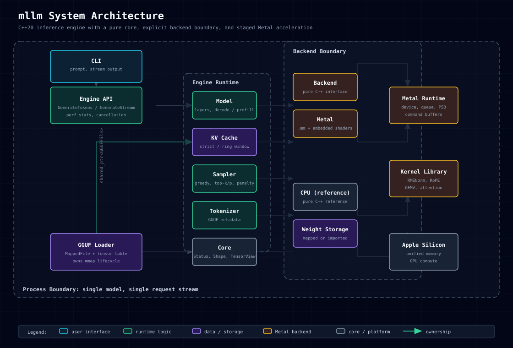
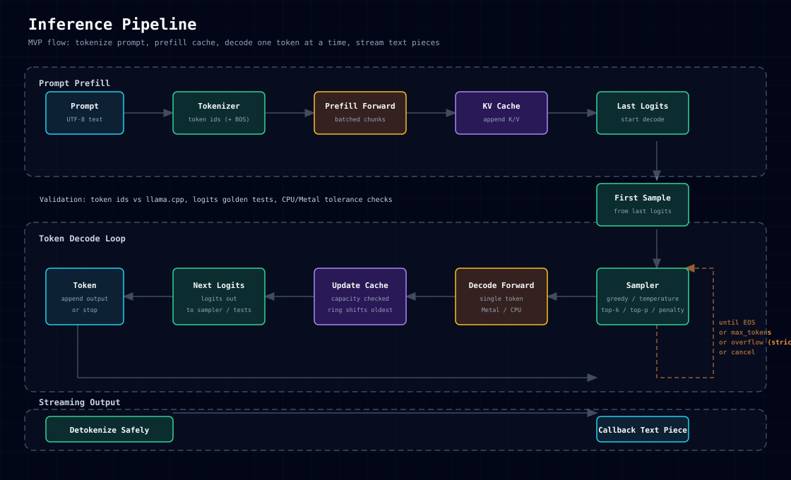
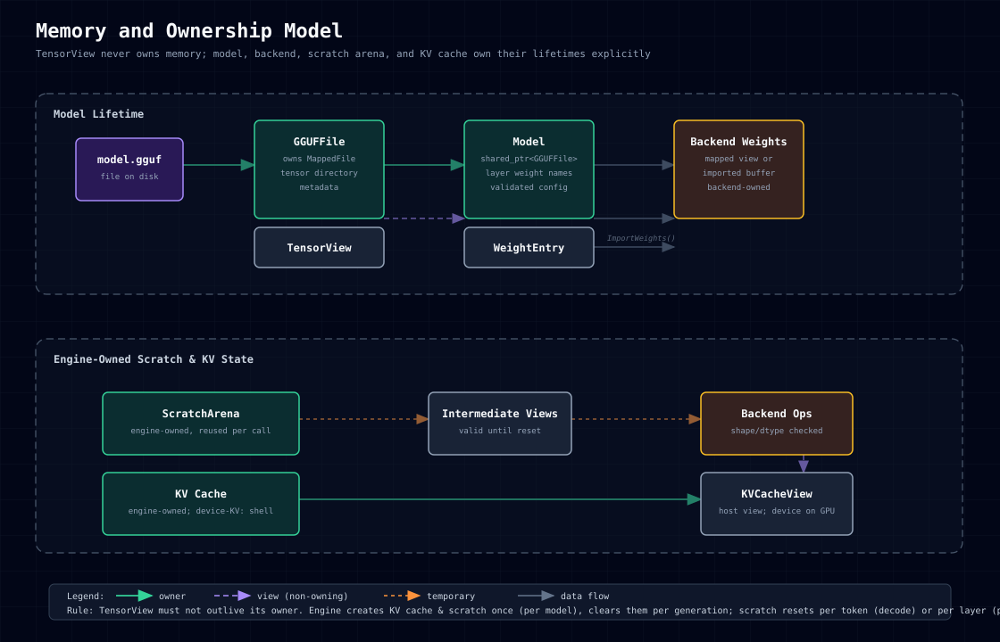

# mllm — LLM Inference Engine for Apple Silicon

mllm 是一个面向 Apple Silicon 的本地 LLM 推理引擎，使用 C++20（Metal 边界为 Objective-C++）实现，直接从 GGUF 文件加载模型，支持 Metal GPU 与 CPU 两种计算后端。本文档以当前实现为基准，描述系统的范围、架构、接口边界、验证策略与交付状态。

核心策略：先交付一条小而完整的端到端推理路径，以 llama.cpp 作为正确性和性能参照；再根据 profiling 结果替换热点 kernel。每个阶段都有明确的验收标准。

---

## 0. 范围与验收

### 0.1 范围

已完成的一条完整路径：

- 平台：macOS 14+，Apple Silicon，arm64；CPU 后端可跨平台编译。
- 语言：C++20 + Objective-C++ 边界文件。
- 构建：Bazel（C++20 由仓库根目录 .bazelrc 统一开启）。
- 模型格式：GGUF v3，权重通过 mmap 加载。
- 模型族：dense decoder-only 家族，由架构注册表（architecture.h）驱动：
  - llama：LLaMA-compatible，无额外 feature flag。
  - qwen2：Q/K/V projection 附加 bias。
  - qwen3：RoPE 前逐 head Q/K RMSNorm，且支持与 head 数解耦的显式 head_dim。
- 量化：F32、F16、Q8_0、Q4_0（Q8_0/Q4_0 为 block-wise 量化，block size 32）。K-quants 不支持。
- 请求模式：单进程、单模型、单请求流式生成。
- KV cache：连续预分配窗口；strict 模式超限报错，ring（滑动窗口）模式超窗自动丢弃最旧 token，可无限长度生成。
- Tokenizer：GGUF 内嵌 BPE；llama（SentencePiece-style byte fallback）与 gpt2（Qwen2/Qwen3 的 byte-level BPE）两个族。
- Chat 模板：ChatML（Qwen）/ Llama-2 / Llama-3 家族，取自 GGUF 元数据。
- 前端：CLI。
- 后端：Metal（GPU，decode 优化）优先，CPU（参考实现，只用于 correctness/debug）。

暂不做：

- continuous batching。
- paged KV cache。
- speculative decoding。
- OpenAI HTTP server。
- MoE / MLA 等非 dense 架构族（注册表已预留 dense_decoder == false 的接入点，模型工厂按架构分发）。
- 多模型热切换。
- Windows/Linux/Intel Mac 支持。

### 0.2 验收标准

系统完成必须同时满足：

1. bazel test //cpp/pl/mllm/... 通过。
2. 能加载 GGUF 模型，完成 prompt prefill（batched）和流式 decode。
3. 固定 seed、greedy sampling 下，前若干 token 与 llama.cpp 同模型同 prompt 对齐（e2e 将输出空白归一后逐字节比对，见 12.3）。
4. 无 AddressSanitizer 可见悬垂指针、越界访问、double free。
5. bench_decode 输出 tok/s、峰值内存、time-to-first-token，并记录 llama.cpp 同机 baseline。

### 0.3 性能目标的写法

性能目标不直接承诺理论带宽百分比。每个优化阶段都以 baseline 为准：

- P0：端到端正确性。
- P1：decode 速度达到 llama.cpp Metal backend 的 30% 以上。
- P2：decode 速度达到 llama.cpp Metal backend 的 60% 以上。
- P3：对指定模型/芯片/量化组合，追赶或超过 llama.cpp。

只有 benchmark 和 profiler 证明瓶颈后，才引入复杂 kernel 或模板特化。

---

## 1. 总体架构

### 1.1 分层



```
cli
 └── engine
      ├── tokenizer
      ├── loader
      ├── model
      │    ├── kv_cache
      │    └── sampler
      └── backend
           ├── metal
           └── cpu
core
```

职责边界：

- core：纯 C++20。定义 DType、Shape、TensorView、OwnedBuffer、ScratchArena、Status/Result 等基础类型，不包含 Metal/Objective-C 类型。
- loader：解析 GGUF，拥有 mmap 生命周期，提供权重表与类型化元数据访问。
- backend：执行算子；Metal backend 隔离在 .mm 文件与 opaque Impl 里，public header 保持纯 C++。
- model：架构注册表 + 组织 transformer 计算图，不直接知道 Metal API。
- engine：管理模型、tokenizer、sampler、生成循环、chat 模板与 perf 统计。
- cli：薄封装，不放推理逻辑。

### 1.2 端到端数据流



```
model.gguf
  -> MappedFile
  -> GGUFFile parses metadata / tensor directory
  -> Model resolves WeightEntry views into the mmap
  -> Backend imports weights (CPU 引用 mmap / Metal 上传为 device buffer)
  -> Engine tokenizes prompt
  -> Model::Prefill 按块前向，更新 KV cache
  -> Decode loop: token -> logits -> sampler -> token
  -> CLI detokenizes streamed pieces
```

CPU 后端直接引用 mmap 权重，Metal 后端在初始化时做一次权重导入与布局转换（量化权重按需 dequant，f16 原样上传）。零拷贝是 backend 内部优化细节，不影响上层生命周期。

---

## 2. 工程约束

### 2.1 C++ 标准与错误处理

项目使用 C++20（仓库根 .bazelrc 全局开启），不使用 C++23 标准库类型。

错误返回使用 core/status.h 定义的 Result 模板（基于 variant 实现；构造时禁止用 ok Status 擦除值通道，value() 在错误时打印并 abort——项目约定不抛 C++ 异常）：

```cpp
enum class ErrorCode {
    kOk,
    kInvalidArgument,
    kNotFound,
    kInvalidFormat,
    kUnsupported,
    kOutOfMemory,
    kBackendFailure,
    kCancelled,
    kInternal,
};

struct Status {
    ErrorCode code = ErrorCode::kOk;
    std::string message;

    bool ok() const noexcept { return code == ErrorCode::kOk; }
    static Status Error(ErrorCode code, std::string message);
    bool operator==(const Status&) const = default;
};

template <typename T>
class Result {
public:
    Result(T value);   // implicit
    Result(Status status);  // implicit; ok Status 会被改写为 kInternal
    bool ok() const noexcept;
    const Status& status() const noexcept;
    T& value() &;
    const T& value() const&;
    T&& value() &&;
};
```

约定：

- 项目代码不 throw。
- 任何可能失败的边界（文件、GGUF 解析、Metal API、资源不足）都返回 Status/Result，不允许 abort()（Result::value() 的 abort 仅是契约违例兜底）。

### 2.2 Objective-C++ 边界

纯 C++ 头文件不得暴露 id<MTLBuffer>、MTLDevice、Foundation 类型。Metal 相关类型只出现在：

- backend/metal/*.mm 翻译单元内部；
- MetalBackend 的 opaque Impl 指针（struct Impl; 前向声明，实现全在 .mm）；
- shader 源码以 C 字符串形式内嵌于 shader_source.h。

上层只依赖 Backend 接口与纯 C++ 的 TensorView / KVCacheView 抽象。

### 2.3 编译选项

实际构建选项由仓库根 .bazelrc 统一管理，不设独立的 mllm config：

- C++ 标准：全局 --cxxopt=-std=c++20。
- 编译宏：所有目标统一使用 //cpp:copts/configure_copts.bzl 的 COPTS/LINKOPTS/TEST_COPTS（按编译器选告警，按 //cpp:asan 开关追加消毒器 flag）。
- ASan：dev/test 默认开启（--//cpp:asan=True）；--config=release 关闭 ASan 且 -c opt。
- 测试运行：bazel test 恒以 -c opt 运行（test -c opt）；本地默认 --nocache_test_results 与 --test_output=all；CI 用 test:ci（--cache_test_results、--test_output=errors）。
- macOS 平台配置：--macos_minimum_os=14.0 与 libc++（Apple/Homebrew Clang）；--config=llvm 可切到 /opt/app/llvm 工具链。
- Metal 边界：backend/metal 用 cc_library + .mm 编译，public header 纯 C++，shader 源码内嵌于 shader_source.h。

---

## 3. 核心数据结构

### 3.1 DType

GGUF element types 枚举：kF32、kF16、kQ8_0、kQ4_0。量化 block size 为 32，相关工具函数：

```cpp
enum class DType : uint8_t { kF32, kF16, kQ8_0, kQ4_0 };

inline constexpr int64_t kQ8_0BlockSize = 32;
inline constexpr size_t kQ8_0TypeSize = 2 + kQ8_0BlockSize;   // fp16 scale + 32 x int8
inline constexpr int64_t kQ4_0BlockSize = 32;
inline constexpr size_t kQ4_0TypeSize = 2 + kQ4_0BlockSize / 2; // fp16 scale + 16 packed nibbles

bool is_quantized(DType dtype) noexcept;          // kQ8_0 / kQ4_0
int64_t dtype_block_size(DType dtype) noexcept;   // 量化 block 元素数，普通类型为 1
size_t dtype_type_size(DType dtype) noexcept;     // 每 block 字节数（普通类型即元素大小）
size_t dtype_nbytes(DType dtype, int64_t numel) noexcept; // 总字节数；numel 不对齐返回 0

float fp16_to_fp32(uint16_t h) noexcept;          // 位精确转换，无硬件依赖
uint16_t fp32_to_fp16(float f) noexcept;
```

### 3.2 Shape

最多 4 维张量，值类型。非法构造（rank 超限、负 dim）产生 empty shape（rank 0），而不是抛错：

```cpp
class Shape {
public:
    static constexpr int kMaxRank = 4;

    Shape() = default;
    explicit Shape(std::span<const int64_t> dims);   // 超限 / 负 dim 拒绝（empty）
    Shape(std::initializer_list<int64_t> dims);

    int rank() const noexcept;
    int64_t dim(int i) const noexcept;               // 越界返回 0
    std::span<const int64_t> dims() const noexcept;
    int64_t numel() const noexcept;                  // int64 溢出返回 -1
    bool empty() const noexcept;                     // rank 0 或 numel <= 0
    bool operator==(const Shape&) const = default;
};
```

### 3.3 TensorView

非拥有、类型化的存储视图。owner 由调用方保证存活（GGUFFile / OwnedBuffer / ScratchArena / KVCache 之一）：

```cpp
class TensorView {
public:
    TensorView() = default;
    TensorView(void* data, DType dtype, Shape shape);  // byte_size 由 dtype 推导

    void* data() noexcept;
    const void* data() const noexcept;
    size_t byte_size() const noexcept;
    DType dtype() const noexcept;
    const Shape& shape() const noexcept;
    bool valid() const noexcept;                       // data 非空且 byte_size > 0
    bool is_contiguous() const noexcept;               // MVP kernel 只收 contiguous

    std::span<const int64_t> strides() const noexcept;

    template <typename T> T* data_as() noexcept;                 // 低层类型化访问
    template <typename T> std::span<T> span_as() noexcept;       // 按 byte_size 划分
    template <typename T> std::span<const T> span_as() const noexcept;

    Result<TensorView> reshape(Shape shape) const noexcept;  // numel 必须一致
    Result<TensorView> slice(int dim, int64_t begin, int64_t end) const noexcept;
};
```

规则：

- TensorView 不保存 owner；所有返回 TensorView 的对象必须在接口文档声明 owner。
- data_as/span_as 为 backend 内部与核心层提供低层访问，调用方必须保证元素布局与 T 匹配（按 byte_size 做边界）。
- MVP 只支持 contiguous 视图：slice 只接受 contiguous 输入；量化张量只允许从 0 开始切片。

### 3.4 OwnedBuffer 与 ScratchArena

对齐 CPU 分配的 RAII owner，move-only：

```cpp
class OwnedBuffer {
public:
    static Result<OwnedBuffer> AllocateCpu(size_t bytes, size_t alignment); // posix_memalign

    OwnedBuffer(OwnedBuffer&&) noexcept;
    OwnedBuffer& operator=(OwnedBuffer&&) noexcept;
    OwnedBuffer(const OwnedBuffer&) = delete;
    OwnedBuffer& operator=(const OwnedBuffer&) = delete;

    void* data() noexcept;
    const void* data() const noexcept;
    size_t size() const noexcept;
    void reset() noexcept;
};
```

ScratchArena 是每 token 中间激活的 bump allocator（64 字节对齐），decode 每步 Reset 一次，从不释放单块：

```cpp
class ScratchArena {
public:
    static constexpr size_t kAlignment = 64;
    static Result<ScratchArena> Create(size_t bytes);

    Result<TensorView> AllocateTensor(Shape shape, DType dtype) noexcept;
    void Reset() noexcept;
    size_t capacity() const noexcept;
    size_t used() const noexcept;
};
```

Metal 的 device buffer 由 Metal backend 管理，不塞进 core::OwnedBuffer。

---

## 4. GGUF Loader

### 4.1 所有权模型

GGUFFile 拥有 MappedFile（read-only mmap，move-only RAII）。所有 TensorView 与元数据引用都指向该 mmap 区域，因此：

- Model 通过 std::shared_ptr 持有 GGUFFile（引擎内存放 shared_ptr<const GGUFFile>）。
- 只要模型存在，mmap 不得释放。
- 不允许把权重 TensorView 单独长期保存到不持有 owner 的对象中。

### 4.2 接口

```cpp
struct TensorInfo {
    std::string name;
    DType dtype = DType::kF32;
    Shape shape;                 // row-major：GGUF dims 按 ggml 序反转存储
    size_t file_offset = 0;      // 文件内绝对偏移
    size_t byte_size = 0;
};

using MetadataValue = std::variant<整数族 / float / double / bool /
                                   std::string / 各类型数组>;

class GGUFFile {
public:
    static Result<std::shared_ptr<GGUFFile>> Open(std::string path);
    GGUFFile(const GGUFFile&) = delete;
    GGUFFile& operator=(const GGUFFile&) = delete;

    std::string_view architecture() const noexcept;   // general.architecture
    Result<ModelConfig> model_config() const;         // 解析 + 注册表校验

    std::span<const TensorInfo> tensors() const noexcept;
    bool has_tensor(std::string_view name) const noexcept;
    Result<TensorInfo> tensor_info(std::string_view name) const;
    Result<TensorView> tensor(std::string_view name) const;  // 指向 mmap

    const MetadataValue* metadata(std::string_view key) const noexcept;
    Result<std::string> string_meta(std::string_view key) const;
    Result<uint32_t> u32_meta(std::string_view key) const;
    Result<int32_t> i32_meta(std::string_view key) const;
    Result<float> f32_meta(std::string_view key) const;
    Result<bool> bool_meta(std::string_view key) const;
    Result<std::span<const std::string>> str_array_meta(std::string_view key) const;
    Result<std::span<const float>> f32_array_meta(std::string_view key) const;
    Result<std::span<const int32_t>> i32_array_meta(std::string_view key) const;
};
```

### 4.3 支持的 GGUF 内容

必须支持：

- little-endian GGUF v3 header（含对齐与 tensor data 对齐校验）。
- metadata：architecture、context length、embedding length、head count、kv head count、layer count、head dim（可选）、rope freq base、norm eps、vocab、tokenizer 相关、chat template。
- tensor directory 与类型化访问。
- F32、F16、Q8_0、Q4_0。

暂不支持：

- LoRA adapter。
- split GGUF。
- K-quants（Q4_K_M / Q5_K_M / Q6_K 等）。
- MoE 等未注册架构（加载/建模型时报 kUnsupported，见 6.3 架构注册表）。

验收：

- 用小型 fixture GGUF 测 header、metadata、tensor table（ut/loader 与 ut/testdata 自带 gguf_writer 工具生成）。
- 与 llama.cpp 打印的 tensor name/shape/dtype 对比（e2e）。
- 对截断文件、错误 magic、错误 offset、未知架构做负例测试。

---

## 5. Backend 设计

### 5.1 接口

backend 抽象采用 virtual dispatch（dispatch 次数远少于 GPU 计算量，MVP 更需要清晰边界与可测试性）。全部算子已实现，并带默认实现的扩展点：

```cpp
struct RopeConfig {
    int32_t head_dim = 0;
    float freq_base = 10000.0f;
    float freq_scale = 1.0f;        // NTK 类缩放（当前恒为 1）
    TensorView q_norm{};            // Qwen3 逐 head Q RMSNorm，无效 view = 关闭
    TensorView k_norm{};
    float rms_eps = 1e-6f;
};

struct KVCacheView {
    const void* keys = nullptr;     // [seq_len, num_kv_heads, head_dim]
    const void* values = nullptr;
    int32_t seq_len = 0;
    int32_t num_kv_heads = 0;
    int32_t head_dim = 0;
    DType dtype = DType::kF16;
};

struct AttentionConfig {
    int32_t num_heads = 0;          // query heads
    int32_t num_kv_heads = 0;       // GQA group = num_heads / num_kv_heads
    int32_t head_dim = 0;
    float scale = 0.0f;             // 1/sqrt(head_dim)，调用方预计算
};

class Backend {
public:
    virtual ~Backend() = default;

    // 权重导入：name -> TensorView 批量注册，backend 保活 device 侧存储
    virtual Status ImportWeights(std::span<const TensorView> weights,
                                 std::span<const std::string_view> names) = 0;

    // out = x * weight^T；x: [batch, in_dim]，weight: [out_dim, in_dim]
    virtual Status MatMul(TensorView out, TensorView x,
                          std::string_view weight_name) = 0;
    // 共享输入的多次 MatMul 合并 dispatch；默认逐个回退
    virtual Status MatMulFused(std::span<TensorView> outs, TensorView x,
                               std::span<const std::string_view> weight_names);

    // out = rmsnorm(x) * weight
    virtual Status RmsNorm(TensorView out, TensorView x,
                           TensorView weight, float eps) = 0;
    // residual += add; out = rmsnorm(residual) * weight；默认组合实现
    virtual Status RmsNormAdd(TensorView out, TensorView residual,
                              TensorView add, TensorView weight, float eps);

    // q/k 原位 RoPE；批内第 b 行旋转于 position + b
    virtual Status RoPE(TensorView q, TensorView k, int64_t position,
                        const RopeConfig& config) = 0;

    // causal attention（GQA）；q: [1, num_heads, head_dim]
    virtual Status Attention(TensorView out, TensorView q,
                             const KVCacheView& kv,
                             const AttentionConfig& config) = 0;

    // out = silu(gate) * up
    virtual Status SwiGLU(TensorView out, TensorView gate, TensorView up) = 0;
    // x += residual（原位）
    virtual Status AddInPlace(TensorView x, TensorView residual) = 0;
    // x[b, i] += bias[i]（行广播，原位）
    virtual Status AddBiasInPlace(TensorView x, TensorView bias) = 0;

    virtual Status Synchronize() = 0;

    // --- 可选 device-residency 钩子（Metal 实现，CPU 默认无操作）---
    virtual Status NotifyHostWrite(TensorView t);  // 主机侧写后使 device 缓存失效
    virtual Status SyncToHost(TensorView t);       // 主机读取前冲刷 + 同步

    // --- 可选 device-resident KV cache（Metal 实现，CPU 默认不支持）---
    virtual bool HasDeviceKV() const;                       // 默认 false
    virtual Status ConfigureDeviceKV(int32_t num_layers, int32_t num_kv_heads,
                                     int32_t head_dim, int32_t capacity);
    virtual Status AppendKV(int32_t layer, TensorView key, TensorView value,
                            int64_t position);              // 从绝对 position 起追加
    virtual Status AttentionKV(TensorView out, TensorView q, int32_t layer,
                               int64_t seq_len, const AttentionConfig& config);
    virtual Status ShiftKV(int64_t drop_tokens);            // ring 滑窗压缩
    virtual Status AttentionPrefillKV(TensorView out, TensorView q, int32_t layer,
                                      int64_t seq_base, const AttentionConfig& config);
    // 默认按行回退 AttentionKV；device backend 覆写为单次 batched kernel
};
```

命名权重查找使用 heterogeneous hash（string_view 直接查 unordered_map<string, ...>，避免每 token 构造临时 string）。

### 5.2 Metal backend

MetalBackend 面向 decode 阶段性能优化，已实现：

- Shadow buffer cache：MTLBuffer 按 host 指针缓存，同一激活跨层复用免重复上传；由 NotifyHostWrite 失效。
- Deferred command buffer：单个 MTLCommandBuffer 跨多个 op 保持打开，只在 SyncToHost/Synchronize 提交，消除每 op 往返延迟。
- Device-resident KV cache：K/V 常驻 MTLBuffer，AppendKV/AttentionKV/ShiftKV/AttentionPrefillKV 全程在 device 上，不再逐 token 上传整 cache；主机侧用 metadata-only 的 KVCache shell 记账（见 §7）。
- 量化处理：Q8_0/Q4_0 decode 走 fused dequant GEMV kernel；batched prefill 先 dequant 到 f16 staging buffer 再走 MPS GEMM。
- F16 权重原样上传（half 带宽），GEMV kernel 用 as_type<half> 原生读半精度。
- 输出缓冲驻留：上一个 op 的输出 MTLBuffer 直接作为下一个 op 的输入，整条 forward 留在 device。
- Fused kernel：MatMulFused（Q/K/V 共享输入的合并 dispatch）、RmsNormAdd 等减少 dispatch 次数。

实现规则：

- 每个 kernel 有 CPU reference 一致性测试（ut/backend/metal_backend_test.mm）。
- 每个 kernel 支持非整除维度。
- 每个 kernel launch 前校验 dtype、shape、contiguous。
- command buffer 错误转为 Status 并 sticky 传播（InjectGpuErrorForTest 供单测注入）。
- 不在上层暴露 id<MTLBuffer>。

### 5.3 CPU backend

CpuBackend 只用于：

- 小 shape 单元测试与 reference。
- logits reference 与 Metal kernel 正确性对比。

CpuBackend 可以慢，但必须简单、确定、易读。它直接引用 mmap 权重视图（ImportWeights 保存 name -> TensorView），不复制权重。

---

## 6. 模型运行时

### 6.1 架构注册表

architecture.h 用静态表描述支持族，结构差异表达为 feature flag，使单一 dense decoder 实现覆盖一族：

```cpp
struct ArchSpec {
    std::string_view name;         // GGUF general.architecture
    bool dense_decoder = true;     // false 时工厂分发到独立实现
    bool qkv_bias = false;         // Qwen2：attn_q/k/v.bias
    bool qk_norm = false;          // Qwen3：逐 head Q/K RMSNorm
    float default_rope_freq_base = 10000.0f;
};

inline constexpr ArchSpec kArchLlama{.name = "llama"};
inline constexpr ArchSpec kArchQwen2{.name = "qwen2", .qkv_bias = true,
                                     .default_rope_freq_base = 1000000.0f};
inline constexpr ArchSpec kArchQwen3{.name = "qwen3", .qk_norm = true,
                                     .default_rope_freq_base = 1000000.0f};
```

新增架构族只需在 kSupportedArchitectures 注册结构差异；MoE/MLA 等结构不同的族可设 dense_decoder = false 并挂独立 Model 实现。

### 6.2 ModelConfig

```cpp
struct ModelConfig {
    std::string architecture;
    int32_t vocab_size = 0;
    int32_t hidden_size = 0;
    int32_t intermediate_size = 0;
    int32_t num_layers = 0;
    int32_t num_attention_heads = 0;
    int32_t num_kv_heads = 0;
    int32_t head_dim = 0;           // 0 = hidden_size / heads 推导；
                                    // 可显式解耦（如 Qwen3 1024/16 heads 但 head_dim 128）
    int32_t context_length = 0;
    float rms_norm_eps = 1e-5f;
    float rope_freq_base = 10000.0f;
    bool qkv_bias = false;          // 由注册表 + GGUF 元数据填充
    bool qk_norm = false;

    Status Validate() const;
    int32_t effective_head_dim() const;   // head_dim 非 0 用之，否则推导
};
```

Validate 检查：

- architecture 已注册。
- 所有核心维度大于 0。
- head_dim（或推导值）为正且为偶数（RoPE 要求）。
- num_attention_heads % num_kv_heads == 0。
- rms_norm_eps 与 rope_freq_base 为正。

GGUF 元数据缺失 rope.freq_base 时使用注册表的 default_rope_freq_base。

### 6.3 Model 抽象与工厂

```cpp
class Model {
public:
    struct WeightEntry { std::string name; TensorView view; };

    // 单 token 前向：hidden: [1, hidden_size] 原位改，position 为绝对位置
    virtual Status Forward(TensorView hidden, int64_t position,
                           KVCache& cache, Backend& backend,
                           ScratchArena& scratch) const = 0;
    // batched prefill：hidden: [n, hidden_size]（须在 scratch 之外）
    virtual Status Prefill(TensorView hidden, int64_t start_pos,
                           KVCache& cache, Backend& backend,
                           ScratchArena& scratch) const = 0;
    // final norm + lm_head：hidden: [1, hidden_size] -> logits: [1, vocab_size]
    virtual Status ComputeLogits(TensorView hidden, TensorView logits,
                                 Backend& backend, ScratchArena& scratch) const = 0;

    virtual const ModelConfig& config() const noexcept = 0;
    virtual int32_t num_layers() const noexcept = 0;
    virtual std::vector<std::string> weight_names() const = 0;
};

Result<std::unique_ptr<Model>> CreateModel(
    ModelConfig config, std::span<const Model::WeightEntry> weights);
```

DenseDecoderModel 覆盖 llama/qwen2/qwen3：持有 output_norm（output_norm.weight）与输出投影（output.weight，可与 token_embd.weight 共享即 tied）以及每层 TransformerLayer。权重命名按 GGUF 惯例（blk.{layer}.{suffix}），weight_names.h 统一生成。

### 6.4 TransformerLayer

```cpp
struct LayerWeights {
    // 投影权重按名引用（backend 内部去量化）
    std::string_view q_weight_name, k_weight_name, v_weight_name, o_weight_name;
    std::string_view gate_weight_name, up_weight_name, down_weight_name;
    // norm 权重按 TensorView 传
    TensorView attn_norm, mlp_norm;
    // 可选 QKV bias（Qwen2）；无效 view = 无
    TensorView q_bias, k_bias, v_bias;
    // 可选逐 head Q/K RMSNorm（Qwen3）
    TensorView q_norm, k_norm;
};

class TransformerLayer {
public:
    TransformerLayer(int32_t layer_index, LayerWeights weights);

    Status Forward(TensorView hidden, int64_t position,
                   KVCache& cache, Backend& backend,
                   ScratchArena& scratch, const ModelConfig& config) const;
    Status ForwardBatch(TensorView hidden, int64_t start_pos,
                        KVCache& cache, Backend& backend,
                        ScratchArena& scratch, const ModelConfig& config) const;
};
```

### 6.5 Forward 语义

单 token decode（Forward）：

1. attn RMSNorm。
2. Q/K/V projection（Qwen2 附加 bias；Metal 走 MatMulFused）。
3. Qwen3：RoPE 前逐 head Q/K RMSNorm。
4. RoPE applied to Q/K（绝对位置）。
5. append K/V to KV cache。
6. attention over valid cache range（GQA）。
7. output projection。
8. residual add。
9. ffn RMSNorm。
10. gate/up projection（可 fused）。
11. SwiGLU。
12. down projection。
13. residual add。

Batched prefill（ForwardBatch / Model::Prefill）按 n 个 token 一块前向：每层 K/V 批量 append（AppendBatch），行 b 以 start_pos + b 的绝对位置做 causal attention（AttentionPrefillKV），块结束后 Advance(n)。Engine 把 prompt 切成 64 token 的 chunk（kPrefillChunk）摊销权重 dequant 与 dispatch 成本。

---

## 7. KV Cache

### 7.1 两种模式

KVCache 是预分配的连续 cache，每层布局 [capacity, num_kv_heads, head_dim]（K 与 V 各一块 OwnedBuffer）：

```cpp
enum class KVCacheMode { kStrict, kRing };

class KVCache {
public:
    static Result<KVCache> Create(const ModelConfig& config, int32_t max_tokens,
                                  DType dtype = DType::kF16,
                                  KVCacheMode mode = KVCacheMode::kStrict);
    // metadata-only shell：device-resident KV 时只记账，不存数据
    static Result<KVCache> CreateShell(const ModelConfig& config, int32_t max_tokens,
                                       KVCacheMode mode = KVCacheMode::kStrict);

    Status Append(int32_t layer, TensorView key, TensorView value);   // 单 token
    Status AppendBatch(int32_t layer, TensorView key, TensorView value); // batched prefill
    KVCacheView View(int32_t layer) const noexcept;   // 有效区间视图
    void Advance(int32_t n = 1) noexcept;             // 所有层 append 后推进长度

    int32_t length() const noexcept;
    int32_t capacity() const noexcept;
    int32_t num_layers() const noexcept;
    int32_t num_kv_heads() const noexcept;
    int32_t head_dim() const noexcept;
    DType dtype() const noexcept;
    bool ring() const noexcept;

    int64_t window_origin() const noexcept;   // 物理槽 0 对应的绝对位置（strict 恒 0）
    Status WindowShift(int64_t drop);         // 丢最旧 drop 个 token（host memmove / shell 记账）
    void Clear() noexcept;
};
```

- kStrict：append 到 capacity 后返回错误，不隐式覆盖；prompt/生成超限由 Engine 拒绝。
- kRing：滑动窗口。append 溢出时以 ceil(capacity/2) 为粒度做分块压缩（ring_shift），最旧 token 被丢弃、window_origin 前移，摊销每 token O(1)。物理槽 i 恒对应绝对位置 origin + i，视图保持连续，attention kernel 无需回绕支持。RoPE 保持绝对位置编码，attention 只作用于保留窗口；窗口外上下文不可见是滑动窗口固有语义。
- shell：当 Backend::HasDeviceKV() 为真（Metal），KVCache 只做长度/容量/origin 记账（backing 只放单 token），Append/View 不可调用；Engine 驱动 WindowShift 与 Backend::ShiftKV 保持 host shell 与 device buffer 同步。

窗口外的质量退化为滑动窗口语义（无 attention sink）；RoPE 位置绝对，shift 后无需 position remap 或重旋转。

### 7.2 设备侧 KV（Metal）

Metal 后端实现 HasDeviceKV/ConfigureDeviceKV/AppendKV/AttentionKV/ShiftKV/AttentionPrefillKV：K/V 常驻 GPU buffer，decode 每步只 append 单 token，attention 全程 on-device。Engine 的 ring + device KV 组合下由 EnsureDeviceKvRoom 在追加前按需 ShiftKV（每次 ceil(capacity/2)），保证 device 与 host 记账一致。

### 7.3 暂不做

- paged cache（page table / block allocator / attention kernel 支持）需单独设计。

---

## 8. Tokenizer 与 Sampler

### 8.1 Tokenizer

从 GGUF tokenizer 元数据构建，支持注册表两个 tokenizer 族：

- llama（SentencePiece-style）：byte fallback，merge 顺序按 scores 排序。
- gpt2（GPT-2 byte-level BPE，Qwen2/Qwen3 使用）：字节先映射到可打印 unicode 区间再 merge，优先级来自 tokenizer.ggml.merges，pre-tokenize 按 GPT-2 模式。

```cpp
class Tokenizer {
public:
    static Result<Tokenizer> FromGGUF(const GGUFFile& file);

    int32_t bos_id() const noexcept;
    int32_t eos_id() const noexcept;
    int32_t vocab_size() const noexcept;

    Result<std::vector<int32_t>> Encode(std::string_view text, bool add_bos) const;
    Result<std::string> Decode(std::span<const int32_t> tokens) const;
    Result<std::string> DecodeOne(int32_t token) const;
};
```

实现要点：

- 特殊 token（CONTROL 类如 ChatML 的 im_start/im_end、endoftext，USER_DEFINED 类如 Qwen3 的 think/endthink）在 Encode 时按整词贪心最长匹配，BPE 永不拆开它们。
- add_bos 行为跟随 tokenizer.ggml.add_bos_token。
- 与 llama.cpp 的 encode/decode 语义对齐，真实模型 token-id parity 由 e2e 保证。

### 8.2 Sampler

确定性（seed 可控）采样器，参数全量实现：

```cpp
struct SamplerParams {
    float temperature = 0.0f;    // <= 0 即 greedy
    int32_t top_k = 0;           // 0 = 关闭
    float top_p = 1.0f;          // 1.0 = 关闭
    float repeat_penalty = 1.0f; // 1.0 = 关闭
    uint64_t seed = 0;
};

class Sampler {
public:
    explicit Sampler(SamplerParams params);
    void set_penalty_tokens(std::span<const int32_t> tokens);  // repeat penalty 窗口
    int32_t Sample(std::span<const float> logits) const;
    int32_t Sample(std::span<const float> logits,
                   std::vector<LogitProbs>& out_candidates) const;
};
```

- PRNG 为 xoshiro128**：跨平台确定、可复现。
- PRNG 状态跨 Sample 持续（每次重播 seed 会产生相同结果，破坏随机性）。
- repeat penalty 作用于最近上下文（prompt 尾部 + 已生成 token）窗口，由 Engine 每步更新。

---

## 9. Engine 与生成接口

### 9.1 Engine

```cpp
enum class BackendKind { kCpu, kMetal };   // kMetal 非 macOS 返回 kUnsupported

struct GenerateParams {
    int32_t max_tokens = 128;
    float temperature = 0.0f;    // <= 0 即 greedy
    int32_t top_k = 0;
    float top_p = 1.0f;
    float repeat_penalty = 1.0f;
    uint64_t seed = 0;
};

struct PerfStats {
    int32_t prompt_tokens = 0;
    int32_t generated_tokens = 0;
    double prefill_ms = 0.0;
    double decode_ms = 0.0;
    double total_ms = 0.0;
    double tok_per_sec = 0.0;
    double time_to_first_token_ms = 0.0;
};

class Engine {
public:
    struct Options {
        std::string model_path;
        int32_t max_context = 4096;      // strict 为容量上限；ring 为窗口大小
        BackendKind backend = BackendKind::kCpu;
        bool ring = false;               // true = KVCacheMode::kRing（§7.1）
    };

    static Result<std::unique_ptr<Engine>> Create(Options options);
    ~Engine();                           // 定义在 .cpp（pimpl）

    // 非流式：返回生成的 token id（不含 prompt）
    Result<std::vector<int32_t>> GenerateTokens(std::string_view prompt,
                                                GenerateParams params);
    // 流式：每个解码文本片段回调一次（片段 + token id）；
    // on_piece 返回 false 取消生成
    Status GenerateStream(std::string_view prompt, GenerateParams params,
                          std::function<bool(std::string_view, int32_t)> on_piece);

    const PerfStats& last_perf_stats() const noexcept;

    // 用模型 GGUF tokenizer.chat_template 渲染 user/system 消息
    // （ChatML / Llama-2 / Llama-3 家族；无模板时原样返回）
    std::string FormatChatPrompt(std::string_view user,
                                 std::string_view system = {}) const;
    bool has_chat_template() const noexcept;
};
```

Engine 拥有 model（含 GGUFFile shared_ptr）、tokenizer、sampler、backend、KV cache（host 或 shell + device）。取消用 callback 返回 false 表达，不使用 coroutine。prompt 超过容量（strict）或模型不兼容等错误在 Create/生成期返回 Status。

### 9.2 取消与错误

on_piece 返回 false 时 Engine 返回 Status{ErrorCode::kCancelled, "cancelled by callback"}（engine.cpp 实现），CLI 收到非 ok 状态后打印并以非零码退出。GPU 错误、context overflow、tokenizer 错误都返回到 CLI，不允许 abort()。

---

## 10. 内存管理



### 10.1 层次

- 权重：GGUFFile mmap。CPU backend 直接引用；Metal backend 初始化导入（f16 原样上传 / 量化按需 dequant），device 存储保活到 backend 析构。
- KV cache：主机侧 OwnedBuffer（strict/ring host 模式）或 device MTLBuffer + shell 记账（Metal）。
- 中间激活：ScratchArena 预分配，decode 每 token Reset，prefill 每层 Reset。

### 10.2 规则

- layer 内部不 new 中间 tensor。
- KV cache 与权重不来自 scratch。
- 权重 TensorView 的 owner 是 GGUFFile；backend 导入后不得持有超出 model 生命周期的 view。

---

## 11. Metal Kernel 交付状态

### 11.1 已交付 kernel（核心算子均有 CPU reference 一致性测试，见 metal_backend_test.mm）

1. add_in_place（残差相加）。
2. rmsnorm 与 add_rmsnorm（RmsNormAdd 的 fused residual-add + RMSNorm）。
3. rope 与 rope_qknorm（Qwen3 逐 head Q/K 预归一后旋转）。
4. swiglu（SwiGLU）。
5. add_bias（行广播 bias）。
6. attention_decode（decode 单 token causal attention，GQA）。
7. attention_flash_batch（batched prefill causal attention）。
8. append_kv（device-resident KV 追加）。
9. gemv_f16 / gemv_f32 / gemv_q8_0 / gemv_q4_0 及 fused 变体（decode GEMV；量化 fused dequant）。
10. 批大于 1 的 MatMul 走 MPS GEMM；量化权重先由 dequant kernel 转 f16 staging buffer。

辅助 kernel：dequant_q8_0 / dequant_q8_0_f16 / dequant_q4_0_f16、cvt_f32_to_f16 / cvt_f16_to_f32 等。

### 11.2 暂缓

- FlashAttention v2。
- simdgroup_matrix 自研 GEMM。
- Q4_K_M / Q5_K_M / Q6_K。
- pipeline overlap。

这些需要单独设计和 benchmark，不放在主线里。

---

## 12. 测试策略

### 12.1 单元测试

```
core_test             Shape / TensorView / Result / ScratchArena / DType
gguf_loader_test      header / metadata / tensor directory / bad files
tokenizer_test        llama 与 gpt2 两个族的 encode/decode（fixture 对齐）
sampler_test          greedy / seeded random / top-k / top-p / repeat penalty
kv_cache_test         strict append / ring shift / batch / shell / 溢出语义
backend_cpu_test      reference ops（含 batched prefill 路径）
backend_metal_test    Metal ops vs CPU reference（含错误注入）
model_test            tiny config 与 CPU reference 对齐（Qwen2 bias / Qwen3 qk_norm + 解耦 head_dim / Q4 权重 / 缺权重负例）
engine_test           tiny model fixture 端到端（batched prefill、greedy 确定性 / strict / ring / Metal-CPU 一致性 / 不支持架构拒绝）
```

### 12.2 Golden 测试

tools/make_tiny_model 生成小模型 fixture：固定 config、权重与 prompt，保存逐层关键 tensor checksum/logits；每次修改 backend/kernel 都跑 golden。tools/dump_logits 用于导出 logits 对比。

### 12.3 与 llama.cpp 对齐（e2e）

e2e/parity_vs_llamacpp.sh 用真实 GGUF 模型对比 mllm_cli 与 llama-cli 的 greedy 输出：文本先做空白归一（collapse 到单空格）再逐字节比对。前置缺失时（llama-cli 不在 PATH、模型目录 /tmp/mllm_models 不存在、cli 未构建）自动 SKIP 并以 0 退出。用例覆盖：raw-prompt 与 --chat 模板的 byte-identical、Metal/CPU 一致性（共享前缀）。target 带 manual tag，不进默认测试集与 CI：

```bash
bazel test //cpp/pl/mllm/e2e:e2e_llama_parity --config=release --test_output=all
```

---

## 13. Benchmark 策略

### 13.1 bench_decode

端到端 decode benchmark，输出：

- model path、quant type、prompt tokens、generated tokens。
- prefill ms、decode ms、total ms、tok/s、TTFT。
- peak RSS、backend、git commit。

### 13.2 bench_ops

每个 kernel 单独 benchmark，--backend cpu|metal 可选：

- RMSNorm hidden sizes: 1024, 2048, 4096, 8192。
- GEMV rows/cols 与目标模型匹配。
- Attention seq lengths: 128, 512, 2048, 4096。

### 13.3 性能决策规则

只有当 profiler 证明某模块超过总耗时 10%，才允许引入更复杂实现。优化必须附带 benchmark before/after、correctness test、fallback 行为。

---

## 14. Bazel 结构

实际目录：

```
cpp/pl/mllm/
├── BUILD
├── README.md
├── SPEC.md
├── core/           DType / Shape / TensorView / OwnedBuffer / ScratchArena / Status
├── loader/         MappedFile / GGUFFile
├── tokenizer/      llama + gpt2 BPE
├── sampler/        greedy / temperature / top-k / top-p / repeat penalty
├── kv_cache/       strict / ring / shell
├── backend/
│   ├── backend.h   Backend 接口与共享结构
│   ├── cpu/        CpuBackend（reference）
│   └── metal/      MetalBackend（.mm + shader_source.h）
├── model/          架构注册表 / config / dense decoder / transformer layer
├── engine/         Engine（pimpl）
├── cli/            mllm_cli
├── bench/          bench_decode / bench_ops
├── tools/          make_tiny_model / dump_logits
├── e2e/            llama.cpp parity（manual）
├── ut/             各模块单测 + testdata（gguf_writer fixture 生成器）
└── doc/            架构 / pipeline / 内存所有权示意图
```

关键点：

- core 不依赖 Metal。
- backend/metal 用 cc_library + .mm，public header 纯 C++；shader 源码内嵌 header。
- 测试 fixture 生成器在 ut/testdata（header-only gguf_writer）。
- e2e sh_test 依赖 cli binary 与模型目录，tag manual 排除默认 CI。

---

## 15. 分阶段计划与状态

| 阶段 | 内容 | 状态 |
|---|---|---|
| Phase 1 | core（Status/Result/Shape/TensorView/OwnedBuffer/ScratchArena）、loader（MappedFile/GGUF）、Bazel 跑通 | 完成 |
| Phase 2 | tokenizer（llama + gpt2）、sampler（全参数）、CPU reference ops | 完成 |
| Phase 3 | 架构注册表、ModelConfig validate、TransformerLayer、KV cache（strict + ring）、tiny model E2E | 完成 |
| Phase 4 | Metal device/queue/pipeline、elementwise kernel、device-resident KV、Engine 接入 | 完成 |
| Phase 5 | Q8_0/Q4_0 fused GEMV、decode attention kernel、batched prefill、bench vs llama.cpp | 完成 |
| Phase 6 | Q4_0、Qwen2/Qwen3 族支持、chat 模板、ring 滑窗、流式 callback 精化 | 完成 |
| 后续候选 | FlashAttention、simdgroup GEMM、K-quants、paged cache、HTTP server、MoE/MLA | 未开始 |

每个后续候选都需要单独小设计文档与 benchmark 证明。

---

## 16. 主要风险与应对

| 风险 | 影响 | 应对 |
|---|---|---|
| GGUF/tokenizer 细节不兼容 | 输出完全不对 | 先与 llama.cpp token ids/tensor table 对齐（e2e parity） |
| TensorView 悬垂 | 难查 crash | 强制 owner 文档；Model/Engine 持有 GGUFFile shared_ptr |
| Metal kernel 正确性差 | 性能优化无意义 | 所有 kernel 必须 CPU reference 对比 |
| 一开始优化过度 | 工期失控 | 主线禁止 FlashAttention/K-quants/continuous batching |
| C++/ObjC++ 边界污染 | 构建困难 | core public header 禁止 Metal 类型；Metal 类型收敛在 .mm |
| device 与 host KV 记账失步 | 静默错误输出 | ring + device KV 由 Engine 单一驱动（EnsureDeviceKvRoom/WindowShift） |
| Qwen2 qkv_bias 路径 | Metal/CPU 与 llama.cpp 在早期 token 偶发分歧 | e2e 中作为 known issue 跟踪（qwen2-0.5b identity，expected-fail），定位中 |
| 性能目标虚高 | 项目判断失真 | benchmark 只跟同机 llama.cpp baseline 比 |

---

## 17. 参考实现

| 项目 | 用途 |
|---|---|
| llama.cpp | GGUF、tokenizer、量化、baseline |
| MLX | Apple unified memory 和 Metal 设计参考 |
| Apple Metal docs | Metal buffer、command queue、kernel 编译 |

---

## 18. 设计决策摘要

- 用 virtual backend 做 MVP，暂不使用 CRTP 作为主架构。
- 错误处理不抛异常：Result/Status 贯穿，失败边界收敛为返回值。
- TensorView 非拥有，owner 必须由 Model/GGUFFile/Engine 明确持有（shared_ptr 保活 mmap）。
- 不使用 coroutine：流式用 callback（携带 token id），取消用返回 false 表达。
- KV cache 预分配连续窗口；strict 与 ring 双模式，ring 的分块压缩保证摊销 O(1) 且视图连续。
- Metal KV 常驻 device（HasDeviceKV），主机侧只留 metadata shell。
- 架构差异用注册表 feature flag（qkv_bias / qk_norm / head_dim 解耦）表达，一族一个 dense decoder。
- 不把零拷贝作为上层 API 承诺；mmap 引用（CPU）/ 上传（Metal）都是 backend 细节。
- 所有性能优化必须有 benchmark 和 correctness test。
