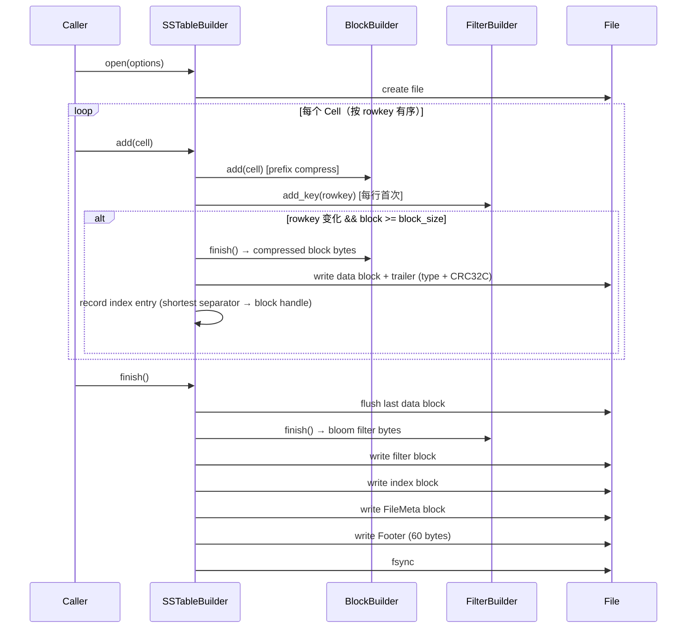
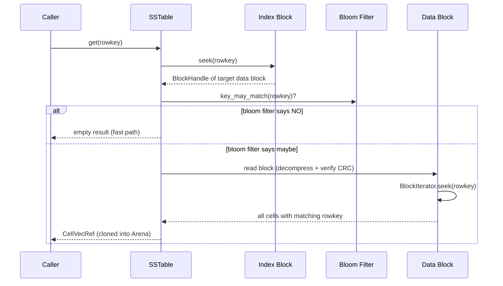
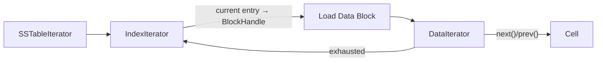

# SSTable Engine Architecture

## Overview

本项目实现了一个 SSTable (Sorted String Table) 存储引擎，即 LSM-Tree 数据库的核心磁盘组件。SSTable 是 LevelDB、RocksDB、HBase 等存储系统的基础数据结构，负责将有序键值对持久化到磁盘并提供高效的点查和范围扫描。

**范围**：完整的 SSTable 读写路径，包含 Block 编解码（前缀压缩）、布隆过滤器（Standard + Blocked）、压缩（Snappy/ZSTD）、两级迭代器、版本管理。数据模型为宽列模型（类 HBase：rowkey + column family + column qualifier + timestamp + type）。

**技术栈**：C++20、Bazel、XXHash (bloom filter hash)、CRC32C (block checksum)、Snappy/ZSTD (compression)、folly (ScopeGuard)。

**与 LevelDB/RocksDB 的差异**：

| 维度 | LevelDB | RocksDB | 本实现 |
|------|---------|---------|--------|
| 数据模型 | key-value | key-value | 宽列 (rowkey + cf + col + ts + type) |
| Block 压缩 | Snappy | Snappy/ZSTD/LZ4/Zlib | Snappy/ZSTD |
| Filter | Bloom (per-block) | Bloom/Ribbon (per-SST) | Standard Bloom / Blocked Bloom (per-SST) |
| 版本管理 | VersionSet + MANIFEST | VersionSet + MANIFEST | 简化版 copy-on-write VersionManager |
| Compaction | Level-based | Level/Universal/FIFO | 未实现（预留） |
| 并发 | 无 | 并发读 + 单写 | 无（单线程读写） |

## Architecture

```mermaid
graph TD
    subgraph "Write Path"
        Cell[Cell] --> SB[SSTableBuilder]
        SB --> BB[BlockBuilder<br/>prefix compression]
        SB --> FB[FilterBuilder<br/>bloom filter]
        BB --> Compress[Compression<br/>Snappy/ZSTD]
        Compress --> File[SST File]
        FB --> File
    end

    subgraph "Read Path"
        Open[SSTable::open] --> Footer
        Footer --> IdxBlk[Index Block]
        Footer --> FilterBlk[Filter Block]
        Footer --> Meta[FileMeta]
        IdxBlk --> Get[SSTable::get]
        FilterBlk --> Get
        Get --> BlkRead[BlockReader<br/>decompress + CRC verify]
        BlkRead --> BlkIter[BlockIterator<br/>binary search on restarts]
    end

    subgraph "Iteration"
        SSTIter[SSTableIterator] --> IdxIter[Index Iterator]
        IdxIter --> DataIter[Data Block Iterator]
    end

    subgraph "Version"
        VM[VersionManager] --> Ver[SSTableVersion]
        Edit[VersionEdit] --> VM
    end
```



## Core Components

| 模块 | 文件 | 职责 |
|------|------|------|
| Cell | `cell.h` | 数据模型：CellKey (rowkey+cf+col+ts+type) + value |
| Comparator | `comparator.h` | 键比较器 + shortest separator/successor（压缩索引键） |
| Encoding | `encoding.h` | 定长整数序列化 (memcpy-based) |
| Options | `options.h` | 读写配置：block_size、compression、bloom bits_per_key |
| BlockBuilder | `block_builder.h` | 写入侧 Block 构建，前缀压缩 |
| Block | `block.h` | 读取侧 Block 解析，二分查找 |
| FilterPolicy | `filter_policy.h` | Standard/Blocked Bloom Filter 构建与查询 |
| Compression | `compression.h` | 压缩适配器 (Snappy/ZSTD) |
| SSTableFormat | `sstable_format.h` | 文件格式定义：BlockHandle、Footer、FileMeta、BlockReader |
| SSTableBuilder | `sstable_builder.h` | SST 文件写入器 |
| SSTable | `sstable.h` | SST 文件读取器 |
| SSTableIterator | `sstable_iterator.h` | 两级迭代器 (index + data) |
| VersionManager | `sstable_version_manager.h` | Copy-on-write 版本管理 |
| Iterator | `iterator.h` | 抽象迭代器接口 |

## Data Flow

### 写入路径



关键约束：**同一 rowkey 的所有 Cell 不会跨 Block**。即使 Block 已达到 `block_size` 阈值，也要等到 rowkey 变化时才刷出。这保证了点查一个 rowkey 只需读取一个 Data Block。

### 读取路径 — 点查



### 读取路径 — 范围扫描



`SSTableIterator` 是一个两级迭代器：外层遍历 Index Block 的条目（每条指向一个 Data Block），内层遍历当前 Data Block 的 Cell。当内层耗尽时自动推进外层。

## Key Data Structures

### SST 文件格式

```
┌─────────────────────────────────────────┐
│           Data Block 0                  │
│  [entry_0 | entry_1 | ... | entry_N]    │
│  [restart_0 | restart_1 | ... | count]  │
├─────────────────────────────────────────┤
│  trailer: compression_type(1B) + CRC(4B)│
├─────────────────────────────────────────┤
│           Data Block 1                  │
│           ...                           │
├─────────────────────────────────────────┤
│           Filter Block                  │
│  [bloom filter bits | metadata(5B)]     │
├─────────────────────────────────────────┤
│           Index Block                   │
│  [shortest_sep_0 → handle_0]           │
│  [shortest_sep_1 → handle_1]           │
│  ...                                    │
├─────────────────────────────────────────┤
│           FileMeta Block                │
│  [magic | sst_type | version | ...]     │
├─────────────────────────────────────────┤
│           Footer (60 bytes)             │
│  [filter_handle(16B) | index_handle(16B)│
│   | meta_handle(16B) | pad | magic(4B)] │
└─────────────────────────────────────────┘
```

- **Footer** 固定 60 字节，位于文件末尾。读取时从文件尾部-60 开始解析。
- **BlockHandle** = offset (8B) + size (8B)，指向文件中的一个 block。
- **Magic**: `0x00545353` ("SST")

### Block 内部编码（前缀压缩）

每个 entry 的布局：

```
+-------------+----------------+-----------------+----------------+
| shared (4B) | non_shared(4B) | rowkey_size(4B) | value_size(4B) |
+-------------+----------------+-----------------+----------------+
| non_shared_key_bytes (non_shared bytes)                         |
+----------------------------------------------------------------+
| value_bytes (value_size bytes)                                  |
+----------------------------------------------------------------+
```

- `shared`：当前 rowkey 与前一个 rowkey 的公共前缀长度
- 每隔 `block_restart_interval`（默认 16）个 entry 插入一个 restart point（`shared=0`）
- Block 尾部存储所有 restart point 的偏移量 + restart 数量

查找时先对 restart point 做二分搜索，定位到目标区间后线性扫描。

### CellKey 编码

```
+------------------+----+-----+----+---------------+-----------+
| rowkey (var len) | cf | \0  | col| \0            | ts (8B)   |
+------------------+----+-----+----+---------------+-----------+
| cell_type (1B)   |
+------------------+
```

排序规则：rowkey ASC → cf ASC → col ASC → timestamp **DESC**（新版本优先）→ cell_type ASC

### Bloom Filter

两种实现：

**Standard Bloom Filter** (`filter_policy.h`)：
- 经典布隆过滤器，bit 数组大小为 2 的幂
- Hash: XXH3_64bits
- Probe 公式：`h1 + i * h2`（double hashing）

**Blocked Bloom Filter**：
- 64 字节对齐的分块布隆过滤器
- 每个 key 的所有 probe 落在同一个 cache line 内
- 构建时使用 8-entry pipeline 优化

### Version 管理

```
SSTableVersionManager
├── current_: shared_ptr<SSTableVersion>  (当前活跃版本)
│
SSTableVersion
├── sst_map_: map<SSTId, SSTableRef>              (按 ID 查找)
└── sst_patch_map_: map<PatchId, vector<SSTableRef>, greater<>>  (按 patch 分组，新 patch 在前)

SSTableVersionEdit
├── add_sstables_: vector<SSTableRef>  (本次新增)
└── del_sstables_: vector<SSTId>       (本次删除)
```

`applyVersionEdit()` 采用 copy-on-write：创建新 Version 副本 → 应用 edit → 原子交换 current 指针。读操作持有旧 Version 的 shared_ptr，不会被新 edit 影响。

## Design Decisions

### 为什么用宽列模型而不是简单 key-value

LSM-Tree 数据库有两种典型数据模型：
- **简单 KV**（LevelDB/RocksDB）：key 是任意字节串，value 是任意字节串
- **宽列**（HBase/Bigtable）：key = rowkey + column family + column + timestamp

本实现选择宽列模型：
- 更接近真实分布式存储系统的使用场景
- 多版本（timestamp DESC）自然支持 MVCC 语义
- 同一 rowkey 的所有列紧凑存储，一次点查返回完整行
- 代价是 key 编码更复杂，前缀压缩效果取决于 rowkey 的分布

### 为什么同一 rowkey 不跨 Block

SSTableBuilder 在 `add()` 时检查：只有当 rowkey 变化 **且** block 超过阈值时才刷出。这意味着一个大 row（很多 column/version）可能使 Block 超出 `block_size`。

收益：点查只需读一个 Block（无需跨 Block 拼接同一 row 的 Cell）。
代价：Block 大小不均匀，最坏情况下一个 Block 可能远大于 `block_size`。

LevelDB/RocksDB 不需要这个约束，因为它们的 key 之间没有"同属一行"的概念。

### 为什么 Index Block 存 shortest separator 而不是原始 key

`BytewiseComparator::findShortestSeparator(start, limit)` 计算位于两个 Data Block 边界之间的最短 key。例如两个 Block 的边界分别是 `"hello"` 和 `"help"`，separator 可以是 `"helm"`。

收益：Index Block 更小，减少内存占用（整个 Index Block 常驻内存）。
这是 LevelDB 的标准做法。

### 为什么提供 Standard 和 Blocked 两种 Bloom Filter

**Standard Bloom Filter**：
- 实现简单
- 每次查询的 probe 散布在整个 bit 数组中，大数组时 cache miss 多

**Blocked Bloom Filter**：
- 每个 key 的 probe 约束在一个 64 字节 cache line 内
- 构建时使用 8-entry pipeline 减少 cache miss
- 代价是 false positive rate 略高于理论最优

对于大 SSTable（filter block 远超 L1 cache），Blocked Bloom Filter 的查询延迟更稳定。

### Copy-on-write 版本管理

`SSTableVersionManager` 不使用锁保护当前版本的读取，而是通过 shared_ptr 的引用计数实现无锁读：
- 读操作获取 `current_` 的 shared_ptr 副本，之后不受后续 edit 影响
- 写操作创建新 Version、应用变更、原子替换 `current_`

这与 LevelDB 的 VersionSet 思路相同，但简化了 MANIFEST 日志（当前没有持久化 VersionEdit 历史）。

## Future Work

- Compaction：Level-based 或 Size-tiered compaction 策略
- MemTable：内存中的有序跳表，作为 SSTable 的写入缓冲
- WAL：Write-Ahead Log，保证写入持久性
- Range Delete：tombstone-based 范围删除
- 并发读取：多线程安全的 SSTable 访问
- Block Cache：LRU cache 避免重复读取热点 Block
- 持久化 MANIFEST：VersionEdit 日志持久化，支持恢复
