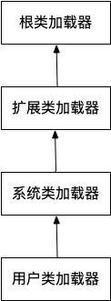

### 类加载

**一、两个要点**

1. 在Java代码中，类型的加载、连接和初始化过程都是在程序运行期间完成的。
2. 提供了更大的灵活性，增加了更多的可能性。

**二、类加载器深入剖析**

- Java虚拟机与程序的声明周期
- 在如下几种情况下，Java虚拟机将结束声明周期
-
    - 执行了`System.exit()`方法
-
    - 程序正常执行结束
-
    - 程序在执行过程中遇到了异常或错误而异常终止
-
    - 由于操作系统出现错误而导致Java虚拟机进程终止

**三、类的加载、连接与初始化**

- 加载：查找并加载类的二进制数据
- 连接：
-
    - 验证：确保被加载的类的正确性
-
    - 准备：为类的静态变量分配内存，并将其初始化为**默认值**。但是在到达初始化之前，类变量都没有初始化为真正的初始值
-
    - 解析：解析过程就是在类型常量池中寻找类、接口、字段和方法的符号引用，把这些符号引用替换成直接引用的过程
- 初始化：为类变量（静态变量）赋予正确的初始值


Java程序对**类**的使用方式可以分为两种：

主动使用：

- 创建类的实例
- 访问某个类或接口的静态变量，或者对该静态变量赋值
- 调用类的静态方法
- 反射（例如：`Class.forName("cn.aaa.bbb.Foo")`）
- 初始化一个类的子类
- Java虚拟机启动时被标明为启动类的类（Java Test）
- JDK1.7开始提供的动态语言支持：`java.lang.invoke.MethodHandler`实例的解析结果`REF_getStatic`, `REF_putStatic`
  , `REF_invokeStatic`句柄对应的类没有初始化，则初始化

被动使用：

除了以上几种情况，其他使用Java类的方式都被看做是对类的**被动使用**，都不会导致类的**初始化**

**结论：** 所有的Java虚拟机实现必须在每个类或接口被Java程序**首次主动使用**时才初始化他们。

类的加载：

指的是将类的`.class`文件中的二进制数据读入到内存中，将其放在运行时数据区的方法区内，然后在内存中创建一个`java.lang.Class`
对象（规范并没有规定该对象存放在哪里，
HotSpot虚拟机将其放在了方法区中）用来封装类在方法区内的数据结构。

加载`.class`文件的方式：

- 从本地系统中直接加载
- 通过网络下载`.class`文件
- 从zip,jar等归档文件中加载`.class`文件
- 从专有数据库中提取`.class`文件
- 将Java源文件动态编译为`.class`文件

案例分析：

案例一：[MyTest1.java](../src/main/java/cn/iliubang/exercises/jvm/classloader/MyTest1.java)

```java
public class MyTest1 {
    public static void main(String[] args) {
        System.out.println(MyChild1.str);
    }
}

class MyParent1 {
    public static String str = "hello world";

    static {
        System.out.println("MyParent1 static block");
    }
}

class MyChild1 extends MyParent1 {
    static {
        System.out.println("MyChild1 static block");
    }
}
```

程序运行的结果是：

```
MyParent1 static block
hello world
```

分析：

- 静态代码块是在类被初始化的时候执行的
- 对于静态成员来说，只有直接定义了该成员的类才会被初始化

案例二：[MyTest2.java](../src/main/java/cn/iliubang/exercises/jvm/classloader/MyTest2.java)

```java
public class MyTest2 {
    public static void main(String[] args) {
        System.out.println(MyChild2.str1);
    }
}

class MyParent2 {
    public static String str = "hello world";

    static {
        System.out.println("MyParent2 static block");
    }
}

class MyChild2 extends MyParent2 {
    public static String str1 = "ok";

    static {
        System.out.println("MyChild2 static block");
    }
}
```

程序运行的结果是：

```
MyParent2 static block
MyChild2 static block
ok
```

分析：

- 当一个类在初始化时，要求其父类全部都已经初始化完毕

案例三：[MyTest3.java](../src/main/java/cn/iliubang/exercises/jvm/classloader/MyTest3.java)

```java
public class MyTest3 {
    public static void main(String[] args) {
        System.out.println(Demo1.str);
    }
}

class Demo1 {
    public static final String str = "hello world";

    static {
        System.out.println("Demo1 static block");
    }
}
```

程序运行的结果是：

```
hello world
```

分析：

常量在编译阶段就会存入到调用这个常量的方法所在的类的常量池中，本质上，调用类并没有直接引用到定义常量的类，因此并不会触发定义常量的类的初始化。
注意：这里指的是将常量存储到了MyTest3的常量池中，之后MyTest3跟Demo1根本就没有关系了。
甚至我们可以将Demo1的class文件删除，程序都能直接运行。

案例四：[MyTest4.java](../src/main/java/cn/iliubang/exercises/jvm/classloader/MyTest4.java)

```java
public class MyTest4 {
    public static void main(String[] args) {
        System.out.println(Demo2.str);
    }
}

class Demo2 {
    public static final String str = UUID.randomUUID().toString();
    static {
        System.out.println(Demo2.class.getName());
    }
}
```

程序运行的结果是：

```
cn.iliubang.exercises.jvm.classloader.Demo2
2aaade9d-07dd-4396-99aa-d0e48835e2a7
```

分析：

当一个常量的值并非编译期间可以确定的，那么其值就不会被放到调用类的常量池中，这时在程序运行时，会导致主动使用这个常量所在的类，显然会导致这个类被初始化。

案例五：[MyTest5.java](../src/main/java/cn/iliubang/exercises/jvm/classloader/MyTest5.java)

```java
public class MyTest5 {
    public static void main(String[] args) {
        Demo3[] demo3s = new Demo3[1];
        System.out.println(demo3s.getClass());
        System.out.println(demo3s.getClass().getSuperclass());

        Demo3[][] demo3s1 = new Demo3[1][1];
        System.out.println(demo3s1.getClass());
        System.out.println(demo3s1.getClass().getSuperclass());
    }
}

class Demo3 {
    static {
        System.out.println(Demo2.class.getName());
    }
}
```

分析：

对于数组类型实例来说，其类型是由JVM运行期动态生成的，表示为[Lxxx.xxx.Xxx这种形式。
动态生成的类型其父类型就是Object，对于数组来说，JavaDoc经常将构成数组的元素称为Component，实际上
就是将数组降低一个维度后的类型。

案例六：[MyTest6.java](../src/main/java/cn/iliubang/exercises/jvm/classloader/MyTest6.java)

案例七：[MyTest7.java](../src/main/java/cn/iliubang/exercises/jvm/classloader/MyTest7.java)

```java
public class MyTest7 {
    public static void main(String[] args) {
        Singleton singleton = Singleton.getInstance();
        System.out.println("counter1:" + Singleton.counter1);
        System.out.println("counter2:" + Singleton.counter2);
    }
}

class Singleton {
    public static int counter1;

    private static Singleton singleton = new Singleton();

    private Singleton() {
        counter1++;
        counter2++; // 准备阶段的重要意义
    }

    public static int counter2 = 0;

    public static Singleton getInstance() {
        return singleton;
    }
}
```

程序运行的结果是：

```
counter1:1
counter2:0
```

分析：

类加载的流程是 准备->解析->初始化，在准备阶段为类的静态变量分配内存，并将其初始化为默认值，
然后再根据代码顺序，从上到下对成员初始化，counter1初始化默认值为0，singleton，需要调用构造方法，
由于counter2在准备阶段已经被分配内存，默认为0，故在构造方法内，counter2执行操作后也变成了1，然后程序
继续初始化，到counter2初始化阶段，被赋值为0。

**四、类的加载**

有两种类型的类加载器：

- Java虚拟机自带的加载器
-
    - 根类加载器（Bootstrap）
-
    - 扩展类加载器（Extension）
-
    - 系统（应用）类加载器（System）
- 用户自定义的类加载器
-
    - `java.lang.ClassLoader`的子类
-
    - 用户可以定制类的加载方式

类加载器并不需要等到某个类被"首次主动使用"时再加载它。

JVM规范允许类加载器在预料某个类将要被使用时就加载它，如果在预先加载的过程中遇到了.class文件缺失或者存在错误，
类加载器必须在**程序首次主动使用**该类的时候才会报告错误（LingageError错误）。如果这个类一直没有被程序主动使用，
那么累加载器就不会报告错误。

**五、类的验证**

类的验证内容

- 类文件的结构检查
- 语义检查
- 字节码验证
- 二进制兼容性的验证

**六、类的准备**

在准备阶段，Java虚拟机为类的静态变量分配内存，并设置默认的初始值。

```java
public class Sample {
    private static int a = 1;
    public static long b;
    
    static {
        b = 2;
    }
}
```

上面的类中，在准备阶段，将为int类型的静态变量`a`分配4个字节的内存空间，并赋默认值为0，为long类型的静态变量`b`分配8个字节的内存
空间，并赋默认值0.

**七、类的初始化**

在初始化阶段，Java虚拟机执行类的初始化语句，为类的静态变量赋予初始值。在程序中，静态变量的初始化有两种途径：
（1）在静态变量的声明处进行初始化；
（2）在静态代码块中进行初始化

例如：

```java
public class Sample {
    private static int a = 1;
    public static long b;
    public static long c;
    
    static {
        b = 2;
    }
}
```

类的初始化步骤：

- 假如这个类还没有被加载和连接，那就先进行加载和连接
- 假如类存在直接的父类，并且这个父类还没有被初始化，那就先初始化直接父类
- 假如类中存在初始化语句，那就依次执行这些初始化语句

类的初始化时机：

当Java虚拟机初始化一个类的时候，要求它的所有父类都已经被初始化，但是这条规则并不适用于接口

- 在初始化一个类的时候，并不会先初始化它所实现的接口
- 在初始化一个接口时，并不会先初始化它的父类

因此，一个父接口并不会因为它的子接口或者实现类的初始化而初始化。只有当程序首次使用特定接口的静态变量时，才会导致该接口的初始化。

调用`ClassLoader`类的`loadClass`方法加载一个类，并不是对类的主动使用，不会导致类的初始化。

**八、类加载器**

类加载器是用来把类加载到Java虚拟机中。从JDK1.2开始，类的加载过程就采用双亲委托机制，这种机制能更好地保证Java平台的安全。在此委托
机制中，除了Java虚拟机自带的根类加载器以外，其余的类加载器都有且只有一个父加载器。当Java程序请求加载器`loader`加载`Sample`
类时，
`loader1`首先委托自己的父加载器去加载`Sample`类，若父加载器能加载，则由父加载器完成加载任务，否则才由`loader1`本身加载。

Java虚拟机中自带了以下几种类加载器:

- 根（Bootstrap）类加载器：该加载器没有父加载器。它负责加载虚拟机的核心类库，如`java.lang.*`等。
- 扩展（extension）类加载器：它的父加载器为根加载器。它从`java.ext.dirs`
  系统属性所指定的目录中加载类库，或者从JDK安装目录的`jre\lib\ext`
  子目录（扩展目录）下加载类库，如果把用户创建的jar文件放在这个目录下，也会自动由扩展类加载器加载。扩展类加载器是纯Java类，是`java.lang.ClassLoader`
  的子类
- 系统（system）类加载器：也称为应用类加载器，它的父加载器为扩展类加载器。它从环境变量`classpath`
  或者系统属性`java.class.path`所指定的目录中加载类，
  它是用户自定义的类加载器的默认父加载器。系统类加载器是纯Java类，是`java.lang.ClassLoader`的子类。

除了以上虚拟机自带的加载器外，用户还可以定制自己的类加载器。Java提供了抽象类`java.lang.ClassLoader`，所有用户自定义的类加载器
都应该继承这个类。

类加载器的双亲委托机制：在双亲委托机制中，各个加载器按照父子关系形成树形结构，除了根类加载器之外，其余的类加载器都有且只有一个父加载器。



**九、类的使用与卸载**

- 使用: 程序正常使用类
- 卸载:

类实例化：

为新的对象分配内存
为实例变量赋默认值
为实例变量赋正确的初始值
ava编译器为它编译的每一个类都至少生成一个实例初始化方法，在Java的class文件中，这个实例初始化方法被称为`<init>`。
针对源代码中每一个类的构造方法，Java编译器都产生一个`<init>`方法